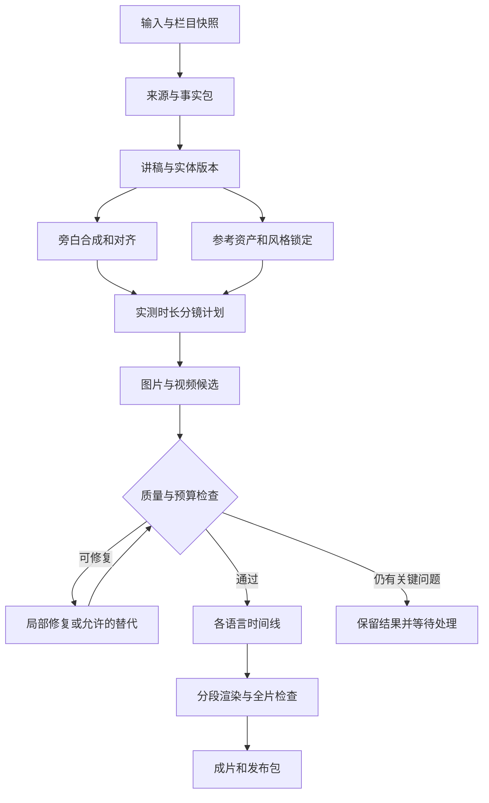

# LocalDramaStudio 解说工厂完整设计与开发规范

版本：1.0　核验日期：2026年9月22日北京时间（2026年9月21日 UTC）

源码基线：`Qioooba/local_drama_studio`，`main` 快照 `8a63c604a1a13556dbe277d312ecf73bebb52883`。

交付目的：供产品审查与 AI 开发执行。本文定义一次完整交付的产品、页面、数据、接口、生产算法、恢复机制、测试和验收；任务依赖用于安排实现顺序，不将核心能力推迟到后续版本。本文是设计规范；本轮没有修改产品代码、运行用户本地 GPU、产生真实成片或证明产能。现状结论来自指定源码与官方资料；所有数值目标均明确作为拟定验收值，不是已有实测成绩。

## 1 核心决定

在现有程序中新增与“快速生成”“AI 短剧制作”并列的 **解说工厂**。其完整闭环为：选题或导入资料 → 核对事件与来源 → 编写解说 → 提取人物与场景 → 锁定旁白和栏目视觉规范 → 制作分镜与画面 → 自动选片及有限修复 → 合成多语言版本 → 检查画面声音字幕 → 导出成片和工程包。

采用“旁白决定时间、事实约束内容、短镜头构成长片”的设计。支持 3、5、10、20、30 分钟及自定义目标时长；几十分钟由章节与镜头组成，不要求单次视频模型输出几十分钟。默认以动态插画与重点图生视频混合生产。用户可以选择更高视频比例，但预检必须重新估算耗时、显存、重试预算。

现有 React、FastAPI、SQLite、Worker、模型中心、媒体资产、GPU 调度继续使用。新增解说业务服务；从既有时间线中提取纯渲染能力，通过显式适配器复用。**不创建假 Episode，不把整剧工作台改个名字，不另装第二套视频工厂。**

核心能力必须一次完成：联网检索与纯离线导入、本地推理、多语旁白/字幕、资产一致性、30 分钟编排、定时生产、局部返工、失败恢复、自动审核与人审区分、多画幅输出、审查证据包。可选能力由真实安装、许可证、设备和 API 授权决定是否可用；不可用必须如实显示，不能标记完成。

## 2 可行性与经营判断

这种形态适合事件经过、人物关系、时空变化清楚的解说。画面能帮助观众理解信息；统一的栏目声音与视觉资产也可以摊薄制作成本。成片是否吸引人，仍取决于题材、证据、讲述结构和节奏，不能由自动化程度保证。

内容运营建议从 3–8 分钟开始校准，而软件本次就支持 30 分钟。原因是短样片更容易测出错读、角色漂移和叙事拖沓；这属于运营方式，不是删减软件范围。每条视频应围绕一个明确问题、展开新的事实和解释、回应开头的问题。可以学习别人选过的事件与公开事实；脚本结构、旁白措辞、画面、声音独立制作，引用原始资料，不把别人的解说稿逐句改写当作新增价值。

YouTube 官方政策明确关注批量、重复、缺少原创价值的内容；统一片头或系列人物本身并不等于不合格。系统因此应保存本片的新问题、证据、原创解释和与既有作品的重复检查，而不是只追求日产数量。[YouTube 获利政策](https://support.google.com/youtube/answer/1311392?hl=en)

## 3 外部项目应怎样学习

本轮资料核验未找到足以证明完整覆盖全部目标的成熟整套项目。下表为官方资料核验与工程取舍，不是这些产品的真实长片质量排名。闭源产品未登录付费试用；不能把功能页视为性能保证。

| 项目 | 可核验的相关能力 | 本项目应吸收的部分 | 接入决定 |
|---|---|---|---|
| MoneyPrinterTurbo | 脚本、素材、TTS、字幕、音乐、任务/API；已含生成图像与本地 TTS 选项 | 一键任务、音频实测时长、分段缓存、缺片中止 | 首要生产编排参考；MIT，按需参考模块，保留主系统状态库。[仓库](https://github.com/harry0703/MoneyPrinterTurbo) [发行记录](https://github.com/harry0703/MoneyPrinterTurbo/releases) |
| NarratoAI | 影视解说、现有视频分析/剪辑、本地 ASR/TTS 连接选项 | 句段与素材关联、视频反向审查 | 不以影视混剪代替历史原创画面；MIT。[仓库](https://github.com/linyqh/NarratoAI) [配置](https://github.com/linyqh/NarratoAI/blob/main/config.example.toml) |
| VideoLingo | 转录、术语、翻译、字幕切分与配音 | 多语时间轴、对齐、时序漂移修复 | 作为实现参考；Apache-2.0。[仓库](https://github.com/Huanshere/VideoLingo) [发行记录](https://github.com/Huanshere/VideoLingo/releases) |
| Huobao Drama | 资产、分镜、批量片段、整集生产交互 | 阶段可见、引用资产、局部替换 | 当前为 CC BY-NC-SA 4.0；本项目默认独立实现流程，不直接商用复制其代码资源。[仓库与许可](https://github.com/chatfire-AI/huobao-drama#-license) |
| StoryToolkitAI | 素材转录检索、文本剪辑、EDL/XML 等工程协作 | 点旁白定位镜头、可编辑工程导出 | GPL-3.0，优先文件互操作与交互参考。[仓库](https://github.com/octimot/StoryToolkitAI) |
| ShortGPT | 结构化编辑计划、脚本、配音、字幕编排 | 计划与确定性执行分离 | 官方自称实验性，不作为长片生产底座。[仓库](https://github.com/RayVentura/ShortGPT) |
| Fliki | 脚本到场景、品牌套件、声音字幕及多画幅 | 简单创建入口、栏目预设、逐场景编辑 | 参考产品结构，不依赖其云推理。[官方功能](https://fliki.ai/features/text-to-video) |
| Pictory | 脚本匹配视觉素材、配音和字幕 | 图文配对、最少场景替换 | 使用现有本地能力实现同类交互。[官方功能](https://pictory.ai/pictory-features/script-to-video) |
| InVideo | 文本到分镜/视觉/声音、场景修改 | 自然语言修改与精确编辑并存 | 不照搬多层复杂编辑器。[官方功能](https://invideo.io/make/add-text-to-video-online/) |

另有作者介绍的 `summitsingh/ai-video-factory`，面向 20–30 分钟纪录片，但其代码、许可和成片本轮未完整核验，不列为成熟推荐。[作者说明](https://dev.to/summitsingh/i-built-a-pipeline-that-turns-a-topic-into-a-20-30-minute-documentary-bfp)

注意：Edge TTS 调用在线语音服务，“免费”“无需 Key”均不能作为本地推理证据。[Edge TTS 官方说明](https://github.com/rany2/edge-tts)

## 4 当前仓库的可复用基础与真实限制

### 4.1 已读源码对应的基础

下表前端使用仓库完整相对路径；后端相对路径以 `apps/api/local_drama/` 为根。

| 当前文件或模块 | 源码中的职责 | 解说工厂使用方式 |
|---|---|---|
| `apps/web/src/app/routeRegistry.ts`、`apps/web/src/app/router.tsx` | 集中路由与页面注册 | 增独立解说路由、导航域及测试 |
| `apps/web/src/layouts/AppShell.tsx` | 全局菜单、项目与分集上下文 | 复用外壳；按项目类型切换菜单，禁止解说拉取分集上下文 |
| `apps/web/src/pages/ProductionFactoryPage.tsx` | 整剧/单集生产、对白与正式审批提示 | 复用独立状态/操作组件；新建解说总览 |
| `application/pipeline_orchestrator.py`、`application/whole_drama_orchestrator.py` | 故事草稿及整剧编排 | 学习计划冻结与已有任务服务，不继承小说分集语义 |
| `model_platform/`、`application/gpu_runtime.py` | 模型能力、工作流与 GPU 运行环境 | 作为唯一生成执行与资源入口 |
| `application/character_identity_packs.py` 等 | 身份参考槽位、快照与过期传播 | 复用人物引用及媒体事实，新增解说出镜状态约束 |
| `application/worker_handlers/tts_job.py`、`infrastructure/database/audio_repository.py`、`application/audio.py` | TTS执行、音轨仓库与音频workspace facade | 抽出与 Episode 无关的音频能力，新增旁白对象 |
| `application/timeline.py` | 时间线、渲染、音频字幕与交付 | 提取确定性 RenderManifest 渲染器，旧端走适配器 |
| 审片、ReviewDecision、媒体与 outbox | 决策、版本、审核记录、事件 | 共用审计/媒体设施，新建解说政策判定 |

源码引用：[路由](https://github.com/Qioooba/local_drama_studio/blob/8a63c604a1a13556dbe277d312ecf73bebb52883/apps/web/src/app/routeRegistry.ts)、[AppShell](https://github.com/Qioooba/local_drama_studio/blob/8a63c604a1a13556dbe277d312ecf73bebb52883/apps/web/src/layouts/AppShell.tsx)、[生产页](https://github.com/Qioooba/local_drama_studio/blob/8a63c604a1a13556dbe277d312ecf73bebb52883/apps/web/src/pages/ProductionFactoryPage.tsx)、[时间线](https://github.com/Qioooba/local_drama_studio/blob/8a63c604a1a13556dbe277d312ecf73bebb52883/apps/api/local_drama/application/timeline.py)。更详细文件与函数证据见《源码接入与开发任务清单》。

### 4.2 必须处理的四个结构性问题

**第一，现有媒体后期强依赖 Episode。**旧时间线、音轨、字幕、渲染和交付有真实 Episode 外键及校验。不要把全部 `episode_id` 改可空，也不要创建隐藏的“第零集”。新增解说 edition 的 composition 表，提取不含数据库 SQL 的渲染核心。旧剧集数据和审批接口保留兼容。

**第二，现有自动生产与正式审批并非同一事实。**现有 `application/episode_render_approval.py` 对最新非过期渲染审批设门槛。新业务使用明确的机器政策接受记录；不得由 Worker 冒充用户写入人工批准。

**第三，现有配音和字幕不能直接承载新的商业多语旁白。** `application/worker_handlers/tts_job.py` 从dialogue_text_revisions读取对白，并要求现有快照为LOCAL_TEST_ONLY；新业务必须增加NarrationTtsHandler、独立旁白revision与音色/模型授权用途校验，不修改字段来绕过原handler。旧字幕校验以SCRIPT为文本权威并按原剧本顺序匹配，新增译文的TRANSLATED_SCRIPT及双语cue映射。现有ReviewService.machine_check主要检查媒体结构，新增视觉语义检测器和真实覆盖报告。[TTS handler](https://github.com/Qioooba/local_drama_studio/blob/8a63c604a1a13556dbe277d312ecf73bebb52883/apps/api/local_drama/application/worker_handlers/tts_job.py)

**第四，网络标志不构成完整的离线推理保证。**`domain/network_policy.py` 限制本地运行时，但 `application/provider_connections.py` 与 `infrastructure/local_llm.py` 的 OpenAI compatible 路径还存在公网连接能力，其中部分业务路径已有显式出站许可，但这不是全局推理禁用；也不能据此说当前V2所有生成类型已支持云。新增“推理出站策略”并在最终 HTTP 传输处执行，才能保证无意外云调用；不能只修改页面上的本地开关。[网络策略源码](https://github.com/Qioooba/local_drama_studio/blob/8a63c604a1a13556dbe277d312ecf73bebb52883/apps/api/local_drama/domain/network_policy.py)、[Provider 连接源码](https://github.com/Qioooba/local_drama_studio/blob/8a63c604a1a13556dbe277d312ecf73bebb52883/apps/api/local_drama/application/provider_connections.py)、[LLM 传输源码](https://github.com/Qioooba/local_drama_studio/blob/8a63c604a1a13556dbe277d312ecf73bebb52883/apps/api/local_drama/infrastructure/local_llm.py)

### 4.3 当前模型清单的正确解释

该快照的 `config/model-lock.json` 声明 Qwen-Image-2512 Q5、Qwen-Image-Edit-2511 Q5 及多角度 LoRA、H3 FL2VA/Ref2VA、VoxCPM2、Qwen3 ASR/ForcedAligner、ACE-Step 等。声明文件、文件真实存在、哈希正确、工作流兼容、真实 smoke 通过是不同状态。本文未接触用户 F 盘实时资源或数据库，不把锁文件视为模型已可用的证明。[模型清单](https://github.com/Qioooba/local_drama_studio/blob/8a63c604a1a13556dbe277d312ecf73bebb52883/config/model-lock.json)

## 5 菜单与路由

### 5.1 全局结构

全局导航顺序：工作台 → 快速生成 → **解说工厂** → 全部项目 → 系统中心。保留原短剧入口。工作台增加“制作解说视频”创建按钮与最近解说作品。全部项目支持“全部 / 短剧 / 解说”筛选，并显示类型，不把解说计入整剧集数。

`Project.product_kind` 新增 `EXPLAINER`，现有项目默认 `DRAMA`。一个解说 Project 默认对应一个 `ExplainerVideo`；同作品的中英文、横竖屏作为 edition/输出版本，不能复制成互不相识的四个项目。栏目由可复用 ChannelProfile 定义，每日定时生产创建新的作品项目。

| 路由 | 用途 |
|---|---|
| `/explainers` | 作品列表、选题池、栏目预设、定时计划入口 |
| `/explainers/new` | 四种输入方式与最少参数创建 |
| `/explainers/:projectId/overview` | 总览与生产 |
| `/explainers/:projectId/script` | 资料与解说稿 |
| `/explainers/:projectId/assets` | 人物与风格 |
| `/explainers/:projectId/storyboard` | 分镜与画面 |
| `/explainers/:projectId/audio` | 声音与字幕 |
| `/explainers/:projectId/review` | 审片与导出 |

项目默认重定向到 overview。页内 edition 选择只在确实存在多版本时显示。解说上下文不显示 Season/Episode 选择器、对白完成率或整剧交付。

### 5.2 创建页面

四个输入选项：① 输入题目自动找资料；② 粘贴讲解稿；③ 上传资料 TXT/MD/DOCX/PDF/EPUB；④ 提供参考链接研究同一题材。默认不下载他人完整视频；已获权的音视频可作为补充来源导入。

首屏只要求标题/主题、目标时长、栏目风格、配音语言、输出画幅、自动程度。来源范围和高级模型参数折叠。已有栏目自动填入声音、字体、音乐规则、视觉规范和素材授权策略。上传后显示识别编码、正文预览、来源是否待核实，不把“导入成功”称为“史实审核通过”。

主按钮“检查并一键生成”。预检报告分为：可执行、需补资料、缺少本地能力、资源预计不足、授权范围待确认。初次预检冻结输入、栏目版本、能力、出站政策、预算上限和任务骨架，再自动提交，无阻塞时无需用户第二次点击。研究、讲稿、TTS产生后，运行内按合同冻结逐步展开的子计划；这是授权计划内展开，不使自己STALE_PLAN。外部编辑输入/政策/依赖才使未执行部分过期。估算标明主题粗估、讲稿估算、TTS后精估，初始不伪造确定镜头数。

### 5.3 六个工作页

| 页面 | 新开发的核心内容 | 复用的组件或设施 | 主要操作 |
|---|---|---|---|
| 总览与生产 | 章节、旁白时长、运行状态、预算和异常摘要 | Job状态、任务抽屉、容量读数 | 一键生成、暂停、继续、取消、只修问题 |
| 资料与解说稿 | 原始来源、事实、事件时间线、旁白引用、双语术语 | 文档预览、分页、草稿差异 | 查证一句、修稿、冻结讲稿 |
| 人物与风格 | 栏目规范、人物历史/虚构标记、时间状态 | 资产卡、Identity Pack、参考图选择、媒体预览 | 锁定参考、局部变更、查看影响 |
| 分镜与画面 | 旁白节拍与画面映射、计划时长、渲染方式 | 候选预览、比较、生成进度、部分提示词控件 | 换画面、锁定镜头、限定修复 |
| 声音与字幕 | 旁白段、中文/英文、对齐、漏读、字幕排版 | 播放、波形、音色选择、字幕样式 | 重读一句、改发音、调混音 |
| 审片与导出 | 完整片时间轴、检查覆盖、问题定位、版本和发布包 | 播放器、逐帧批注、导出预设 | 按问题审片、人工确认、导出 |

每个页面必须包含加载、空状态、无能力、执行中、部分完成、失败、过期版本和成功状态。任务失败只锁定依赖其结果的控件。保留刷新后定位、浏览器后退和可分享的项目内 URL。

### 5.4 交互规则

普通用户始终能看见“下一步是什么、谁在执行、预计范围、为什么暂停”。“失败”必须带可理解原因与可执行修复；GPU 等待不能显示生成失败。批量操作先展示影响镜头数，实际提交以 revision 校验。危险范围变更（重建整片）显示已有结果将保留及新版本关系，不覆盖已锁定候选。

修改旁白时，侧栏展示会失效的配音、字幕、镜头时间段及 edition。修改音乐不使图像过期。问题条目可定位到正确语言、时间码、镜头、原始来源；点击“重生成这个镜头”只处理该镜头及后续渲染块。

布局沿用项目主题和基础控件。宽屏采用内容区加可收起检查侧栏；窄屏按顺序堆叠；镜头列表虚拟化，媒体缩略图惰性加载。不得同时在六页挂载全量视频。1366×768、1920×1080、125%/150% 缩放与键盘操作是明确验收场景。

## 6 内容与事实模型

### 6.1 来源包

`ResearchPacket` 是独立可版本化输入，包含来源 URL、标题、作者/机构、发布日期（未知为 null）、获取时间、正文哈希、截取位置、可信类型、权利说明及语言。发布日期、更新日期、事件发生日期分开；历史题材允许旧原始史料，不能因为“最近搜索”就把旧事件说成新闻。

联网来源可采用自建 SearXNG、机构 RSS 与指定 URL；它们是资料获取服务，不是模型推理服务。SearXNG 的 JSON 输出要在配置中开启，公共实例未必提供。提取正文可采用 Trafilatura，后接现有本地知识索引。[SearXNG API](https://docs.searxng.org/dev/search_api.html)、[Trafilatura](https://trafilatura.readthedocs.io/en/latest/)

抓取必须限制协议、重定向、文件体积、解压大小、超时和 URL scheme；公网抓取不得通过重定向访问 loopback、私网或 metadata 地址。抓取结果中的脚本、网页指令和提示词注入是资料，不是系统指令。解析文本与可信系统指令分别传给模型；生成器只接受 schema 内字段，不执行网页里的命令。

### 6.2 事实账本

每条 `Claim` 保存原子事实、支持/反驳的 source span、重要度、状态、置信理由和验证记录。状态至少包括 `SUPPORTED / DISPUTED / UNVERIFIED / EXCLUDED`；“来源间意见不同”必须进入争议，不能按搜索数量投票为真。多家转载同一稿件视为同一上游证据，不伪装独立来源。

`Event` 保存起止时间、时间精度、地点、参与人、因果关系及 claim 引用。未知时间不可自动填精确分钟；古代人物同名、不同历法、简称、地名迁移要有消歧字段。`Entity` 区分真实人物、虚构人物、群体、地点、道具，稳定 entity_id 跨全文使用。

每条旁白至少标记：事实引用 / 原创解释 / 过渡语 / 明确虚构。对真实事件的新增数字、具体对话、内心独白、衣服细节不可由模型补成事实。视觉字段单独标 `DOCUMENTED / RECONSTRUCTION / SYMBOLIC / FICTIONAL`。画面再现不能当作照片证据。

### 6.3 自动放行条件

核心日期、人名、人数、结果和指控不存在未解决冲突；来源可定位且支持对应事实；关键缺失只可通过删改叙述或查证解决。来源置信分仅作排序，不能作为事实真伪的数学证明。可自动生成预览，但未通过内容门槛的成片不得显示“事实核验完成”。

真实事件检索用例示范：FBI 的 Alcatraz 案件资料区分 1962年6月11日晚逃离与6月12日清晨发现，列明三名失踪者，并保留后续命运不明；系统应抓住这类日期语义和不确定性，不能自动写成“三人成功到岸”。这组事实用于资料链验收，完整生成样片另用原创虚构资料，避免把测试虚构情节混进历史解说。[FBI 原始案例资料](https://www.fbi.gov/history/cases-and-criminals/alcatraz-escape)

## 7 讲稿与叙事设计

先生成“观众问题 → 必要背景 → 关键人物与冲突 → 转折与证据 → 结果与解释”的章节纲要，再逐章写旁白。每章输入只能包含相关来源、全片摘要、术语表与已锁定事实；禁止把整本资料反复塞入上下文。

开头建议 5–15 秒提出真实悬念或反常识问题；在后文回答，不能虚构夸张结论引流。人物首次出现使用姓名和一句角色说明，后续使用固定简称。每章应增加信息，重复铺垫和强行卖关子由叙事检查器标出。结尾可以提出有内容的问题邀请讨论，不生成虚假争议、假评论或虚构历史冲突。

稿件对象：`ScriptRevision → Chapters → NarrationSegments`。每段包含稳定 segment_id、display_text、spoken_text、language、claim_ids、pronunciation_lexicon、speaker、emotion、pause、revision_hash。display_text 保留规范数字和名字；spoken_text 可把“1962”展开为中文读法，二者通过映射表保持等价。

时长策略：先以栏目实测语速估算预算；生成 TTS 后取真实音频时长并重新排镜头。不能靠字数宣称一定五分钟。超过目标容差，优先压缩重复文字或补充已有证据的解释，再重读受影响段；不得截断音节、用长黑屏凑时长或把旁白拉成失真速度。

普通自动稿可在已授权的事实范围和修订预算内产生新revision，并重新验证来源引用和语音。人工锁定文字不可自动改写；先用合法镜头弹性或自然时长，精确时长冲突仍未解决时才请求处理。旧稿批准不自动继承给新稿。

默认输出档为目标时长 ±5% 的自然叙事；精确时长模式另设总帧数目标，通过留白、镜头弹性和有限修稿满足。所有 UI 中的时码明确区分“计划”和“实际”。

## 8 人物圣经与栏目视觉规范

### 8.1 栏目规范

ChannelProfileVersion 保存：画风/渲染方式、颜色与材质、镜头语法、光照、文字字体、字幕区域、转场集合、声音、BGM 规则、负面约束与许可。将引用资料到处出现的摄影风格描述隔离，避免其污染栏目画风。每次生产冻结版本，不能因全局模板编辑使旧作品悄悄变样。

建议一个栏目先固定一种可控插画风或轻写实风。稳定性来自稳定的参考、资产、状态与镜头复杂度控制；固定 seed 只支持复现，不保证不同姿态中是同一人物。

### 8.2 人物资产

角色记录分成可核验身份和美术设定两部分。真实人物不具备可靠肖像时，选择明确的示意化形象，不宣称“复原真实长相”。年龄、服装、伤势、携带道具按事件时间建立状态版本，避免几十年跨度中外形全程不变。

关键人物：规范正面参考 → 左/右侧或三分之四视角 → 需要时背面 → 必要表情。优先生成清晰的单视角图，拼成三视图仅作为检查展示；不要把带分隔线/标签的三视图整张喂入 I2V，导致多个人物被生成在同一画面。对出镜一次的小人物，单张参考足够。

现有bind_shot_identity_pack要求旧Shot及人工批准，解说新增entity_identity_binding/run_identity_inputs，提取共用slot/hash验证；机器策略接受的包不伪造旧批准ID。

每个镜头引用 `identity_pack_revision + costume_revision + scene_revision + prop_revision + style_revision`，关键人物及画风样张自动/人工确认后冻结。自动选图结合结构检查、参考相似性和多模态核对；无法分辨的低置信结果进入少量人工复核，不能伪造100%一致。

### 8.3 文生图与图像编辑的边界

纯 T2I 用于首张人物设定、空镜和无需参考的资产；参考条件生成与多角度修改走具备此能力的 Edit/参考工作流。项目中 Qwen-Image-2512 与 Qwen-Image-Edit-2511 应分别注册能力；传了 reference 参数但实际节点未消费，必须在 smoke 测试中失败。[Qwen 图像项目](https://github.com/QwenLM/Qwen-Image)

地图轮廓、数字、日期、关系线、文章引用、图表和字幕由确定性图形/文字层生成；真实地理使用有来源的底图或标清“示意图”，不让生成模型猜地图。

## 9 镜头编排与低抽卡机制

`NarrationSegment` 与 `VisualBeat` 允许多对多；一句话可以跨两个镜头，一个镜头也可承载相邻几句。编排依据语义转折、人物动作和信息变化，避免机械地每五秒换一张无关图。

| 渲染类型 | 典型用途 | 处理方式 |
|---|---|---|
| `STILL_MOTION` | 人物介绍、空镜、资料讲述 | 稳定插画加受限推拉/平移，预渲染为 video clip |
| `PARALLAX` | 需要轻微空间层次的场景 | 分层深度必须过遮挡检查；失败回普通图片动效 |
| `I2V` | 核心动作、关键转折、空间变化 | 固定参考首帧，必要时参考尾帧，受能力约束 |
| `INFOGRAPHIC` | 时间、证据、路线、关系 | 确定性布局与文字，标出来源/再现属性 |
| `LICENSED_MEDIA` | 已有授权的历史照片/素材 | 入库引用、权利记录、裁剪与时间码冻结 |

栏目初始建议约 60% 图片动效、30% 短视频、10% 信息图，以可调整预设实现，不能硬性把每片锁成模板。比例是计算成本与叙事效果的起点，验收使用实际镜头清单。每镜头只承担一个主要动作、少量角色及明确视觉焦点；长打斗/复杂群像不是自动生成默认动作。

首尾帧仅在动作终态、连续衔接和能力支持时使用。章节换景不用上一镜尾帧；同一地点连续动作可以建立 frame bridge，但定期回到 canonical reference 防止滚雪球漂移。尾帧几何/人物状态冲突时重新规划，不强行插值。

### 9.1 有限候选与回退

普通镜头初次1个候选，必要时最多2次创作修复；关键人物设定初次2个候选，并有整片 GPU 时间上限。技术重试与创作重抽分别计账。采用顺序：文件/解码合格 → 内容相关 → 人物与物体约束 → 可读/可听 → 风格与美感排序。审美评分不能覆盖事实错误。

失败处理：定位可修问题 → 只改问题相关提示或资产 → 有预算才重生 → 改成同义的低复杂度构图 → 若预先允许则改为动态插画/信息图 → 仍无法清楚表达则暂停并报告。所有替代记录 `fallback_reason`，不可把用户锁定的关键动作默默降级。`must_be_motion=true` 的镜头不可降为静图。

已人工锁定镜头不能被批次操作改掉。修复后以新的 Variant/MediaVersion 保存，原版本可回看。累计同类缺陷提示修正栏目模板或模型工作流，而不是继续无限抽卡。

## 10 本地模型与硬件策略

默认沿用已有通过校验的本地 LLM、Qwen 图像/Edit、VoxCPM2、Qwen3 ASR/Aligner 与 ComfyUI 视频工作流。Qwen3-TTS、WhisperX/faster-whisper 可作为替代适配器；不为新增解说把稳定配音重新迁移一次。[VoxCPM 官方](https://github.com/OpenBMB/VoxCPM)、[Qwen3 ASR 与对齐](https://github.com/QwenLM/Qwen3-ASR)、[Qwen3 TTS](https://github.com/QwenLM/Qwen3-TTS)

H3 必须区分本地 H3-Base 与官方完整高分辨率系统。官方说明 Context-IR 与 Regenerate-2K 包含托管环节；本地链使用本项目的提示/上下文编译和已验证的本地后期，不能在 workflow 内隐式联网调用这些服务。[H3 官方模型卡](https://huggingface.co/MiniMaxAI/MiniMax-H3)

当前 H3 自定义许可对适用地域及 Outputs 有明确限制，不能从“可下载权重”推导到“可全球公开分发成片”。全球发行预设应在授权未核实前排除受限制资产，或者要求有效授权证据；可以选择通过本机 smoke 的其他视频模型和独立生成的图片动效路径。具体授权适用性需要结合使用地、分发地及获得的许可确认。[H3 LICENSE 原文](https://huggingface.co/MiniMaxAI/MiniMax-H3/blob/main/LICENSE)

作为可替换路径，Wan2.2 官方提供 T2V/I2V/TI2V 等不同模型；5B 与 A14B 的资源要求不能混写，原版脚本、Comfy offload、社区量化也不能共用一个显存数字。纳入模型中心后对精确模型、量化、节点版本与用户机器运行真实 smoke，再发布其能力；不承诺24GB必然运行任意工作流。[Wan2.2 官方仓库](https://github.com/Wan-Video/Wan2.2)

### 10.1 以单张 24GB 显卡为例的调度

本文以单张24GB显卡与128GB内存作为容量规划示例，不代表已经确认用户当前机器配置或完成实测。所有 GPU 作业走现有 coordinator：按DAG已就绪任务组成同模型批次。首轮必须先完成文本规划与TTS/对齐，得到权威时间后才冻结最终分镜及视频任务；参考资产可提前生产。随后在依赖允许范围内批处理图像、视频和视觉审查，切换前释放前一模型。CPU 可并行做抓取、文本清洗、文件校验和部分合成；不能让多个高显存模型不受控常驻。

GPU 租约保存 owner、runtime、VRAM需求档、心跳和取消 token；载入前确认前一运行时已释放且剩余显存满足实测档位。OOM 只允许按批准策略改 batch/offload/分辨率，新参数形成新执行快照，不能悄悄换云。还要校验H3具体变体和加速组合：model-lock中的Ref2VA文件名/字节数与原始发布变体可能需要核对；保存来源revision、原始文件名及SHA，不凭重命名确认pruned。Turbo LoRA在FL2VA与Ref2VA分别做真实样片验收，不能因能加载就认定同样生效。[Comfy官方Ref2VA文件](https://huggingface.co/Comfy-Org/MiniMax-H3/blob/main/diffusion_models/minimax_h3_ref2va_int8_convrot.safetensors)、[Turbo作者说明](https://github.com/Larryvrh/ComfyUI-MiniMax-H3-Turbo)。老电脑内存带宽/CPU offload可能成为瓶颈，必须看整条流水线墙钟时间。

产能估算：`总时长 = 文本 + Σ图片耗时 + Σ视频耗时 + TTS/对齐 + QC + 渲染 + 模型切换 + 重试`。以 profile 本机近次样本的中位数和P90显示区间；没有样本显示“待校准”。例如30分钟平均7.5秒一镜约240镜，若30%为视频即约72个生成片段；这是镜头数算术，不是生成速度承诺。调度器根据真实吞吐判断能否在每日窗口内完成。

### 10.2 具体工作流的验收合同

| 能力 | 本次应固定的调用方式 | 真实smoke必须证明 |
|---|---|---|
| 文生图 | Qwen-Image当前精确profile；无参考的新资产起点 | 输出实际尺寸/哈希；不能把Edit能力挂在纯T2I名下 |
| 参考图与多视角 | Qwen-Image-Edit及对应LoRA；单视角输入/输出分开保存 | 替换成明显不同参考人物时输出确实响应；检查参考顺序和节点连线 |
| H3首尾/多参考 | FL2VA与Ref2VA分别登记；模型/LoRA/节点/采样器组合整体锁定 | 请求范围与真实首尾/多参考一致；最终帧数和声音被探测；不调用托管IR/2K |
| 旁白 | VoxCPM2本地独立旁白handler；按语义小段合成 | 中文、英文、专名、数字、重复/漏读；备用音色不可静默切换 |
| 强制对齐 | Qwen3-ForcedAligner小段对齐已知稿，记录原采样偏移 | 段末偏移与长片总时钟一致；未对齐词不能编造时间戳 |
| 视觉审片 | 新VisualQcProvider，输入参考图、真实抽帧和有限检查问题 | 真正读到图像，识别预置明显错误，能输出UNKNOWN与证据位置 |

视觉审片建议以独立的 `Qwen/Qwen3-VL-8B-Instruct` 作为本次新增验收基线，官方公开图像/视频理解和本地加载方式，权重标注Apache-2.0；这不表示项目已安装，也不代表它天然具备可靠史实裁判能力。通过既有模型中心新增本地多模态adapter，使用受GPU coordinator管理的独立依赖环境；固定模型revision、processor、视觉输入预算与实际运行库，不因有H3条件编码器文件就跳过安装与验收。量化或替代后重新校准误报、漏报与UNKNOWN比例。[Qwen3-VL官方项目](https://github.com/QwenLM/Qwen3-VL)、[8B-Instruct官方模型卡](https://huggingface.co/Qwen/Qwen3-VL-8B-Instruct)

首轮视觉检查以参考人物/场景加少量实际镜头帧为输入，明确询问角色数、身份线索、物体、动作阶段与文字；输出`issue_kind / frame_ref / observed / expected / confidence / unknown_reason`。不将整部30分钟视频一次塞入上下文。技术层负责全片帧数与解码，VLM负责声明覆盖内的语义检查，两者按相同媒体hash关联。

H3的Comfy原生工作流还有具体尺寸和帧数网格要求：按该工作流当前能力声明校验32倍数尺寸与`17k+5`帧网格。例如124帧/24fps约5.167秒，不能直接当作5秒最终镜头；保存生成帧数/FPS与最终裁切区间，按合成时钟得到精确时长。其他模型使用自己的能力网格，不共享硬编码。[ComfyUI H3原生工作流](https://docs.comfy.org/tutorials/video/minimax/minimax-h3-native)

## 11 声音 字幕 与多语言

### 11.1 旁白

默认一个栏目主旁白，按语义分段合成，保留跨段发音词典、音色版本、参数与适当上下文。无需给每个历史人物配角色对白，更不默认开口型同步。引用原话需要可靠来源；演绎对白明确标记。原生视频声音独立入库，默认静音或只作为经过审核的环境音，禁止覆盖主旁白。

以审定文字生成 TTS；之后强制对齐已知文字，并用独立 ASR 找漏读、重复、专名/数字错读。ASR 的错误不能反向修改事实主稿。对齐任务按小段处理，保持原音频采样偏移、音素/词与显示文本的映射。失败段单独重读，邻段重新做拼接检查。

### 11.2 三类语言输出

| 输出 | 旁白 | 时间线 |
|---|---|---|
| 中文版 | 中文 | 中文实测时钟 |
| 中文配音加中英字幕 | 中文 | 共用中文语音时钟；英文译文按语义 cue 对应 |
| 英语配音版 | 英文 | 独立英文 TTS 时钟、独立剪辑点和字幕 |

术语表锁定人名、地名、年代、计量与专有名词。翻译先保证事实和语义等价，再符合母语表达；不依赖回译一个分数证明正确。英文同一段更长时优先重排镜头、复用备用画面或合理改写；不按中文时间戳机械加速英文。多语言 edition 共享内容和可用视觉资产，但保留语言与时间线版本。

### 11.3 字幕

字幕为独立 revision，输出 SRT、VTT、ASS；按平台选择软字幕和烧录版。双语采用成对语义 cue，各自换行，不逐字硬对齐。字体具备中文/拉丁字形和商用可用性；计算文本边界、平台遮挡区域、对比度与换行，数字/人名不被拆坏。样式编辑不会触发重新 TTS。

拟定可校准默认值：每种语言尽量1–2行、cue通常1–6秒、中文阅读速率目标不高于8字/秒、英文目标不高于20字符/秒；信息复杂时优先缩短文字或延长画面。上述是产品初值，不是各平台统一硬标准。双语超高时先重新断句、分cue、精炼等义译文和重排，遵守最低字号及安全区；仍失败则报告布局问题。只有输出策略预先允许且平台支持软字幕时，才改成软字幕方案并明确标记，不能静默少烧录一种语言。

### 11.4 BGM 与混音

默认自动匹配本地已授权音乐库：根据段落情绪、密度、节奏匹配，避免人声歌曲抢旁白。ACE-Step 本地生成可作为已校验的另一来源；其许可、生成来源同样进入资产记录。支持首尾淡入淡出、章节间交叉淡化与换曲、响度匹配和旁白 sidechain ducking。

旁白、音乐、音效分轨，最终混音后做响度及true peak检查。建议默认整片约 -16 LUFS ±1、true peak不高于 -1 dBTP，均为本产品可调验收档；不能宣称为所有平台官方标准。FFmpeg可提供 loudnorm、sidechaincompress、silencedetect、blackdetect 等构件，但它们只能检测相应信号，不会判断史实。[FFmpeg filters](https://ffmpeg.org/ffmpeg-filters.html)

## 12 一键生产的任务图

说明：TTS先得到权威时间，再锁定最终视觉节拍；参考资产可并行规划，GPU由统一调度器串行仲裁。翻译产生独立语言分支。最终检查失败回到相关祖先节点，不启动整片重做。

每步输入包含项目、视频/edition、不可变版本引用、输入hash、能力快照、输出类型及预算。一步完成必须满足“作业终态成功 + 文件真实存在 + 哈希/探测有效 + 业务结果登记成功”。HTTP200、Comfy队列提交成功、文件名存在都不等于生成完成。

### 12.1 运行状态

运行：`QUEUED → PREFLIGHT → RUNNING → QC_RUNNING → READY_TO_EXPORT → EXPORTING → COMPLETED`；旁支包括 `PAUSING / PAUSED / WAITING_INPUT / FAILED / CANCELLING / CANCELLED`。单个步骤可 `BLOCKED / SKIPPED_WITH_REASON / RETRYABLE_FAILED / TERMINAL_FAILED`；禁用的可选步骤跳过必须写原因。

取消停止后续调度，向底层作业发送取消；共享Comfy实例调用interrupt前必须确认当前作业归属，不能中断另一项目。WebSocket断开按保存的prompt_id查queue/history后对账，不立刻重复提交。不能只改前端状态。运行中资源无法立即终止时显示“正在停止，当前片段可能完成”，完成结果隔离，不再发布。断电后凭数据库lease及运行时真实状态恢复，不用内存列表判断权威状态。

### 12.2 自动程度

| 模式 | 行为 | 完成状态说明 |
|---|---|---|
| `AUTO_WITH_EXCEPTIONS` 默认 | 自动选片、有限修复；只有关键事实/质量/能力问题暂停 | 机器政策通过可自动导出 |
| `REVIEW_BEFORE_RENDER` | 讲稿与关键资产后停一次，后续自动 | 标记实际人审范围 |
| `MANUAL_REVIEW` | 每个选择由用户决定 | 不影响其他自动模式 |

机器决策 `POLICY_ACCEPTED` 保存规则版本、阈值、检测证据及限制；人工决策 `HUMAN_APPROVED` 保存actor、对象版本和时间；发布授权另存。界面显示“自动检查通过，未人工审阅”或具体的人审范围。用户选择全自动后，不再在每个正常节点弹确认；无法满足不可降低的门槛时才请求处理。

## 13 数据设计

### 13.1 存储策略

继续 SQLite WAL、文件系统媒体与既有迁移工具。新表围绕 EXPLAINER 增量建立，不引入 Redis/Celery/Kafka，也不建立新的模型服务总控。长内容保存版本化JSON/文档与分页索引；关键状态、引用和并发控制保存在数据库。

| 实体或表组 | 关键字段与关系 |
|---|---|
| `projects.product_kind` | DRAMA/EXPLAINER；现有项目回填DRAMA |
| `explainer_videos` | project_id唯一、标题、topic、内容类型、目标时长、当前revision、channel_profile_version_id |
| `channel_profiles / channel_profile_versions` | 不可变栏目风格、声音、字幕、音乐与生成策略快照 |
| `explainer_research_packets / explainer_sources / explainer_source_spans` | video_id、来源哈希/位置、获取时间、文本与权利 |
| `explainer_claims / claim_evidence / explainer_events` | 支持/反驳、事实状态、事件时间精度、实体映射 |
| `explainer_script_revisions / narration_segments` | script_hash、语言、稳定segment、显示/朗读文本、claim引用 |
| `explainer_entities / entity_state_revisions` | 人物/地点/道具、真实/虚构、资产及身份包revision |
| `explainer_visual_beats / beat_narration_links` | 共享语义、效果类型、约束、旁白关系与期望时长；实际frame范围/裁切归各edition的composition_items |
| `explainer_editions` | video_id、语言、旁白/字幕策略、画幅、版本；冻结script_revision_id、subtitle_revision_id、narration_take_ids；唯一edition_key |
| `narration_takes / narration_alignment_revisions / explainer_subtitle_revisions` | 音频media_version、实测采样、脚本hash、词级时间及显示映射 |
| `composition_revisions / composition_items` | edition_id真外键、不可变manifest、音视频/图层clip与转场 |
| `composition_renders / composition_deliveries` | 精确manifest_hash、文件证据、QA引用、输出profile版本 |
| `explainer_runs / explainer_step_bindings / artifact_dependencies` | 既有workflow_run/task/job_id、输入hash、上游依赖和预算；执行状态以既有workflow/Job为权威 |
| `explainer_qc_reports / explainer_qc_issues / explainer_decisions` | 检查对象hash、检测覆盖、问题时间码、机器/人工决策 |
| `explainer_schedules / schedule_occurrences` | 时区、规则、租约、唯一触发点、去重key、run_id |
| `publication_packages / publication_receipts` | 平台规格快照、素材许可范围、生成标记、授权/上传状态 |

explainer_runs只保存解说范围、策略/版本快照及automation_workflow_run_id，step_bindings只关联节点与媒体；不建立第二个领取队列或独立Job终态。页面中的业务状态从既有workflow/Job状态及业务阻塞原因投影。新EXPLAINER_POLICY_EVALUATE处理器记录POLICY_ACCEPTED后返回既有CONTINUE；不增加AUTO_APPROVE绕过旧工作流限制。

媒体继续使用既有 `media_assets/media_versions` 的 project/owner引用；Job/Attempt、outbox和审计继续使用旧设施。新实体必须有明确外键；多态media引用在服务层验证owner存在且同项目，不凭任意字符串跨项目引用。

### 13.2 版本与失效传播

每个产物hash来自规范化输入、上游revision、模型/工作流/参数、声音/字库及处理代码版本。内容重试相同输入复用可验证成功产物；创作重抽增加variant/nonce；二者不可混同。

| 变更 | 需失效 | 可复用 |
|---|---|---|
| 一句话事实或措辞变 | 该句配音/对齐/字幕、相关分镜语义、edition后续绝对时码与渲染块 | 无依赖的图像、其他章素材 |
| 发音词典 | 受影响语音与对齐、时长相关项 | 主讲稿事实、视觉资产 |
| 人物正面参考 | 引用该身份版本的镜头及下游渲染 | 不出镜片段、独立旁白 |
| 字幕字体 | 字幕布局、烧录成片 | 音频、图像视频源 |
| BGM替换 | 混音、音频QC、成片包装 | 画面与旁白 |
| 横屏改竖屏 | 构图/文字safe area、必要补画、渲染 | 内容、已可用的音频与宽幅素材 |

不要将“某句时长改变”误写成只影响该句：后面所有绝对时间都会平移。块内使用相对时间/采样，最终映射重算；边界转场与音乐包络检查必须重做。

## 14 接口合同

API沿用 `/api/v2`。所有生成命令持久化后返回202与run/job标识，不在HTTP请求内等待GPU。创建使用Idempotency-Key；修改使用expected_revision；同一key不同payload返回409。分页游标稳定；事件用既有SSE/outbox并支持断线重放。完整示例合同见附件，不直接手改generated/api.ts。

| 方法与路径 | 主要行为 |
|---|---|
| POST `/explainers` | 创建Project+Video与输入引用，事务一致 |
| GET `/explainers` | 类型明确、分页筛选 |
| GET `/explainers/{project_id}` | 聚合概况、当前版本、异常与可执行操作 |
| POST `/explainers/{project_id}/sources:import` | 复用安全上传/文档处理，返回导入任务 |
| POST `/explainers/{project_id}/research-runs` | 受检索出站策略控制的资料研究 |
| PATCH `/explainers/{project_id}/claims/{claim_id}` | 来源/状态修订并使相关下游失效 |
| POST `/explainers/{project_id}/script-revisions` | 创建可审查讲稿新revision |
| POST `/explainers/{project_id}/plans:preflight` | 冻结执行计划、能力/预算/阻塞及plan_hash |
| POST `/explainers/{project_id}/runs` | 按plan_hash提交完整生产 |
| POST `/explainer-runs/{run_id}:pause`、`:resume`、`:cancel` | 后台控制与真实运行时协作 |
| POST `/explainers/{project_id}/repairs` | 根据issue_ids、预算及expected_revision局部返工 |
| POST `/explainers/{project_id}/beats/{beat_id}/selections` | 采用候选；锁定与失效检查 |
| POST `/explainers/{project_id}/editions` | 新语言/画幅版本，复用语义和兼容媒体 |
| POST `/explainer-editions/{edition_id}/renders` | 固化manifest后分段渲染 |
| GET `/explainer-editions/{edition_id}/qc` | 覆盖率、问题及检查证据 |
| POST `/explainer-editions/{edition_id}/decisions` | 提交真实人审或请求重跑已冻结政策；机器决策仅由内部处理器创建 |
| POST `/explainer-editions/{edition_id}/exports` | 精确版本发布包、ZIP/成片任务 |
| POST/GET `/explainer-schedules`；GET/PATCH `/explainer-schedules/{schedule_id}` | 集合创建/列表与单对象读取/修改 |
| POST `/publication-packages/{id}/attempts` | 能力允许的授权上传或记录手动发布交接 |

机器政策决定只能由内部处理器依据冻结policy与QC证据创建；HTTP客户端不能自填POLICY_ACCEPTED或actor_type来放行。人审操作记录本地操作者真实行为及当前内容hash；现可信LAN无登录体系不能伪称已认证到具体自然人。

错误码至少包括 `SOURCE_EVIDENCE_MISSING / CLAIM_CONFLICT / SCHEMA_INVALID / CAPABILITY_UNAVAILABLE / INFERENCE_EGRESS_DENIED / GPU_CAPACITY_UNAVAILABLE / BUDGET_EXCEEDED / STALE_PLAN / STALE_REVISION / QC_BLOCKED / LICENSE_SCOPE_UNVERIFIED / OUTPUT_VALIDATION_FAILED`。响应中提供中文message、可重试性、对象范围及下一步，不返回密钥或任意本地路径。

## 15 Provider 兼容与网络策略

三个独立维度：

- 服务监听：沿用NetworkMode，只决定loopback/受控LAN绑定。
- 推理：`LOCAL_ONLY / ALLOW_CONFIGURED_CLOUD`，默认LOCAL_ONLY；最终传输层禁止公网及未登记外发。
- 资料：`OFFLINE_IMPORT / WEB_RESEARCH`，默认按创建方式；WEB只开放资料获取进程的受控出站。

另有发布出口策略，只有用户配置的平台和授权凭据才可发送作品。不能把“资料检索允许联网”继承为“模型可把全文送往云端”。单机内部服务地址也必须登记其真实执行类别，防止本地代理暗中转发云模型而仍标本地；无法证明来源显示未知，不给离线验收通过。

新增文本/翻译/事实QC/视觉QC操作必须同步能力定义、production_execution_registry、_TEXT_CAPABILITIES、profile模板、readiness、smoke和客户端。使用PROJECT scope及semantic_inputs中的video/segment/beat引用，不伪造旧Shot或Episode。

ProviderRegistry暴露：任务类型、执行类别、支持语言、参考图数、首尾帧、native时长/尺寸/帧率、native音频、取消/查询能力、工作流revision、许可范围。统一输入输出为本地媒体引用与Job协议，不把各云商参数泄漏到核心领域。

本次实现OpenAI-compatible文本协议和通用异步媒体adapter合同、凭据引用/预算/出站门禁；实际云连接默认禁用。将来录入云Key后仍需能力probe/授权开启，不能默认回退。不同图像/视频云API由专门adapter转换，不宣称只填一个OpenAI URL就能兼容全部。

## 16 长片渲染与精确时间

`RenderManifest` 是渲染输入唯一真值，包含composition版本、画幅、帧率有理数、总帧数、音频采样率、各clip的媒体hash/in/out/目标frame区间、变换、字幕和混音。FFmpeg命令由白名单结构字段构建，LLM不能输出任意shell命令。

所有源视频先统一视频像素格式、时间基、帧率、色彩信息和音频采样率；将图片动效/信息图渲染为带精确帧数的中间视频。混合24/25/30fps使用有理数换算与明确CFR输出；不靠连续浮点相加累积字幕误差。字幕以采样/词级时间为基础，最终映射到成片frame/PTS。

每30–90秒或章节边界形成渲染块，记录相对时间与稳定hash。转场在块内处理；跨块转场使用显式handles并扣除重叠，最终校验整片总帧数。只有codec、timebase、extradata、像素格式等相容时才能stream-copy拼接，否则明确重编码。音频与字幕在最终manifest总时钟下验整片，不能只验各块。

严禁用 `-shortest` 掩盖旁白缺失、视频不足或字幕超时。音轨不足要判定原因，合法的静音留白必须在计划中声明。结果先写临时目录、ffprobe与全片解码校验、hash、登记成功后原子发布。磁盘满进入可恢复失败，不能把半个MP4列为完成。

## 17 定时生产与恢复

调度运行在本地Runtime Host/Worker中，不依赖浏览器定时器，也不是在ChatGPT里另建提醒。Schedule保存栏目版本、题材范围、来源白名单、频率/时区、每日时长/预算、最大并发、重复间隔、选题不足策略、关闭窗口和失败通知。

选择 `Asia/Shanghai` 等IANA时区；UTC存储实际触发点。`schedule_id + scheduled_for`唯一，config_revision只保存触发时冻结快照；更改配置不能让同一逻辑触发点再执行。用户明确“立即再做一条”建立独立manual occurrence。夏令时重复本地时间默认只执行首次对应UTC时刻，缺失时间视为misfire并应用补最近一次策略；规则固定在调度版本。默认同栏目同时最多1条生产；错过窗口只补最近1次，积压上限可配置；不在重启后补跑一个月的所有任务。必须有数据库租约及fencing token，多worker最多一个有效领取者。

选题去重结合规范化实体+事件日期/地点+已发布内容hash/语义相似度。标题不同但同一事件也可重复；若刻意追踪新证据应标记update_to并要求新增价值。来源不足时跳过并给出原因，不能为保证日产凑造事实。

步骤失败分类：瞬时连接 → 有限重试；模型缺失/协议不支持 → 停止预检；OOM → 执行已批准档位回退；内容错误 → 有限创作修复；来源冲突/权利未确认 → 等待处理；磁盘不足 → 清理可再生缓存建议后恢复。退避要有上限和取消响应，不长期霸占GPU。

每次完成作业记录输出hash和数据库事实。恢复时核对文件，不仅检查数据库SUCCESS。全片或平台上传失败只重做对应渲染/上传，不重新生图。持久化执行时采用至少一次任务投递、幂等提交；不宣称分布式端到端exactly-once。

## 18 全片审查与自动修复

### 18.1 三层检查

**技术全量检查**：每个源片和最终视频全帧解码；持续检测黑帧、冻结、花屏迹象、帧数/PTS、不合法尺寸、音频缺口与峰值、字幕越界。刻意黑场/静帧有allowlist语义，避免将插画误报为冻结视频。

**语义抽样检查**：新增或验证本地VisualQcProvider，登记可读图像/视频输入、实际模型和权重。H3的文本/条件编码器不能当作通用问答审片服务；纯文本chat也不能声称完成视觉审查。缺少视觉能力时依所选策略阻塞或标UNCHECKED，不能给语义通过。每镜首/中/尾、镜头切点前后、人物变化点、文字变化点和异常片段做本地VLM检测。核对人物、道具、动作、时代、画面与旁白；可按问题加密采样。把覆盖保存为时间区间，不把抽3帧宣称逐帧理解。

**深度逐帧与人工检查**：提供指定镜头全帧VLM检查模式，速度按设备测量；逐帧播放器、frame stepping、波形与字幕cue同步。复杂动作、真实人物重要结论和低置信段可聚焦人审。模型没有可靠评判能力时报告UNKNOWN，不假装全自动审核无漏检。

### 18.2 问题与报告

每个issue有：范围、edition、frame/时间区间、severity、detector/version、证据media/文本、置信、建议修复、依赖节点、状态。最终报告展示技术检查100%解码覆盖、语义检查具体采样率/区间、未检查项、人工检查范围、剩余问题及批准依据。

硬阻塞：无旁白/漏句、错误关键数字人名、事实核心冲突、字幕不匹配、损坏文件、许可不满足发布用途。软提示：局部构图一般、节奏可优化、轻微风格差别。普通审美意见不能自动引发无限重做。

所有修复回到对应节点，生成新版本后重查该节点和下游。同一内容的QC模型与生成模型可以共享底座，但不得把自评当作独立事实核验；数值/来源、解码/时序采用确定性检查优先。

### 18.3 拟定验收目标

| 项目 | 初始验收目标 | 解释 |
|---|---|---|
| 事实链 | 核心事实全部可定位到支持来源；未解决关键冲突为0 | 引用完整不等于事实绝对正确，需证据审核 |
| 漏读/错读 | 验收集关键人名数字0错读、旁白0漏段 | ASR预警后可听审复核 |
| 配音字幕 | 标注验收集边界偏差P95≤150ms | 需人工标注时点作真值 |
| 长片漂移 | 30分钟末尾与统一时钟差≤1输出帧 | 真值来自manifest与采样/PTS |
| 字幕 | 无越界/遮挡硬错误，文本与当前revision一致 | 每个输出画幅重新排版 |
| 渲染 | 全片解码无错误，总时长/帧数满足所选模式 | 包含转场与尾帧 |
| 声音 | 无非计划断音、削波；响度/峰值满足选择档 | 静音情节允许声明 |
| 人物 | 标注测试镜头中无错误角色替代；不确定项可见 | 不承诺检测器100%识别 |
| 恢复 | 杀进程后成功产物可复用，无重复正式采用 | 通过故障注入验证 |
| 自动程度 | 正常样片无逐镜审批；问题集中呈现 | 记录实际人工点击及耗时 |
| 网络 | 本地推理模式公网模型请求为0 | 传输测试+进程级出站证据 |

这些阈值在真实验收样本上校准后固定版本；阈值变化必须使旧报告标为使用旧标准，不回写旧判定。

## 19 多平台交付

一条作品保留无字幕母版、中文烧录版、英文配音版、双语字幕版、SRT/VTT/ASS、旁白/音乐/音效stem、封面、标题/简介/章节/引用、审核与许可清单。横屏16:9、竖屏9:16和需要的3:4通过独立构图/安全区模板输出。竖屏不只是把横屏居中裁掉：关键人物、信息图布局及字幕必须重算；必要时补一张竖屏参考。

平台预设是有版本和核验日期的数据，记录目标容器/编码/尺寸/时长范围、字幕方式、safe area、封面、AI声明、发布权限。当前平台精确限制应在上线时查官方资料与账号能力，不在代码中把“所有平台支持同样时长/音轨”写死。

上传与生成解耦：已授权且具备官方API能力的平台使用PublisherAdapter；其余输出完整手工发布包与交接记录，状态为NEEDS_MANUAL_PUBLISH。发布幂等范围是平台、账号、发布包版本/hash；保存远端upload session与resource id。超时先查询/恢复原会话，确认未创建才重发；无查询或幂等能力则进入PUBLICATION_RESULT_UNKNOWN等待核对，不盲目重复发布。没有账号授权/接口时不能虚构自动发布成功，也不能为了上传重新生成作品。

对需要披露的逼真AI场景，发布包携带机器生成标记与用户可读说明；画面中的“AI场景重现”与平台提供的AI披露字段分别处理，不能用一个角落水印代替平台字段。[YouTube AI披露说明](https://support.google.com/youtube/answer/14328491?hl=en)

版权/许可检查直接服务全球发布目标：代码、模型、LoRA、音乐、字体、原照片、声音参考分开登记，派生资产继承来源限制。旧H3资产不能通过换一个导出模板自动洗成其他模型资产；改用替代工作流时需重新生成相应视觉。音乐跨平台授权尤其按实际素材证明，不以“AI生成”“免费音乐”自动通过。

## 20 一次交付的实现组织

下列是同一版本的并行工作包；任何关键包未完成，本功能不得标记全部完成。

| 工作包 | 交付内容 | 依赖及完成证据 |
|---|---|---|
| W01 领域与迁移 | product_kind、video/edition/revision、引用与索引 | 旧数据库升级副本通过、回滚恢复集可用 |
| W02 资料研究 | 上传、抓取、来源span、事实/事件、冲突检查 | 真实资料正反用例、纯离线导入 |
| W03 讲稿与语言 | 段落schema、术语/发音、修稿、翻译 | 长稿分页、专名数字一致性 |
| W04 资产与分镜 | 共享身份包、状态版本、画风、多类镜头 | 固定人物多镜头、参考实际被消费 |
| W05 声音与字幕 | 本地TTS、强制对齐、ASR复核、双语、混音 | 真实音频、时序与局部重读证据 |
| W06 生成与政策 | 单卡租约、能力适配、有限候选、失败回退 | 真Comfy任务、取消、OOM策略 |
| W07 渲染核心 | RenderManifest、旧/新adapter、分块成片 | 旧剧集回归、30分钟精确时钟 |
| W08 编排与调度 | 预检、一键DAG、恢复、cron与预算 | 多worker/断电/重复点击故障测试 |
| W09 六页前端 | 新入口/类型分流/异常定位/局部编辑 | 浏览器真实用户路径与截图 |
| W10 全片质检 | 技术全量、语义覆盖、问题报告、审片 | 注入错帧/错音/错字可发现 |
| W11 发布出口 | 多画幅/多语包、授权策略、发布回执 | 文件hash、目标模板与失败重试 |
| W12 全量验收 | 5分钟真实链、30分钟长链、性能与恢复 | 成片/日志/截图/质量报告归档 |

建议依赖顺序：W01和关键共享合同先定；W02/W03/W04与W07渲染提取可以并行；前端用合同mock并行开发；W05/W06/W08联调后W10/W11/W12收口。不能为赶进度把真实模型测试替换成mock截图，也不能用“后面补双语/恢复/审片”结束本次版本。

## 21 测试与审查交付要求

详细用例见《测试与验收矩阵》。测试包含单元、合同、数据库迁移、真实组件集成、浏览器端到端、GPU设备、故障注入、长片、逐帧/音频/字幕、人审可用性和旧功能回归。用例按真实依赖分层，mock仅验证交互/协议，不作为成片质量通过证据。

最终AI开发提交至少包含：源码diff、迁移、生成后的OpenAPI/client、单元/集成测试结果、真实模型profile与环境清单、5分钟成片、30分钟真实长片与验收结果、每项需求到测试映射、六页截图、无未解释P0/P1问题、发布包hash与恢复演练结果。缺少运行条件的项标BLOCKED，不能写PASS。失败日志可作为当次执行证据，但不替代30分钟成片验收、不允许标记整体完成。全球发布配置也须至少一条全部本地且许可满足目标范围的生产路径真实验收通过，不能仅提交一份许可阻塞报告就算完成。

代码审查重点：不能新增绕过最终出站策略的HTTP路径；不能用内存任务当权威状态；不能动态执行LLM命令；不能人工批准字段由机器伪造；不能把应用级锁当跨进程锁；不能在数据库事务里等待GPU；不能让导出读“最新”而不是冻结revision；不能把生成API提交当成功；不能覆盖人工锁定；不能直接手改生成客户端。

## 22 完整样片与交付包

附件提供原创虚构《灯塔最后一页值班记录》的完整工程验收稿：3人物、2场景、2核心道具、24段中英文旁白、40镜头、精确300秒计划及画面/声音/字幕要求。所有计划时码明确不是已生成音频时间。它验证全链制作与审片，不用于验证真实历史检索；真实资料链另采用FBI来源案例及冲突fixture。

实机生成时从sample输入开始，禁止提前导入外部做好成片蒙混过关。生成后保留：来源包、讲稿revision、人物/画风参考、关键帧、镜头片段、旁白/对齐、字幕、RenderManifest、最终MP4、问题列表、检查覆盖、人工处理记录与媒体hash。中文与英文版使用各自实测时间线；5分钟是中文目标，英文自然时长可不同。

持续改进属于本次就实现的功能：统计每个profile的首轮采用率、平均候选数、每成片分钟GPU耗时、修复失败类别、人工干预分钟、对齐误差、章节重复、镜头复用比例。用户可导入平台的观看留存/评论统计用于选题与节奏复盘，但不以未经证实的“涨粉算法”自动改变事实或生成假互动。新模板在固定回归样片比较通过后发布新版本，旧作品可重现。

## 23 最终完成定义

用户可以从主导航进入解说工厂，导入一篇完整资料或输入主题；系统以本地模型完成事实整理、讲稿、人物与场景、镜头、配音、字幕、配乐、成片与多平台包。在正常路径不需要逐镜抽卡；异常集中显示，能够只修问题并继续。中文、英文、横竖版可追溯到同一内容源；机器检查覆盖与人工批准如实区分。旧的快速生成和短剧流程通过回归，用户没有被迫迁移原项目。

软件支持一次完整生产不意味着视频必然受欢迎，也不意味着所有事实可以无人工判断地证实。验收的是清楚、可执行、可恢复、可审查的生产系统，以及真实设备上的成片证据。
