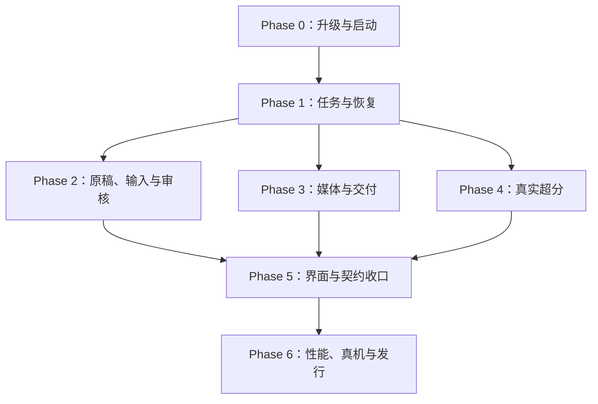

# LocalDramaStudio 代码审查报告与分阶段实施方案

**审查日期：2026-09-21。** 适用仓库：`Qioooba/local_drama_studio`。固定版本：`a1cd6acce39621381a92ebbbfc25bf5b7955703d`（北京时间 2026-09-21 20:18:28）。本报告用于交给 AI 分阶段开发；本次只做审查、隔离验证和方案设计，没有修改、推送仓库代码或操作用户的生产数据库。

## 1. 总体结论

**项目已经有实际可执行的短剧生产系统，但当前版本还不能认定为“稳定的一键原稿到整部成片交付”。最先需要解决的是升级数据保全、干净安装、任务真实终态与恢复、人工选择保护、媒体规格验收。继续堆叠入口或扩大自动生成规模，会放大这些问题。**

代码中已经存在真实的模型调用、Job/Attempt/Artifact、依赖与租约、生产会话、临时资产、关键帧/视频选择、音轨和时间线冻结、FFmpeg 合成、人工批准、超分版本与交付清单。它们值得保留。问题主要出现在这些机制的交界：不同服务各自判断成功、暂停、当前输入和有效批准，正常流程与恢复流程又没有消费同一份业务结果。[生产会话](https://github.com/Qioooba/local_drama_studio/blob/a1cd6acce39621381a92ebbbfc25bf5b7955703d/apps/api/local_drama/application/production_sessions.py)、[任务服务](https://github.com/Qioooba/local_drama_studio/blob/a1cd6acce39621381a92ebbbfc25bf5b7955703d/apps/api/local_drama/application/jobs.py)、[时间线与交付](https://github.com/Qioooba/local_drama_studio/blob/a1cd6acce39621381a92ebbbfc25bf5b7955703d/apps/api/local_drama/application/timeline.py)。

本次确认的三个发布/安装阻断尤其明确：

- **0100 升级会丢生产会话子数据。** 不仅最小 SQLite 用例能复现，完整维护入口也将 `session/item=1/1` 升级成 `1/0`，同时升级、演练和 integrity check 全部判 PASS。外键级联删除是合法数据库操作，普通完整性检查发现不了业务数据消失。
- **按仓库锁文件干净安装后 API 不能启动。** 新代码顶层导入 `pypdf`，三个锁文件却未包含它。实际 `import local_drama.main` 报 `ModuleNotFoundError`。手动补装后才具备继续运行定向测试的条件。
- **发行组装 smoke 的版本资源与上下文不完整。** 原顺序在放入版本文件前导入应用；只提前复制文件也不够，还要设置与正式运行一致的发行上下文。按实际 payload 布局的子进程复现了失败与修正条件；未宣称运行了完整 Windows 安装包构建。

这些问题及其余条目的代码位置、触发条件、复现和验收要求在“详细问题”章节展开。不要只修界面文案、扩大重试次数或放松 QC 来让流程看起来通过。

仓库自身的最新交接也没有宣称全部完成：原稿到整部待审还有关键帧分波阻塞，已提交证据未证明完成真实 24 小时运行；超分状态明确为 `CODE_IMPLEMENTED_REAL_NCNN_UAT_PENDING`；发行 readiness 为 `IN_PROGRESS`。这些判断限于固定版本可见的源码和已提交证据，没有检查用户当前现场进程。本报告与这些边界一致，并补充了独立代码与行为验证。[一键生产交接](https://github.com/Qioooba/local_drama_studio/blob/a1cd6acce39621381a92ebbbfc25bf5b7955703d/docs/gpt/LocalDramaStudio_一键生产实现交接_2026-09-21.md)、[超分实施状态](https://github.com/Qioooba/local_drama_studio/blob/a1cd6acce39621381a92ebbbfc25bf5b7955703d/docs/plan/episode-delivery-upscale-2026-09-21/implementation-status.md)、[发行状态](https://github.com/Qioooba/local_drama_studio/blob/a1cd6acce39621381a92ebbbfc25bf5b7955703d/docs/evidence/g10/release-readiness-2026-09-21.json)。

### 1.1 如何使用这份报告

1. 先执行 **Phase 0**，解决升级数据丢失和干净安装。已有数据的测试必须在备份副本上执行。
2. 按 **Phase 1 → Phase 2/3/4 → Phase 5 → Phase 6** 推进。每个阶段内部拆成小 PR，先补能证明问题的测试，再修实现。
3. 每个问题保留稳定编号，例如 `PIPE-01`、`S2`、`UPS-03`。提交说明和验收回执注明修了哪些编号。
4. 阅读某一 Phase 时，同时把该阶段引用的问题详细章节交给 AI。不要只给一句“按报告优化”。
5. 修复时重新确认工作分支版本。若代码已经变化，先复现再决定是否仍需修改；不能把本报告中的旧行号当成当前版本绝对位置。

### 1.2 证据等级和优先级

| 标记 | 含义 | 允许得出的结论 |
|---|---|---|
| E1：完整应用或真实媒体验证 | 实际 API/维护入口、当前迁移数据库，或原 FFmpeg 方法处理真实合成媒体 | 该限定条件下的错误已发生；不代表真实 GPU 全流程也已测试 |
| E2：原函数隔离复现 | 提取固定版本原函数，使用最小 SQLite/确定性边界替身；前端使用真实组件和受控 API | 被测状态、查询或 UI 行为已确认；不外推为完整现场端到端 |
| E3：源码调用链确认 | 已核对入口、调用者、数据结构和后果 | 条件缺陷有直接代码依据；报告注明尚未实际执行的环境条件 |
| B：边界/改进/待验证风险 | 明确功能上限、性能复杂度或需要现场证明的风险 | 不能写成已经发生的数据损坏、OOM、真实生成失败或全量测试失败 |

P0 为数据损失等需要最先阻断的问题；P1 为主流程不可用、结果错误或重要控制约束失效；P2 为有条件的功能缺陷、展示错误、门禁或性能改进。严重性是本次结合本地短剧生产目标作出的判断。

## 2. 提交范围与审查覆盖

主范围采用**北京时间 2026-09-14 00:00 至 2026-09-21 最新提交**，默认分支 `main`，共 **14 个提交、278 个去重变更路径**。主比较基线为 `58db7f9bbfb1f993c02fe17959978262fc58f08b`。另外追溯 9 月 13 日紧邻的 4 个提交以判断旧缺陷和新接入问题；没有将所有现存问题都归因于 9 月 21 日新增代码。[主范围比较](https://github.com/Qioooba/local_drama_studio/compare/58db7f9bbfb1f993c02fe17959978262fc58f08b...a1cd6acce39621381a92ebbbfc25bf5b7955703d)。

最新 `a1cd6ac` 单次涉及 **222 个文件**，GitHub 原始统计为增加 163,028 行、删除 107,514 行。这包含生成文件和大面积格式变化，不能视为同等数量的新业务逻辑。例如 `local_llm.py` 与前一提交在标准化换行后只有 12 行增删差异，而原始变更统计为 5,702；`timeline.py` 标准化后的差异为 590 行，原始统计 7,744。建议后续把格式调整、生成快照和行为变更分开提交，降低真实问题被大差异掩盖的概率。[最新提交](https://github.com/Qioooba/local_drama_studio/commit/a1cd6acce39621381a92ebbbfc25bf5b7955703d)。

审查覆盖包括：全量提交及变更路径清单；六条核心代码链；API/数据库/前端交界；依赖、迁移、生成契约、发行与 UAT 证据。获取了固定版本的 943 个后端、迁移、测试与脚本文件供交叉检索和执行，并对全部 460 个后端源文件执行类型检查。完整路径清单放在附录。**“清单全量覆盖”“核心调用链深审”“测试实际执行”是不同覆盖口径，不声称对所有生成文本逐字人工审读，也不声称所有平台与真实模型已运行。**

新增的参考代码 ZIP 也检查了目录与文本内容：其中是草稿协调器参考实现、实施任务书和独立参考测试结果；结果明确写了应用集成未测试。它不是运行时源码，不能替代当前应用集成验收。

| 北京时间 | 提交 | 变更文件数 | 内容 |
|---|---|---:|---|
| 09-21 20:18:28 | [a1cd6ac](https://github.com/Qioooba/local_drama_studio/commit/a1cd6acce39621381a92ebbbfc25bf5b7955703d) | 222 | 生产会话、超分交付及相关全链路变更 |
| 09-16 00:01:21 | [04829fe](https://github.com/Qioooba/local_drama_studio/commit/04829fec584a9691fbb29b29e895cc248727a5c6) | 22 | 草稿协调、资产幂等、任务重试反馈 |
| 09-14 20:15:30 | [791b3c4](https://github.com/Qioooba/local_drama_studio/commit/791b3c48aa66f15b23cf024ffd1d29c943a7055d) | 24 | 模型配置及运行修复，现场验收记录 |
| 09-14 01:49:41 | [253b7aa](https://github.com/Qioooba/local_drama_studio/commit/253b7aadc4214e2694711c750a405e8d115e2798) | 2 | 第二轮UAT/对标审核收口文档 |
| 09-14 01:34:10 | [e253fb9](https://github.com/Qioooba/local_drama_studio/commit/e253fb948d8988fa3d80a2df29a257ccfa7d92b8) | 1 | 审核清单受控状态测试等待 |
| 09-14 01:32:05 | [8bb3dcd](https://github.com/Qioooba/local_drama_studio/commit/8bb3dcd6384425b598f4f6e262e5360e36a3ec05) | 1 | 音频受控输入测试等待 |
| 09-14 01:10:51 | [2606fb7](https://github.com/Qioooba/local_drama_studio/commit/2606fb7ae53a863c7f90812dc12b03d590b4561c) | 1 | 范围化UX交付记录 |
| 09-14 01:10:50 | [525aa10](https://github.com/Qioooba/local_drama_studio/commit/525aa100dc8b3388c72096df4ba037ff8d5b35f1) | 2 | 项目事件刷新分集事实 |
| 09-14 01:07:35 | [3232e0c](https://github.com/Qioooba/local_drama_studio/commit/3232e0c3cb5c118be6f1cc2d89aa1949b1506683) | 5 | 导演台稳定资产引用 |
| 09-14 01:05:40 | [aa92300](https://github.com/Qioooba/local_drama_studio/commit/aa92300deca7e24a24e00d167b3cd6dca6b78382) | 7 | 分集任务生成客户端集成 |
| 09-14 00:58:39 | [5d40c2b](https://github.com/Qioooba/local_drama_studio/commit/5d40c2b111029d11f68b697dd0a1f81110215748) | 16 | 分集事实与任务抽屉 |
| 09-14 00:58:38 | [2bb2d27](https://github.com/Qioooba/local_drama_studio/commit/2bb2d27ce6525a565da1977c26f55a992a9ef752) | 9 | 资产就绪与分组回执 |
| 09-14 00:58:38 | [765d26c](https://github.com/Qioooba/local_drama_studio/commit/765d26c1545ecf8e5940f6c1f8d4f550c4b4fbac) | 4 | 并发草稿所有者保护 |
| 09-14 00:57:29 | [fb37211](https://github.com/Qioooba/local_drama_studio/commit/fb37211a1fb1a4ed302855be9baca1f24abac978) | 22 | 操作预检与持久执行绑定 |

## 3. 功能到底实现到什么程度

| 功能 | 当前判断 | 主要缺口/应保留的边界 |
|---|---|---|
| 原稿导入、分集拆解 | 有实际解析和流水线 | PDF 依赖漏锁；长文覆盖证据与分段质量汇总错误，见 Q02/G1/G2 |
| 长篇小说自动做完整部 | 有界处理和 resume 元数据已实现 | 每批最多 60 集、单集输入 24,000 字符；自动续批和 FULL 覆盖闭环仍需补，见 PIPE-07 |
| 生产会话持久化 | 已实现父会话、分集项、启动与推进 | 升级保全、父子恢复与晚回调写权需修，见 Q01/S1/S7 |
| 分波自动补关键帧 | 接口和调度已接通，行为存在阻塞 | 后波可能重复第一镜，见 PIPE-01 |
| 本地 LLM、Comfy、TTS、视频执行 | 有真实调用、文件登记和验证路径 | 本次没有真实 GPU 推理效果认证；不能把整个项目说成 mock |
| 临时角色/场景资产与三视图 | 生成与会话输入链已实现 | 自动回调可能覆盖人工草稿；人工纠错到另一资产无后续闭环，见 S4/S5 |
| 角色视觉一致性 | 有输入引用、身份快照和 hash 约束 | 这些证明输入身份，不能证明每帧脸、服装、道具都正确；需要最终人工/模型质检 |
| 自动“挑最好候选” | 有确定性选择 | 当前按批次/候选序号等规则，不是视觉质量评审；应准确命名，不应宣传已实现智能审片 |
| 换候选与局部返工 | 视频候选重合成路径存在 | 关键帧换选会被后续检查覆盖；资产重映射和最小镜头修复需补，见 S2/S5 |
| 暂停、取消、重试、重启恢复 | 正常路径存在 | 租约恢复复活任务、恢复漏依赖、通用 retry 绕过检查点，见 PIPE-02/04/05 |
| 长时间运行与预算 | 有预算投影、等待和扩容 | 主图、三视图、TTS 等入口缺统一原子额度预留，见 S6；24 小时现场验收尚未完成 |
| 集中审核、最后确认 | 有聚合与正式批准检查 | MEDIA_VERSION 的历史批准可越过新拒绝；资源等待和最终待审混淆，见 S3/S8 |
| 时间线、TTS、BGM、字幕 | 真实冻结与 FFmpeg 合成已实现 | 非循环音轨越界；部分旧时间线布局被错误串接，见 G3/G4 |
| 模型原声默认控制 | 已有新修复 | V6 默认关闭模型原声、字幕烧录/横竖方向门禁应保留；不要重复恢复旧行为 |
| 超分配置、样片、批次、正式采用 | 主体代码与数据库已实现 | 标准模型布局、SAR、设备、预检更新和控制恢复仍有缺陷，见 UPS 系列 |
| 普通成片与超分交付 | 有真实文件与 manifest | 普通 COMPOSE 规格不符仍 VERIFIED；历史包/音轨来源有错配，见 G5/G6/UPS-06 |
| 草稿保护、批量资产请求幂等 | 近期有真实改进 | 新版草稿协议、版本校验、批量请求身份值得保留；旧协议边界、重试未知回执和计划失效仍需检查 |
| 发布和回归 | 有大量测试与演练脚本 | 干净安装和非空库迁移盲区；当前严格类型门禁未通过；现有有限 UAT 不能代表最终发行完成 |

矩阵的依据是下文逐项代码证据及仓库的[一键生产交接](https://github.com/Qioooba/local_drama_studio/blob/a1cd6acce39621381a92ebbbfc25bf5b7955703d/docs/gpt/LocalDramaStudio_一键生产实现交接_2026-09-21.md)、[超分实施状态](https://github.com/Qioooba/local_drama_studio/blob/a1cd6acce39621381a92ebbbfc25bf5b7955703d/docs/plan/episode-delivery-upscale-2026-09-21/implementation-status.md)。不建议给一个“已完成 90%”之类的主观总百分比：一次有数据升级、一处失败恢复或一条错误规格交付都足以破坏用户主要目标。

## 4. 详细问题、代码位置与实现要求

每个问题保留来源、触发条件、修复设计与验收。已存在于基线的问题明确视为当前遗留问题；新文件接入的缺陷和旧服务被新入口放大的问题分别说明。后续 Phase 章节是统一实施顺序。

### 4.0 问题与阶段索引

共有45个带编号条目；PIPE-07/08、G7等明确包含功能边界、性能或架构风险，不能将全部条目都计成已实测BUG。前端另有4个补充核验项。

| 编号 | 内容 | Phase |
|---|---|---|
| Q01 | P0：0100 迁移会删除已有生产会话子事实 | 0 |
| Q02 | P1：PDF依赖没有进入任何锁文件，干净安装/发行API无法启动 | 0 |
| Q03 | P2：完整门禁会先重写OpenAPI快照，弱化“已提交快照一致”测试 | 5 |
| Q04 | P2：新数据库端口与服务构造仍不闭合，Windows严格类型门禁失败 | 5 |
| Q05 | P1：发行组装smoke读取版本身份的时序与环境错误 | 0 |
| PIPE-01 | 关键帧分波没有按候选缺口派发 | 1 |
| PIPE-02 | 租约恢复覆盖取消/暂停意图 | 1 |
| PIPE-03 | 末尾动作业务失败仍被标整条成功 | 1 |
| PIPE-04 | 普通重试可以跳过人工检查点 | 1 |
| PIPE-05 | 恢复遗漏已经派出的异步子任务依赖 | 1 |
| PIPE-06 | 草案取消被重写为失败 | 1 |
| PIPE-07 | P2功能边界：长篇自动续批仍未形成产品闭环 | 2 |
| PIPE-08 | P2架构风险：Job下的重试共用文件路径，历史Artifact证据不够稳定 | 6 |
| S1 | P1：恢复非配置型人工门禁后，子run运行而父分集永远BLOCKED | 1 |
| S2 | P1：换过的关键帧会在重建时被系统改回原候选 | 2 |
| S3 | P1：集中确认允许引用已被较新拒绝替代的旧媒体批准 | 2 |
| S4 | P1：机器三视图收尾会覆盖用户正在编辑的身份包草稿 | 2 |
| S5 | P1：正确纠正临时资产到另一个正式资产后，审核与返工进入死路 | 2 |
| S6 | P1：生产预算和GPU窗口只覆盖部分入口，不能作为统一投放上限 | 1 |
| S7 | P1（取消时序条件）：取消后的晚到三视图回调仍写全局资产，并把CANCELLED分集改为BLOCKED | 1 |
| S8 | P2：普通机器等待被审阅API误投影成“阻塞，需要重合成” | 2 |
| G1 | P1：长文遗漏剧情被自动补写“来源编号”，覆盖校验失真 | 2 |
| G2 | P2：长文分段合并丢失置信度、待确认问题，读取错误的 grounding 字段 | 2 |
| G3 | P1：非循环音轨不按 end_us 截断，声音会越过编辑区间 | 3 |
| G4 | P2：公开时间线接口接受重叠/空隙，渲染却只是顺序串接再截总时长 | 3 |
| G5 | P2（本窗口新增）：静音成片的交付清单会把后来加入的当前BGM写成冻结输入 | 3 |
| G6 | P1：普通 COMPOSE 成片交付没有验证目标分辨率和帧率，规格不符仍 VERIFIED | 3 |
| G7 | 性能改进：交付验证按整文件读内存，并在每次验证时再复制完整视频做损坏自测 | 6 |
| UPS-01 | P1：默认 AnimeVideoV3 Profile 无法接入标准上游模型目录，模型指纹也覆盖错了文件 | 4 |
| UPS-02 | P1：预检过期或暂时阻塞后，同样参数永久复用旧计划，无法重新检查 | 4 |
| UPS-03 | P1：854×480 等预设明确支持的几何会在真实 FFmpeg 编码后被自己的 SAR QC 拒绝 | 4 |
| UPS-04 | P2：配置并验证 GPU 1，正式任务与样片仍总使用 GPU 0 | 4 |
| UPS-05 | P1：批次暂停/取消先落参与状态、后控制 Job，失败或崩溃后重放不能补做 | 1 |
| UPS-06 | P2：批量交付查询把包 A 的 ID 与包 B 的路径、状态、manifest 混在一起 | 3 |
| UPS-07 | P2：NVENC 配置可以预检 READY，执行到推理后才必然拒绝 | 4 |
| UPS-08 | P2（性能）：每一分块都从头解码整集，分块数越多重复扫描越多 | 4 |
| UPS-09 | P2：逐集 override 可以把已验证模型名/倍率换成另一个未经当前 Profile 验证的组合 | 4 |
| UPS-10 | P2：低分辨率一集可以让整个来源分页接口失败 | 4 |
| F01 | 审核/交付预检计划未绑定当前页面选择，切换分集后仍能批准旧分集 | 5 |
| F02 | 新建→启动的两段操作没有可恢复命令记录，丢回执后可能重复创建会话 | 5 |
| F03 | 超分页覆盖用户已保存的项目默认参数 | 5 |
| F04 | 任务重试结果未知后，即使新的失败尝试已确认，按钮仍不能再次重试 | 5 |
| F05 | 整剧入口分页消费未闭合，大于页面上限的分集无法完整在该工作区处理 | 5 |
| F06 | 资产 @ 引用键盘导航索引越界 | 5 |
| COV-01 | P2：首页把合法超分交付判为需要更新 | 3 |

### 4.1 升级、依赖、发行与工程门禁

#### Q01 / P0：0100 迁移会删除已有生产会话子事实

已用仓库锁定的 Alembic 1.19.1、SQLAlchemy 2.0.51 与 Python 3.12.14 实测复现。

- [apps/api/alembic/versions/0100_production_session_waiting_user.py:13–20](https://github.com/Qioooba/local_drama_studio/blob/a1cd6acce39621381a92ebbbfc25bf5b7955703d/apps/api/alembic/versions/0100_production_session_waiting_user.py#L13-L20) 用 `batch_alter_table(production_sessions, recreate='always')` 替换状态 CHECK。
- [apps/api/alembic/env.py:33–42](https://github.com/Qioooba/local_drama_studio/blob/a1cd6acce39621381a92ebbbfc25bf5b7955703d/apps/api/alembic/env.py#L33-L42) 明确打开 `PRAGMA foreign_keys=ON`，没有围绕该父表重建的保护。
- [0096_production_sessions.py](https://github.com/Qioooba/local_drama_studio/blob/a1cd6acce39621381a92ebbbfc25bf5b7955703d/apps/api/alembic/versions/0096_production_sessions.py) 的 items、choices、job_links 都以 CASCADE 引用 session，`0098` identity_inputs 与 `0099` asset_inputs 也相同。
- Alembic batch rebuild 会复制父行、DROP 原父表、rename 临时表；DROP 触发 SQLite ON DELETE CASCADE。原 session 被复制回来，子事实已被删。
- [entrypoints/maintenance.py:178–190,225-240](https://github.com/Qioooba/local_drama_studio/blob/a1cd6acce39621381a92ebbbfc25bf5b7955703d/apps/api/local_drama/entrypoints/maintenance.py#L178-L190) rehearsal 与实际升级只验证 `integrity_check` 和 migration head。级联删除是合法 SQL，因此这两个指标仍可以 PASS，不能证明业务数据保全。

实际最小复现：本节对应的隔离复现 执行原样0096、0100迁移函数，SQLite内存库 FK=1。升级前 production_sessions=1 / production_session_items=1；升级后1/0；integrity_check='ok'、foreign_key_check=[]。这不是完整产品数据库迁移测试，而是相同真实迁移函数和SQLite外键设置的最小数据丢失复现。

**随后已补完整维护链路复现**：本节对应的隔离复现用全部真实Alembic迁移升级到0099，在临时实例通过真实ProjectService创建项目/分集、真实ProductionSessionService创建会话及item，再调用当前正式`maintenance.upgrade_database`。升级前session/item=1/1，升级后1/0；project与episode仍为1，`upgrade_status=PASS`、`rehearsal_status=PASS`、`integrity=ok`、head0100。完整输出在quality_migration_full.log。此结果已经证明正式维护流程真实丢数据且误判PASS，不再只是最小复现。

修复建议 Phase 0：

1. 把“升级保护”置于 Runtime Host / Maintenance / Alembic env 的统一执行路径，保证所有从旧版本进入0100的路径得到保护。仅追加0101不能救从0099途经0100已丢失的行。
2. 在隔离备份副本上、持有维护锁并排空Worker后执行父表重建；SQLite FK开关必须在事务开始之前生效，不能在已开始事务内简单PRAGMA OFF。完成后恢复FK、执行foreign_key_check。
3. 附加业务保全断言：六张session相关表的主键集合、行数、关键引用与内容摘要，迁移后除明确允许的字段外必须一致。随后才切换候选数据库/发布。
4. 已经过0100且出现子事实缺失的实例，需基于pre_migration备份提供只读差异报告及专门恢复方案；不要假装新增迁移能重造已丢数据，也不要覆盖升级后新产生业务。
5. 新增带真实0099 session/item/choice/joblink/identity/asset数据的升级回归，覆盖RUNNING/PAUSED/WAITING_REVIEW，断言升级后WAITING_USER可写且所有旧数据一致。当前常见pytest database fixture直接迁移空库，因此不会触发这个缺陷。

#### Q02 / P1：PDF依赖没有进入任何锁文件，干净安装/发行API无法启动

- `apps/api/pyproject.toml:17` 已声明 `pypdf>=5,<7`。
- `apps/api/requirements.lock`、`apps/api/requirements-runtime.lock`、`apps/api/uv.lock` 都没有pypdf。
- [apps/api/local_drama/application/documents.py:18](https://github.com/Qioooba/local_drama_studio/blob/a1cd6acce39621381a92ebbbfc25bf5b7955703d/apps/api/local_drama/application/documents.py#L18) 在模块顶层 `from pypdf import PdfReader`，不是PDF操作时的可选导入。
- [api/routes/imports.py:20](https://github.com/Qioooba/local_drama_studio/blob/a1cd6acce39621381a92ebbbfc25bf5b7955703d/apps/api/local_drama/api/routes/imports.py#L20) 导入DocumentImportService；[main.py](https://github.com/Qioooba/local_drama_studio/blob/a1cd6acce39621381a92ebbbfc25bf5b7955703d/apps/api/local_drama/main.py)在顶层注册imports等路由，所以损害范围是API启动，而非仅PDF按钮。
- README安装命令只装两个requirements锁。[packaging/common/build_release.py:225](https://github.com/Qioooba/local_drama_studio/blob/a1cd6acce39621381a92ebbbfc25bf5b7955703d/packaging/common/build_release.py#L225)只装runtime.lock，再复制源码；`:234-235` smoke只导入local_drama包根，没有导入main，因此可以漏检真实路由依赖。
- [tests/test_document_formats.py:9–28](https://github.com/Qioooba/local_drama_studio/blob/a1cd6acce39621381a92ebbbfc25bf5b7955703d/apps/api/tests/test_document_formats.py#L9-L28)只mock PdfReader测试文本进入管线，现有开发机已有pypdf时能绿，但不验证发行依赖闭包或真正PDF解析。

已执行：创建完全隔离venv，按README同时安装两个锁文件，安装成功。用该解释器执行原样documents.py，真实报 `ModuleNotFoundError: No module named 'pypdf'`，位于第18行。完整460个应用源码到位后，执行 `import local_drama.main`，沿 main.py:19 → asset_bible.py:37 → service_composition.py:16 → documents.py:18，再次复现同一异常。仅在隔离venv补装pyproject允许的pypdf6.19.0后，main导入成功。

修复建议 Phase 0：选择一个依赖权威（例如pyproject+uv.lock），自动导出生产/开发requirements，更新wheelhouse和SBOM；建立锁一致性检查，不手改三份版本。发行smoke必须用被打包的私有解释器，在只有payload目录的隔离环境实际 `import local_drama.main`、建立应用、空库升级、健康检查，并添加一份真实最小PDF的导入验收。

#### Q03 / P2：完整门禁会先重写OpenAPI快照，弱化“已提交快照一致”测试

[scripts/check.ps1:21–24](https://github.com/Qioooba/local_drama_studio/blob/a1cd6acce39621381a92ebbbfc25bf5b7955703d/scripts/check.ps1#L21-L24)先执行generate_client.py，之后才跑API测试；[tests/test_openapi_release_contract.py:11–13](https://github.com/Qioooba/local_drama_studio/blob/a1cd6acce39621381a92ebbbfc25bf5b7955703d/apps/api/tests/test_openapi_release_contract.py#L11-L13)比较已生成文件与app.openapi。若只提交后端路由、忘记提交生成文件，完整check可以在本地先修好文件再PASS。建议为generator加入`--check`（生成至临时目录并比较，失败非零退出），CI使用只读check；开发者保留显式generate命令。或至少生成后`git diff --exit-code -- docs/openapi/openapi.json apps/web/src/generated/api.ts`。此项只是门禁弱点；本次从固定HEAD blob读取1.68MB已提交OpenAPI文件，不运行生成器，直接运行test_openapi_release_contract.py，2项测试均通过，说明当前快照与注册路由一致，不能报当前API失配。

#### Q04 / P2：新数据库端口与服务构造仍不闭合，Windows严格类型门禁失败

完整460个应用Python源文件、仓库锁定mypy1.20.2、原pyproject strict配置：Linux默认平台105 errors/29files；为排除ctypes.WinDLL等平台声明差异，补跑`mypy --platform win32`仍93 errors/27files。没有对所有历史代码做旧SHA基线，因此不能称93条都是本轮新增。

按本窗口commit_manifest中的added文件核对，有22条错误位于6个新增文件：production_sessions.py、production_session_review.py、production_choices.py、production_identity_inputs.py、production_session_runner.py、ncnn_video_upscale_execution.py。这是新增代码未达到自身strict gate的确证。

代表：[application/ports/database.py:15–18](https://github.com/Qioooba/local_drama_studio/blob/a1cd6acce39621381a92ebbbfc25bf5b7955703d/apps/api/local_drama/application/ports/database.py#L15-L18)只声明sqlite3.Connection形式的DatabaseUnitOfWork；[production_session_runner.py:54–60](https://github.com/Qioooba/local_drama_studio/blob/a1cd6acce39621381a92ebbbfc25bf5b7955703d/apps/api/local_drama/application/production_session_runner.py#L54-L60)接受该Protocol，却直接构造仍只接受具体Database的EpisodeProductionRunService/AutomationWorkflowService，`:148,:380`其他Service同类；production_identity_inputs.py:542,687,746,860,945,1083,1104,1195亦如此。当前实际传入Database不一定运行时报错，准确问题是抽象未贯通、替换seam不能按声明成立、strict门禁确实失败。还有多处fetchone/动态facts的Any越过声明返回类型（sessions.py:336等；ncnn_execution.py:612-621）。

Phase 5建议（统一阶段编号）：先检查每个旧Service所需数据库成员，仅用connect/transaction的统一接受端口；需要path/backup等运维能力的留在基础设施或单独明确端口。通过现有service_composition注入业务协作者，避免runner内部重复new；不扩建另一套框架。逐步在查询边界把Row/None与结构化结果归一化，使用TypedDict/dataclass为生产会话、冻结超分facts建立稳定内部合同，保持窗口内新增文件strict零错误；禁止用整段Any/ignore或降低strict掩盖。

#### Q05 / P1：发行组装smoke读取版本身份的时序与环境错误

这是当前源码缺陷，未证明是本审计窗口引入，必须与新增缺陷分开标注。

- [packaging/common/build_release.py:227–239](https://github.com/Qioooba/local_drama_studio/blob/a1cd6acce39621381a92ebbbfc25bf5b7955703d/packaging/common/build_release.py#L227-L239)复制应用后立刻用私有Python执行 `import alembic, fastapi, local_drama, sqlalchemy, uvicorn`，validation_environment只补了PYTHONPATH。
- 同文件`:261`才复制`payload/version.json`。
- [apps/api/local_drama/__init__.py:3–5](https://github.com/Qioooba/local_drama_studio/blob/a1cd6acce39621381a92ebbbfc25bf5b7955703d/apps/api/local_drama/__init__.py#L3-L5)导入包时立即load_build_identity；[bootstrap/build_identity.py:19–32](https://github.com/Qioooba/local_drama_studio/blob/a1cd6acce39621381a92ebbbfc25bf5b7955703d/apps/api/local_drama/bootstrap/build_identity.py#L19-L32)缺文件直接RuntimeError。
- [bootstrap/resource_locator.py:33–42,106-109](https://github.com/Qioooba/local_drama_studio/blob/a1cd6acce39621381a92ebbbfc25bf5b7955703d/apps/api/local_drama/bootstrap/resource_locator.py#L33-L42)无LOCAL_DRAMA_RELEASE_ROOT/LOCAL_DRAMA_PACKAGED环境时按源码目录猜release；在payload/app/local_drama布局下落到packageRoot/release/version.json，并非payload/version.json。因此仅把copy提前仍不够。
- Windows与Linuxbuild wrapper均未设置这两个运行上下文变量。

已按真正payload目录复制当前完整local_drama源码，隔离子进程分别验证：当前smoke顺序→exit1，提前copy version但仍原env→exit1，提前copy且设PACKAGED=1/RELEASE_ROOT=payload/独立INSTANCE_ROOT→exit0输出0.1.0。脚本reproduce_packaged_identity.py，日志quality_packaged_identity.log。此为组装smoke的真实复现，没有完成完整Windows/Inno/签名发行构建。

Phase 0修复：先复制版本、合同、迁移等启动必要资源，再设置与Runtime Host一致的release/instance上下文运行包内解释器；清理继承的开发实例环境，避免CI碰巧从开发源码读到version而掩盖问题。结合Q02把smoke提升到main/health/空库维护；正式发行最后需Windows与Linux独立构建并对可搬迁目录做启动检查。


### 4.2 流水线、Job、Worker与恢复

#### PIPE-01：关键帧分波没有按候选缺口派发

##### 触发与影响

两镜头、`candidate_count=1`、`dispatch_shots_per_tick=1`，计划生成两个关键帧波次。第一波给第一镜产生成功候选；第二波时还没执行 `KEYFRAME_CHECK`，没有人工批准或 session temporary choice，因此又从第一镜开始提交，第二镜没有候选。固定波次数用完后进入关键帧检查/视频阶段，被 `SESSION_KEYFRAME_CANDIDATE_REQUIRED` 阻塞。

更多镜头时，这不是单次多花一张图的问题：批次数是按理论任务数预展开的，重复会消耗全部波次数，后面的镜头永远没分到生成机会。

##### 代码证据

- [[episode_worker_actions.py](https://github.com/Qioooba/local_drama_studio/blob/a1cd6acce39621381a92ebbbfc25bf5b7955703d/apps/api/local_drama/application/episode_worker_actions.py) 98–116](https://github.com/Qioooba/local_drama_studio/blob/a1cd6acce39621381a92ebbbfc25bf5b7955703d/apps/api/local_drama/application/episode_worker_actions.py#L98-L116)：`covered` 只含 `approved_keyframes_for_shots` 和 `session_keyframes_for_shots`，没有已生成、当前有效的候选。
- [同文件 153–161](https://github.com/Qioooba/local_drama_studio/blob/a1cd6acce39621381a92ebbbfc25bf5b7955703d/apps/api/local_drama/application/episode_worker_actions.py#L153-L161)：不同 `task_id` 给不同 idempotency key，因此 wave 2 不会复用 wave 1 批次。
- [[shot_keyframe_generation.py](https://github.com/Qioooba/local_drama_studio/blob/a1cd6acce39621381a92ebbbfc25bf5b7955703d/apps/api/local_drama/application/shot_keyframe_generation.py) 74–77](https://github.com/Qioooba/local_drama_studio/blob/a1cd6acce39621381a92ebbbfc25bf5b7955703d/apps/api/local_drama/application/shot_keyframe_generation.py#L74-L77)：`_next_candidate_indices` 明确 `del completed; return range(1, requested + 1)`，这是用户再次点击重画的合理语义。
- [同文件 617–624](https://github.com/Qioooba/local_drama_studio/blob/a1cd6acce39621381a92ebbbfc25bf5b7955703d/apps/api/local_drama/application/shot_keyframe_generation.py#L617-L624)：`max_jobs` 每次截取 ready 列表前 N 项。
- [[episode_production_runs.py](https://github.com/Qioooba/local_drama_studio/blob/a1cd6acce39621381a92ebbbfc25bf5b7955703d/apps/api/local_drama/application/episode_production_runs.py) 1125–1137](https://github.com/Qioooba/local_drama_studio/blob/a1cd6acce39621381a92ebbbfc25bf5b7955703d/apps/api/local_drama/application/episode_production_runs.py#L1125-L1137)：生成波次数在开始时按总镜头×候选数预计算，随后不会因为重复覆盖而补足缺失镜头。
- 仓库交接 [`LocalDramaStudio_一键生产实现交接_2026-09-21.md` §6](https://github.com/Qioooba/local_drama_studio/blob/a1cd6acce39621381a92ebbbfc25bf5b7955703d/docs/gpt/LocalDramaStudio_一键生产实现交接_2026-09-21.md) 明确记录“两次真实Job都为第一镜头生成候选”、补丁未应用。HEAD 与交接结论一致。

##### 独立复现结果

`keyframe_waves.actual_dispatches == [["shot1"], ["shot1"]]`，期望 `[["shot1"], ["shot2"]]`。探针执行了真实 `keyframe_generation` 和真实 `_next_candidate_indices`，只把批次持久化替成 test double。

##### 修复设计

1. 在自动化入口增加 `plan_keyframe_deficit(...)`，以 `shot_id + shot_revision/input_fingerprint + profile_version_id + frame_role + session` 为当前输入身份，统计 eligible 当前候选。
2. 合并已验证媒体与 `Job SUCCEEDED + VERIFIED Artifact + non-stale GenerationVariant` 证据，按 variant 去重，覆盖 Job 完成与媒体提升之间的窗口；不要把同一 variant 在两种证据中算两次。
3. `needed = max(0, target_count - valid_count - compatible_in_flight_count)`，只为缺口镜头创建候选槽位。活动子 Job 作为后续依赖返回，不另投一次。
4. 不直接修改通用 `_next_candidate_indices` 的手动“再画一版”语义。自动化 planner 需要独立 `FILL_MISSING` intent，交互式 `NEW_TAKE/REDRAW` 保持显式新增。
5. 稳定幂等身份用 `session/run + shot + input_fingerprint + role + logical_slot`；波次仅做容量调度，不能改变同一逻辑候选的身份。
6. 从固定波次列表逐步改成“有缺口则追加一个有界 dispatch task，无缺口再转 KEYFRAME_CHECK”，或者至少在最后波次执行 deficit 断言并返回明确待续状态。避免波次数与真实可用输入脱节。

##### 验收

- 2镜头×1候选×每波1 Job，只提交两个不同镜头；10镜头×3候选×每波2 Job，每个当前候选槽只生成一次。
- 已有合法候选、无人工批准/临时 choice 时，下一波仍正确复用。
- Job成功、Artifact已VERIFIED、媒体尚未提升，下一波不得重复。
- stale/换prompt/换revision后正确新生成，不错误复用旧候选。
- 同一task重试和两个worker并发推进不增加同槽Job；手工重画仍产生新seed、新版本。

#### PIPE-02：租约恢复覆盖取消/暂停意图

##### 触发与影响

执行任务时用户取消或暂停，worker尚未正常 `complete` 就退出/崩溃。租约过期恢复把它重新排队，之后继续生成或写正式输出。会话取消不代表所有子任务真的停止。这里不仅是显示错误，还可能恢复用户已经终止的昂贵工作。

##### 代码证据

- [[jobs.py](https://github.com/Qioooba/local_drama_studio/blob/a1cd6acce39621381a92ebbbfc25bf5b7955703d/apps/api/local_drama/application/jobs.py) 1159–1183](https://github.com/Qioooba/local_drama_studio/blob/a1cd6acce39621381a92ebbbfc25bf5b7955703d/apps/api/local_drama/application/jobs.py#L1159-L1183)：reconcile 有 uncertain 和 PAUSED 分支，没有 `CANCEL_REQUESTED/CANCELLED`；普通任务按剩余attempt直接 `QUEUED`。
- [[worker_sessions.py](https://github.com/Qioooba/local_drama_studio/blob/a1cd6acce39621381a92ebbbfc25bf5b7955703d/apps/api/local_drama/application/worker_sessions.py) 297–320](https://github.com/Qioooba/local_drama_studio/blob/a1cd6acce39621381a92ebbbfc25bf5b7955703d/apps/api/local_drama/application/worker_sessions.py#L297-L320)：session恢复查询甚至不选 `j.state/j.next_run_at`，一律根据 provider 和attempt预算决定 QUEUED/NEEDS_ATTENTION。
- [[jobs.py](https://github.com/Qioooba/local_drama_studio/blob/a1cd6acce39621381a92ebbbfc25bf5b7955703d/apps/api/local_drama/application/jobs.py) 759–769](https://github.com/Qioooba/local_drama_studio/blob/a1cd6acce39621381a92ebbbfc25bf5b7955703d/apps/api/local_drama/application/jobs.py#L759-L769) 正常 complete 已正确考虑取消/暂停，说明恢复分支与正常路径不一致。

##### 离线实证

- `JobService.reconcile`: `CANCEL_REQUESTED → QUEUED`。
- `WorkerSessionService.reconcile`: `PAUSED → QUEUED`。
- `WorkerSessionService.reconcile`: `CANCEL_REQUESTED → QUEUED`。
- 全部发生于 max_attempts=3、首个attempt过期、无provider不确定副作用的最简单情况。

##### 修复设计

抽取纯状态决策 `settle_abandoned_attempt(job_state, resume_intent, provider_state, attempt_budget, parent_control_state)`，由 Job lease恢复、WorkerSession恢复、正常complete共同调用。优先保存控制意图：取消永不自动QUEUED；暂停未显式resume永不自动QUEUED；provider受理未知作为独立 `reconciliation_required` 事实保留，不应把取消意图冲掉。要保留未知provider产物可以对账，但对账不能自动重新发起生产。

建立统一 `cancel_in_transaction/pause_in_transaction`，其他服务不要自己手写 state 分类。`automation_workflows.cancel_run` 1062 把无活动attempt的 PAUSED Job分类为CANCEL_REQUESTED，也会产生永远“取消中”的孤立状态；应按有无活动attempt判断而非仅凭枚举。

##### 验收

笛卡尔场景覆盖：RUNNING/PAUSED/CANCEL_REQUESTED × 有/无provider受理 × attempt/session过期 × 有/无resume intent。完成后不可存在可领取的已取消任务；暂停任务重启后保持暂停；旧lease不能提交成功或登记正式产物；不确定provider对账与用户取消同时成立。

#### PIPE-03：末尾动作业务失败仍被标整条成功

##### 触发与影响

session workflow最后一步是 RENDER。没有时间线、FFmpeg业务失败等 `DomainRuleError` 会被包装为一个真实报告：`machine_check.status=FAIL`。报告本身写出成功，因此 controller Job `SUCCEEDED`。此时 `step_run` 进入 `finite_batch_exhausted`，只核对该Job成功，直接把run置SUCCEEDED，没有检查本次报告业务状态。

因此“最后动作Job完成”和“产物完成”混在一起。会话审查已交叉确认：runner把子run SUCCEEDED映射为待审；审阅页面后续另外检查成片缺失，又显示阻塞。这使用户看到“生产完成待审”却拿不到预览，真实render错误也没传回该item。

##### 代码证据

- [[worker_handlers/automation_task.py](https://github.com/Qioooba/local_drama_studio/blob/a1cd6acce39621381a92ebbbfc25bf5b7955703d/apps/api/local_drama/application/worker_handlers/automation_task.py) 5–10](https://github.com/Qioooba/local_drama_studio/blob/a1cd6acce39621381a92ebbbfc25bf5b7955703d/apps/api/local_drama/application/worker_handlers/automation_task.py#L5-L10) 明确声明业务失败返回报告、Job仍成功的设计。
- [同文件 509–521](https://github.com/Qioooba/local_drama_studio/blob/a1cd6acce39621381a92ebbbfc25bf5b7955703d/apps/api/local_drama/application/worker_handlers/automation_task.py#L509-L521)：RENDER_NO_TIMELINE/渲染DomainRuleError转换FAIL报告。
- [[automation_workflows.py](https://github.com/Qioooba/local_drama_studio/blob/a1cd6acce39621381a92ebbbfc25bf5b7955703d/apps/api/local_drama/application/automation_workflows.py) 716–743](https://github.com/Qioooba/local_drama_studio/blob/a1cd6acce39621381a92ebbbfc25bf5b7955703d/apps/api/local_drama/application/automation_workflows.py#L716-L743)：finite_batch已耗尽直接SUCCEEDED，业务检查在后面的779–806，因分支提前结束不会进入。
- [[production_session_runner.py](https://github.com/Qioooba/local_drama_studio/blob/a1cd6acce39621381a92ebbbfc25bf5b7955703d/apps/api/local_drama/application/production_session_runner.py) 616–617、688–689](https://github.com/Qioooba/local_drama_studio/blob/a1cd6acce39621381a92ebbbfc25bf5b7955703d/apps/api/local_drama/application/production_session_runner.py#L616-L617)：子run成功→等待审阅；session 汇总随之 WAITING_REVIEW。

##### 离线实证

给最后一个已经SUCCEEDED的controller Job投递 `machine_status=FAIL, code=RENDER_NO_TIMELINE`，实际run `SUCCEEDED`。同次投递 `produced_bytes=999999`、预算100000，终态run disk_bytes仍为0，说明末动作的字节统计/预算也被跳过。

##### 修复设计

将 `step_run` 拆为三段：①幂等消费完成事件、更新任务业务结果与实际字节；②应用业务失败/检查点/预算规则；③只有业务结果允许且所有必需产物已核验时，选择结束或派发下一任务。最后任务与中间任务走同一结果决策，不因“没有下一任务”跳过失败。

Outcome应有独立字段 `execution_state`（controller是否写出报告）、`business_state`（PASS/BLOCKED/FAIL）、`outputs_ready`、`artifact_refs`。session最后RENDER成功要求当前session的指定timeline产生 VERIFIED render；正式交付另外要求review批准，不把这几个状态混为一个SUCCEEDED。

##### 验收

- 最后RENDER失败、最后DELIVERY失败均不得run SUCCEEDED。
- 成片输出缺失/摘要不符不得 WAITING_REVIEW。
- 最后任务PASS且合法产物存在可以完成；最后合法SKIPPED必须受明确允许的动作规则约束。
- 最后任务字节只计一次；重复完成事件不重复预算累加、不多派发。

#### PIPE-04：普通重试可以跳过人工检查点

##### 用户可触发路径

工作流暂停前先创建下一个task，`approval_required=true`、`approval_status=PENDING`，Job变为 `NEEDS_ATTENTION/AUTOMATION_HITL_REQUIRED`。项目任务中心把NEEDS_ATTENTION归为可重试，单行“重试原任务”和批量重试都调用通用Job retry。后端将其直接变QUEUED；领取与执行时都不验证父run当前仍PAUSED_HITL，也不验证审批事实，因此下一动作会执行。

业务门禁不能只依赖前端隐藏按钮，否则其他页面、batch_retry或API一样可以绕过。

##### 代码证据

- [[automation_workflows.py](https://github.com/Qioooba/local_drama_studio/blob/a1cd6acce39621381a92ebbbfc25bf5b7955703d/apps/api/local_drama/application/automation_workflows.py) 848–870](https://github.com/Qioooba/local_drama_studio/blob/a1cd6acce39621381a92ebbbfc25bf5b7955703d/apps/api/local_drama/application/automation_workflows.py#L848-L870)：冻结approval标志及gated Job状态。
- [[jobs.py](https://github.com/Qioooba/local_drama_studio/blob/a1cd6acce39621381a92ebbbfc25bf5b7955703d/apps/api/local_drama/application/jobs.py) 884–907](https://github.com/Qioooba/local_drama_studio/blob/a1cd6acce39621381a92ebbbfc25bf5b7955703d/apps/api/local_drama/application/jobs.py#L884-L907)：retry允许NEEDS_ATTENTION，唯一专门禁止是provider受理未知。
- [[jobs.py](https://github.com/Qioooba/local_drama_studio/blob/a1cd6acce39621381a92ebbbfc25bf5b7955703d/apps/api/local_drama/application/jobs.py) 495–501](https://github.com/Qioooba/local_drama_studio/blob/a1cd6acce39621381a92ebbbfc25bf5b7955703d/apps/api/local_drama/application/jobs.py#L495-L501)：claim只看Job状态/依赖/资源，没有父run状态。
- [[worker_handlers/automation_task.py](https://github.com/Qioooba/local_drama_studio/blob/a1cd6acce39621381a92ebbbfc25bf5b7955703d/apps/api/local_drama/application/worker_handlers/automation_task.py) 700–758](https://github.com/Qioooba/local_drama_studio/blob/a1cd6acce39621381a92ebbbfc25bf5b7955703d/apps/api/local_drama/application/worker_handlers/automation_task.py#L700-L758)：从task加载item后直接分派，不核对审批或父run状态。
- 固定HEAD [[JobsPanel.tsx](https://github.com/Qioooba/local_drama_studio/blob/a1cd6acce39621381a92ebbbfc25bf5b7955703d/apps/web/src/features/jobs/JobsPanel.tsx) 379、416–417](https://github.com/Qioooba/local_drama_studio/blob/a1cd6acce39621381a92ebbbfc25bf5b7955703d/apps/web/src/features/jobs/JobsPanel.tsx#L379-L417)：NEEDS_ATTENTION有“重试原任务”按钮，134调用retryJob；123/219同样允许批量retry。
- 新 [[EpisodeTaskDrawer.tsx](https://github.com/Qioooba/local_drama_studio/blob/a1cd6acce39621381a92ebbbfc25bf5b7955703d/apps/web/src/layouts/EpisodeTaskDrawer.tsx) 59–71](https://github.com/Qioooba/local_drama_studio/blob/a1cd6acce39621381a92ebbbfc25bf5b7955703d/apps/web/src/layouts/EpisodeTaskDrawer.tsx#L59-L71) 也有相同无gate过滤的组件策略。但应谨慎：automation controller Job创建未传scope_episode_id，本集查询会漏掉这类Job，所以抽屉组件fixture证明的可重试行为不能单独充当真实端到端可达证明。项目任务中心不受此scope缺失影响。

##### 离线实证

真实Job.retry将 `NEEDS_ATTENTION + AUTOMATION_HITL_REQUIRED` 变QUEUED；真实handler在 `parent_run=PAUSED_HITL, approval_required=true, approval_status=PENDING` 时仍调用 `ASSET_HERO_COMPLETION`。动作替成spy以避免生成服务，调用本身已证明边界被越过。

##### 修复设计

1. 增加机器可读 `blocked_reason_kind`（TECHNICAL_RETRYABLE / HUMAN_DECISION / BUDGET / DEPENDENCY / CANCELLED）及 `allowed_actions`，不要让UI用一个NEEDS_ATTENTION自行推理。
2. `JobService.retry/batch_retry/resume` 对workflow-owned Job读取持久化父run和gate事实；HUMAN_DECISION返回结构化错误 `WORKFLOW_APPROVAL_REQUIRED`，让UI定位到该检查点。
3. 真正批准走 `AutomationWorkflowService.resume_run` 原子写审批事件并放开对应Job。冻结input中的PENDING只是历史，不应修改为伪批准；通过独立decision记录说明此轮执行权何时获得。
4. claim增加父状态检查，handler在第一次外部/业务副作用前再次验证。处理“领取后刚被暂停/取消”的竞态。
5. 前端接收allowed_actions，按钮改为“处理检查点”或技术重试，不能一键把所有NEEDS_ATTENTION当故障重投。

##### 验收

逐项测试单Job retry、批量retry、resume、旧worker lease、直接claim都不能绕过HITL；仅明确审核命令可放开。技术失败且父run可运行时仍能原输入重试，不需要额外人工审批。

#### PIPE-05：恢复遗漏已经派出的异步子任务依赖

##### 崩溃窗口

controller task已经提交GPU/TTS子任务，写出报告并把自己的Job置SUCCEEDED；进程在 `advance_automation_run` 前崩溃。重启watchdog用 `EpisodeProductionRunService.recover` 读完成报告继续推进。

正常完成路径会把report的 `produced.items[].job_id/submissions/dependency_job_ids` 附到下一task的依赖。recover则只取machine_check，并直接调用step_run，丢掉全部child依赖。下一步可能在关键帧/语音没有完成时提前QC、finalize、临时选择，引发假失败、错误暂停或缺少输入的时间线。

##### 代码证据

- [[worker.py](https://github.com/Qioooba/local_drama_studio/blob/a1cd6acce39621381a92ebbbfc25bf5b7955703d/apps/api/local_drama/application/worker.py) 833、851–858](https://github.com/Qioooba/local_drama_studio/blob/a1cd6acce39621381a92ebbbfc25bf5b7955703d/apps/api/local_drama/application/worker.py#L833-L858)：先完成Job再推进run，确实存在可恢复窗口。
- [[worker_handlers/automation_task.py](https://github.com/Qioooba/local_drama_studio/blob/a1cd6acce39621381a92ebbbfc25bf5b7955703d/apps/api/local_drama/application/worker_handlers/automation_task.py) 929–953](https://github.com/Qioooba/local_drama_studio/blob/a1cd6acce39621381a92ebbbfc25bf5b7955703d/apps/api/local_drama/application/worker_handlers/automation_task.py#L929-L953)：正常提取并传入`additional_dependency_job_ids`。
- [[episode_production_runs.py](https://github.com/Qioooba/local_drama_studio/blob/a1cd6acce39621381a92ebbbfc25bf5b7955703d/apps/api/local_drama/application/episode_production_runs.py) 2085–2094](https://github.com/Qioooba/local_drama_studio/blob/a1cd6acce39621381a92ebbbfc25bf5b7955703d/apps/api/local_drama/application/episode_production_runs.py#L2085-L2094)：恢复调用缺少此参数。
- [[automation_workflows.py](https://github.com/Qioooba/local_drama_studio/blob/a1cd6acce39621381a92ebbbfc25bf5b7955703d/apps/api/local_drama/application/automation_workflows.py) 822–830](https://github.com/Qioooba/local_drama_studio/blob/a1cd6acce39621381a92ebbbfc25bf5b7955703d/apps/api/local_drama/application/automation_workflows.py#L822-L830)：默认只依赖前一个controller Job，附加依赖必须由调用方提供。

##### 离线实证

用同一个包含 `gpu-child` 和 `tts-child` 的真实结构报告喂正常推进与recover，捕获到：正常依赖`[gpu-child, tts-child]`，恢复依赖`[]`。

##### 修复设计

抽出单一 `AutomationTaskOutcome.from_report()`（business status、child Job IDs、实际产物bytes、产物refs），正常complete和recover都调用同一`consume_outcome`。恢复不是另写一套简化逻辑。

进一步把完成事件/Outcome写入DB，与controller Job完结在同一事务；以 `(task_id, execution_job_id, completion_kind)` 唯一键消费，派发下一任务及所有依赖同事务提交。现有outbox可复用，无需另引队列系统。JSON报告保留作可下载证据，不能成为不同路径各自解析的唯一事实。

##### 验收

- 在“提交child后/报告落盘后/Job成功后/下一task创建后”四个边界注入crash。
- 恢复前后下一task的完整依赖集合完全一致。
- 子Job未完成不可claim下一步；任一child失败传播阻塞，恢复成功后正确解锁。
- 恢复与正常完成并发不重复派发/漏依赖；produced_bytes保持一致。

#### PIPE-06：草案取消被重写为失败

##### 证据与复现

- [[pipeline_orchestrator.py](https://github.com/Qioooba/local_drama_studio/blob/a1cd6acce39621381a92ebbbfc25bf5b7955703d/apps/api/local_drama/application/pipeline_orchestrator.py) 732–758](https://github.com/Qioooba/local_drama_studio/blob/a1cd6acce39621381a92ebbbfc25bf5b7955703d/apps/api/local_drama/application/pipeline_orchestrator.py#L732-L758)：cancel只接受RUNNING；已CANCELLED再调抛`PIPELINE_STATE_INVALID`。
- [同文件1064–1068](https://github.com/Qioooba/local_drama_studio/blob/a1cd6acce39621381a92ebbbfc25bf5b7955703d/apps/api/local_drama/application/pipeline_orchestrator.py#L1064-L1068)：worker progress看到cancel_check为true时再次调用cancel_pipeline。
- [同文件1225–1269](https://github.com/Qioooba/local_drama_studio/blob/a1cd6acce39621381a92ebbbfc25bf5b7955703d/apps/api/local_drama/application/pipeline_orchestrator.py#L1225-L1269)：PIPELINE_STATE_INVALID并非JOB_CANCELLED，被当生成失败，更新run为FAILED。

实际探针输出 `external_state=CANCELLED → actual_state=FAILED, error=PIPELINE_STATE_INVALID`。如果Job随后按正常取消逻辑变CANCELLED，草案显示FAILED，retry_pipeline却又被JobService以JOB_NOT_RETRYABLE拒绝。

##### 修复与验收

取消幂等：已CANCELLED返回当前结果。worker看到取消只抛带明确code的取消结果，不再调用UI命令。状态更新用 `WHERE state='RUNNING' AND revision/attempt_generation...`，取消后checkpoint、progress与late success均不得复活run。失败捕获先核对取消事实，未知错误不能覆盖终态。验证API取消与每个progress/checkpoint/success点交错，最终pipeline/Job/attempt一致CANCELLED。

#### PIPE-07 / P2功能边界：长篇自动续批仍未形成产品闭环

##### 已实现与未实现的边界

源码认真记录了coverage和resume位置，这是优点，不能说系统完全没提示截断。但完整生产授权入口并不把PARTIAL作为阻断，且没有看到消费resume位置并自动安排下一窗口的实现。

- [[pipeline_orchestrator.py](https://github.com/Qioooba/local_drama_studio/blob/a1cd6acce39621381a92ebbbfc25bf5b7955703d/apps/api/local_drama/application/pipeline_orchestrator.py) 29–30、1083–1088](https://github.com/Qioooba/local_drama_studio/blob/a1cd6acce39621381a92ebbbfc25bf5b7955703d/apps/api/local_drama/application/pipeline_orchestrator.py#L1083-L1088)：单次最多60个episode spec；每集source输入上限24000字符。
- [同文件934–979](https://github.com/Qioooba/local_drama_studio/blob/a1cd6acce39621381a92ebbbfc25bf5b7955703d/apps/api/local_drama/application/pipeline_orchestrator.py#L934-L979)：PARTIAL明确标记未处理尾部及resume元数据。
- [同文件83–85](https://github.com/Qioooba/local_drama_studio/blob/a1cd6acce39621381a92ebbbfc25bf5b7955703d/apps/api/local_drama/application/pipeline_orchestrator.py#L83-L85)：SOURCE_COVERAGE_COMPLETE是WARNING，而非BLOCKER。
- [同文件1523、1565–1567](https://github.com/Qioooba/local_drama_studio/blob/a1cd6acce39621381a92ebbbfc25bf5b7955703d/apps/api/local_drama/application/pipeline_orchestrator.py#L1565-L1567)：只阻断blockers，partial草案能应用；243–288会继续创建整部session。

##### 实现方案

保留有界任务，新增明确的 source work units（稳定document version + paragraph/character区间），整体source coverage用区间并集且不重叠。每窗口记录state、checkpoint、输入hash、outline refs，成功后调度下一窗口；全部成功后才能把“完整原稿规划”标FULL并启动默认整部生产。用户显式选择“先制作已完成部分”时可建立范围冻结的partial session，UI显示具体未处理章/段范围。

分集不能简单每章强制一集：当前 `_episode_specs` 869–885一章一个spec，标题EP01从本次选择重新编号；真正长篇续批需全局稳定episode mapping和目标时长规划，防止第二批覆盖第一批的集code。超长单章应按语义段拆窗口后汇总，而不是仅传首24000字符。

##### 验收

61章、180章、单章>24000字符、无章节>21万字符、跨窗口同名角色与长段落，要求授权区间最终100%覆盖且不重复、集编号不重置、重试不重复生成已完成窗口。若只实现partial生产，产品说明与状态必须如实保持PARTIAL。

#### PIPE-08 / P2架构风险：Job下的重试共用文件路径，历史Artifact证据不够稳定

##### 代码链与风险边界

- [[worker.py](https://github.com/Qioooba/local_drama_studio/blob/a1cd6acce39621381a92ebbbfc25bf5b7955703d/apps/api/local_drama/application/worker.py) 802](https://github.com/Qioooba/local_drama_studio/blob/a1cd6acce39621381a92ebbbfc25bf5b7955703d/apps/api/local_drama/application/worker.py#L802)：所有attempt的`output_root=work_root/jobs/{job_id}`，没有attempt_id目录。
- [[worker_handlers/automation_task.py](https://github.com/Qioooba/local_drama_studio/blob/a1cd6acce39621381a92ebbbfc25bf5b7955703d/apps/api/local_drama/application/worker_handlers/automation_task.py) 904–907](https://github.com/Qioooba/local_drama_studio/blob/a1cd6acce39621381a92ebbbfc25bf5b7955703d/apps/api/local_drama/application/worker_handlers/automation_task.py#L904-L907)：每次写同一个report.json，而且报告内含本次时间、worker等不同内容。
- [[jobs.py](https://github.com/Qioooba/local_drama_studio/blob/a1cd6acce39621381a92ebbbfc25bf5b7955703d/apps/api/local_drama/application/jobs.py) 1320–1337](https://github.com/Qioooba/local_drama_studio/blob/a1cd6acce39621381a92ebbbfc25bf5b7955703d/apps/api/local_drama/application/jobs.py#L1320-L1337)：Artifact按attempt登记hash但共享路径。`path.read_bytes()`也会一次把整份大视频读入内存。
- [同文件1358–1377](https://github.com/Qioooba/local_drama_studio/blob/a1cd6acce39621381a92ebbbfc25bf5b7955703d/apps/api/local_drama/application/jobs.py#L1358-L1377)：download只检查数据库VERIFIED与路径存在，不重新验证内容hash；旧attempt链接可能返回新attempt内容。
- [[episode_production_runs.py](https://github.com/Qioooba/local_drama_studio/blob/a1cd6acce39621381a92ebbbfc25bf5b7955703d/apps/api/local_drama/application/episode_production_runs.py)1855–1880](https://github.com/Qioooba/local_drama_studio/blob/a1cd6acce39621381a92ebbbfc25bf5b7955703d/apps/api/local_drama/application/episode_production_runs.py#L1855-L1880)：恢复读取报告也不核对sha或report内Job/task身份。

这里属于代码可确认的设计缺口，未伪称已经做真实媒体覆盖实验。只要在artifact登记后、Job完成前失败并重试，就存在旧证据被下一attempt覆写的可达窗口。

##### 修复与验收

输出目录改`jobs/{job_id}/attempts/{attempt_id}/`；final artifact写入后只读，工作中先`.partial`，完成rename；内容hash流式分块计算。API下载与恢复读取核对记录的hash/size，或采用不可变content-addressed路径与持久化完成事务。`register_artifact`应校验有效lease/attempt状态，禁止过期worker登记权威产物。回归测试连续两attempt报告内容不同，两份历史链接必须各自返回其原始bytes；SIGKILL不能产生VERIFIED的partial文件。


### 4.3 生产会话、输入、选择与人工确认

#### S1 — P1：恢复非配置型人工门禁后，子run运行而父分集永远BLOCKED

**证据与路径**：

- [apps/api/local_drama/application/production_session_runner.py:565–615](https://github.com/Qioooba/local_drama_studio/blob/a1cd6acce39621381a92ebbbfc25bf5b7955703d/apps/api/local_drama/application/production_session_runner.py#L565-L615)：PAUSED_HITL且reason不属于CONFIGURED_CREATOR_CHECKPOINT/NODE_HUMAN_GATE时，分集写成BLOCKED。
- [production_sessions.py:265–274,987–1004](https://github.com/Qioooba/local_drama_studio/blob/a1cd6acce39621381a92ebbbfc25bf5b7955703d/apps/api/local_drama/application/production_sessions.py#L265-L274)：只要关联run为PAUSED_HITL，就暴露/允许RESUME，并不限制门禁原因。
- [production_sessions.py:1030–1049](https://github.com/Qioooba/local_drama_studio/blob/a1cd6acce39621381a92ebbbfc25bf5b7955703d/apps/api/local_drama/application/production_sessions.py#L1030-L1049)：RESUME会恢复run和门禁Job，但完全没有恢复对应`production_session_items.state`。
- [production_session_runner.py:729–769](https://github.com/Qioooba/local_drama_studio/blob/a1cd6acce39621381a92ebbbfc25bf5b7955703d/apps/api/local_drama/application/production_session_runner.py#L729-L769)：reconcile只刷新RUNNING/WAITING项、只新投PENDING项；BLOCKED不会再读取子run。`_summarize:674–687`于是重新把会话设成WAITING_USER。

**最小复现已运行**：本节对应的隔离复现执行原control/reconcile/_summarize方法，给定item BLOCKED、run PAUSED_HITL，结果：

```json
{"after_resume":"RUNNING","after_reconcile":"WAITING_USER","run_state":"RUNNING","item_state":"BLOCKED","job_state":"QUEUED"}
```

**用户后果**：界面“继续”似乎成功，随后重新等待人工；后台任务可能仍在运行，成功也无法被父会话收敛。再次点继续还可能因run已不是PAUSED_HITL被拒绝。

**修复设计**：把门禁原因分成显式可批准的checkpoint、待修复缺口、预算不足。RESUME只针对合法门禁，且在同一事务恢复对应item、run和待执行job；记录原阻塞原因和恢复决策，不用笼统human_approval_status=APPROVED覆盖所有门禁。reconcile应能读取已关联非终态run并修复投影漂移，而不是依赖item字符串永久排除它。

**验收**：两种configured checkpoint正常继续；质量/缺输入门禁修复后继续一次可收敛；未修复不得继续；resume回执丢失重放不创建第二run；子run后续SUCCEEDED时父项必达WAITING_REVIEW。新增回归须验证父项、run、job三者，而非仅HTTP200。

#### S2 — P1：换过的关键帧会在重建时被系统改回原候选

**证据与路径**：

- [production_choices.py:283–335](https://github.com/Qioooba/local_drama_studio/blob/a1cd6acce39621381a92ebbbfc25bf5b7955703d/apps/api/local_drama/application/production_choices.py#L283-L335)：FIRST_FRAME reroll写入新candidate，分集BLOCKED/VIDEO并要求重新生成对应视频。
- [production_sessions.py:720–740](https://github.com/Qioooba/local_drama_studio/blob/a1cd6acce39621381a92ebbbfc25bf5b7955703d/apps/api/local_drama/application/production_sessions.py#L720-L740)：普通retry清掉旧run，非recompose分支清除requested_operation，重走完整生产。
- [episode_production_runs.py:1558–1575,1057–1082](https://github.com/Qioooba/local_drama_studio/blob/a1cd6acce39621381a92ebbbfc25bf5b7955703d/apps/api/local_drama/application/episode_production_runs.py#L1558-L1575)：正常重试仍创建含KEYFRAME_GENERATION、KEYFRAME_CHECK的工作流。
- [production_choices.py:681–717](https://github.com/Qioooba/local_drama_studio/blob/a1cd6acce39621381a92ebbbfc25bf5b7955703d/apps/api/local_drama/application/production_choices.py#L681-L717)：`ensure_keyframes()`不先读取既有session choice；总是选最新batch最小candidate_index，然后无条件upsert覆盖选择及原因。

**最小复现已运行**：本节对应的隔离复现，同一批两张已验证图，将当前choice设为模拟reroll得到的candidate-2，执行原`ensure_keyframes()`后变为candidate-1，reason从NEXT_VERIFIED_CANDIDATE_V1改为FIRST_VERIFIED_DETERMINISTIC_V1。

**用户后果**：用户换到第二张图再重建，系统仍可能用第一张；换候选按钮和最终视频输入不一致。这是功能实际失效，不只是候选评分不够智能。

**修复设计**：引入`selection_origin=AUTO_INITIAL/USER_REROLL/HUMAN_APPROVED`或对应显式选择锁；保留仍有效的会话选择优先于自动初选。KEYFRAME_CHECK负责验证当前选择，不负责每次重新排名。只在choice不存在/失效时自动选择。reroll冻结新frame依赖指纹并使对应镜头VIDEO及下游时间线失效；不能把整个episode重跑当成局部镜头返工。

**验收**：两候选换到第二张→重试→KEYFRAME_CHECK→VIDEO提交，所有输入快照仍精确引用第二张；重复回调不改choice；另一镜头不重新生成；明确撤销/重新自动选择才可回到第一张。

#### S3 — P1：集中确认允许引用已被较新拒绝替代的旧媒体批准

**证据与路径**：

- [production_session_review.py:165–170](https://github.com/Qioooba/local_drama_studio/blob/a1cd6acce39621381a92ebbbfc25bf5b7955703d/apps/api/local_drama/application/production_session_review.py#L165-L170)：available_human_approval的子查询先筛APPROVED再选最近，完全跳过较新的REJECTED/NEEDS_CHANGES。
- [production_session_review.py:720–741](https://github.com/Qioooba/local_drama_studio/blob/a1cd6acce39621381a92ebbbfc25bf5b7955703d/apps/api/local_drama/application/production_session_review.py#L720-L741)：confirm只检查指定review id的subject、APPROVED和is_stale，不检查其是否当前最新决定。
- 关联[reviews.py:1147–1150,1156–1160](https://github.com/Qioooba/local_drama_studio/blob/a1cd6acce39621381a92ebbbfc25bf5b7955703d/apps/api/local_drama/application/reviews.py#L1147-L1150)：媒体审核追加新决策，拒绝不会把旧批准标stale，也不清旧approved_version_id。媒体审查和本专项均已复核。

**触发**：同一MEDIA_VERSION先批准A，再拒绝B。审片汇总仍给出A的id，confirm_episode接受A，将choice标HUMAN/CONFIRMED并可能结束会话，即使最新决定明确拒绝。

**修复设计**：建设共用的`current_media_approval`解析/验证函数：先确定该媒体最新有效决策，再要求APPROVED，核对媒体资产当前批准指针和相应版本语义；展示和写命令共用。较新拒绝/撤销应使已完成会话的相关确认失效/显示待复核。不能机械套用render的`subject_revision == asset.revision`：现有MEDIA_VERSION批准记录保存批准前revision，而批准本身会将asset revision+1，必须先统一这个语义，避免把所有正常批准判错。

**验收**：APPROVE→REJECT、APPROVE→NEEDS_CHANGES、VOIDED、另版本成为approved、人工改资产后，旧id均不能confirm；当前有效批准可正常通过；前端available_human_approval与写接口返回一致。

#### S4 — P1：机器三视图收尾会覆盖用户正在编辑的身份包草稿

**证据与路径**：

- [production_identity_inputs.py:1184–1207](https://github.com/Qioooba/local_drama_studio/blob/a1cd6acce39621381a92ebbbfc25bf5b7955703d/apps/api/local_drama/application/production_identity_inputs.py#L1184-L1207)：`_assemble_and_register()`按asset查任意最新DRAFT/READY_FOR_REVIEW，没有session、创建者或所有权约束。
- 同文件`1208–1214`：自动循环FRONT/LEFT/RIGHT调用set_version_slot，不检查已有槽位是否人工选择。
- [character_identity_packs.py:619–710](https://github.com/Qioooba/local_drama_studio/blob/a1cd6acce39621381a92ebbbfc25bf5b7955703d/apps/api/local_drama/application/character_identity_packs.py#L619-L710)，特别`676–707`：setter是无条件upsert，覆盖media_version_id并重写slots_json、清content_hash；没有期望revision或“仅填空”条件。

**触发**：某角色已有人工部分草稿（例如人工FRONT已选，缺LEFT/RIGHT），自动生产补三视图后，收尾选中该人工草稿并用全局references覆盖三槽。另一个常见窗口是任务进行时用户新建了更新草稿，完成回调将覆盖这份最新草稿。

**修复设计**：每次自动身份生成创建/复用明确属于`session_id + asset_id + asset_state_id + generation_round`的专用draft，记录其version id进入不可变job snapshot。收尾只写该draft；存在用户编辑则创建新draft/提出合并，不改人工槽。所有槽写入用expected_revision/CAS，三槽组成一次事务。会话临时references需要独立映射，不直接把普通全局参考表的当前值当作已冻结本次输出。

**验收**：人工FRONT=X、自动FRONT=Y时，原草稿永远保持X，新会话草稿引用Y；生成中人工编辑/新建draft不被晚到结果覆盖；同角色不同服装/状态的两个session不互改输入；重复finalize幂等。

#### S5 — P1：正确纠正临时资产到另一个正式资产后，审核与返工进入死路

**证据与路径**：

- [production_asset_inputs.py:561–627](https://github.com/Qioooba/local_drama_studio/blob/a1cd6acce39621381a92ebbbfc25bf5b7955703d/apps/api/local_drama/application/production_asset_inputs.py#L561-L627)冻结proposal→临时asset A；[production_session_review.py:258–267](https://github.com/Qioooba/local_drama_studio/blob/a1cd6acce39621381a92ebbbfc25bf5b7955703d/apps/api/local_drama/application/production_session_review.py#L258-L267)只有最终proposal.resolved_asset_id仍等于A时才CONFIRMED，否则MISMATCH。
- [asset_proposals.py:47–143](https://github.com/Qioooba/local_drama_studio/blob/a1cd6acce39621381a92ebbbfc25bf5b7955703d/apps/api/local_drama/application/asset_proposals.py#L47-L143)允许用户CREATE_NEW、MERGE_EXISTING到B或REJECT；`67–68`决定后禁止再决定。服务仅更新proposal，未同步生产会话映射/依赖。
- [production_asset_inputs.py:155–177,522–524](https://github.com/Qioooba/local_drama_studio/blob/a1cd6acce39621381a92ebbbfc25bf5b7955703d/apps/api/local_drama/application/production_asset_inputs.py#L155-L177)：后续ensure把ACCEPTED提案视为FORMAL并直接skip，旧ACTIVE输入A不撤销、不重绑。
- [production_sessions.py:581–619,709–718](https://github.com/Qioooba/local_drama_studio/blob/a1cd6acce39621381a92ebbbfc25bf5b7955703d/apps/api/local_drama/application/production_sessions.py#L581-L619)：最终审核/资产阶段的retry前置条件仍要求最终解析到A，因而拒绝retry。全仓检索该表写点，未发现替换/撤销旧映射的业务命令。

**触发**：机器创建临时“张三”A，用户看完发现应归并已有正式张三B，正常点MERGE_EXISTING B。随后本会话永远提示资产身份审核不一致；重试亦被拒，proposal又不可重审。CREATE_NEW生成B和REJECT也出现同类缺少后续动作。

**修复设计**：新增明确的`plan_asset_resolution_impact`及`apply_asset_resolution`命令，冻结expected proposal/input/session revisions；撤销旧映射，建立指向B的新输入版本，精确更新本session依赖绑定；使受影响身份快照、关键帧/视频/时间线失效并产生最小修复DAG。旧A与旧成片保留历史。拒绝则允许删去本session相应镜头绑定或请求重新拆解，不能要求用户接受错误A才能继续。

**验收**：MERGE到原A免重做；MERGE到B可明确重建受影响镜头并最终通过；CREATE_NEW、REJECT均给可执行下一步；原proposal保持人工决策不可变；其他session/人工全局绑定不受影响。

#### S6 — P1：生产预算和GPU窗口只覆盖部分入口，不能作为统一投放上限

**证据与路径**：

- [production_session_runner.py:224–294](https://github.com/Qioooba/local_drama_studio/blob/a1cd6acce39621381a92ebbbfc25bf5b7955703d/apps/api/local_drama/application/production_session_runner.py#L224-L294)在初始分集投放前检查预算/磁盘。
- [worker_handlers/automation_task.py:723–736](https://github.com/Qioooba/local_drama_studio/blob/a1cd6acce39621381a92ebbbfc25bf5b7955703d/apps/api/local_drama/application/worker_handlers/automation_task.py#L723-L736)读取hard blockers和remaining，但`750–758`直接执行front-half动作；实际拦截仅在KEYFRAME_GENERATION `767–795`、VIDEO_GENERATION `813+`。
- [episode_front_half_actions.py:557–580,~690–700](https://github.com/Qioooba/local_drama_studio/blob/a1cd6acce39621381a92ebbbfc25bf5b7955703d/apps/api/local_drama/application/episode_front_half_actions.py#L557-L580)分派身份/主图生成；[production_identity_inputs.py:677–698,946–958](https://github.com/Qioooba/local_drama_studio/blob/a1cd6acce39621381a92ebbbfc25bf5b7955703d/apps/api/local_drama/application/production_identity_inputs.py#L677-L698)遍历全量主图batch/角色三视图提交，无remaining job/attempt/GPU slot预留。
- 同handler TTS_BATCH路径亦无上述统一预算门禁；JobService.claim `495–517`没有按session budget预留Attempt；预算服务`79–112`事后统计，不是原子配额。

**触发**：max_new_jobs设置为很小的合法值，首个控制任务已用尽后ASSET_HERO_COMPLETION仍可提交整个角色主图批；三视图会再创建多个任务。max_queued_gpu_jobs=1不能限制一个三视图批一次提交3个GPU任务。两个并行分集对同一remaining读数的竞争也无原子reservation。

**修复设计**：不要继续在每个controller分支复制if。引入统一Job提交/claim配额边界，事务内计算可用额度并登记reservation，用唯一logical_work_key确保重放不重复扣减。所有paid/compute child jobs（主图、三视图、关键帧、视频、TTS、衍生等）携带session/ownership，分批按实际剩余slot投放；Attempt在claim时原子预留。完成/失败结算reservation，崩溃可对账；允许已运行任务收尾，不把预算到期当模型立即中止。

**补充限制**：max_output_bytes当前只统计VERIFIED media_versions→artifact→owned Job，未覆盖episode_render_versions、delivery包、临时帧等实际磁盘占用。最新文档已把它表述为“已验证媒体输出字节”，因此该点应列为产品边界/容量方案，不单凭此指称代码违反自身最新合同。

**验收**：max_new_jobs=1/2、GPU窗口1、角色3视图、全集TTS都不超新投放上限；两个并发dispatcher同剩余额度只成功一份reservation；failed attempt同样占预算；重放不重复扣费；deadline到期后所有入口停止新投放；扩展预算恢复原未完成工作。

#### S7 — P1（取消时序条件）：取消后的晚到三视图回调仍写全局资产，并把CANCELLED分集改为BLOCKED

**精确窗口与证据**：

- [worker.py:833–850](https://github.com/Qioooba/local_drama_studio/blob/a1cd6acce39621381a92ebbbfc25bf5b7955703d/apps/api/local_drama/application/worker.py#L833-L850)先把Job complete为SUCCEEDED，之后才调用identity finalize。
- 在此间用户cancel：[production_sessions.py:1051–1085](https://github.com/Qioooba/local_drama_studio/blob/a1cd6acce39621381a92ebbbfc25bf5b7955703d/apps/api/local_drama/application/production_sessions.py#L1051-L1085)不更改已SUCCEEDED的Job，但把item置CANCELLED。
- [production_identity_inputs.py:1041–1121](https://github.com/Qioooba/local_drama_studio/blob/a1cd6acce39621381a92ebbbfc25bf5b7955703d/apps/api/local_drama/application/production_identity_inputs.py#L1041-L1121)finalize查询未限制session状态；在最后register前可先创建全局reference、覆盖draft。
- 最后`register()`的`_session_row:36–47`因session CANCELLED抛错，worker catch进入`record_failure:1134–1149`，后者无条件将item改为BLOCKED。已取消会话仍为CANCELLED，计数却可能不再匹配。

**修复设计**：每次dispatch写session/item epoch；所有完成回调先核对`session active && item epoch matches && link active`，在同一事务写本次输入/选择和父项结果。晚到输出只登记历史artifact，不写当前选择、全局reference或终态item。record_failure同样要有状态条件和epoch，CAS失败记录late_completion事件即可。

**验收**：在jobs.complete之后、业务finalize之前插入cancel屏障，释放回调后父/子仍CANCELLED，用户草稿/全局参考不变；重复回调、旧attempt回调、retry后旧回调都不能复活/覆盖当前项。

#### S8 — P2：普通机器等待被审阅API误投影成“阻塞，需要重合成”

[production_session_review.py:447–463](https://github.com/Qioooba/local_drama_studio/blob/a1cd6acce39621381a92ebbbfc25bf5b7955703d/apps/api/local_drama/application/production_session_review.py#L447-L463)仅凭item.state=WAITING就要求视频choice、冻结timeline和render；但runner在排队准备/RESOURCE_WAIT/创作者checkpoint时也用WAITING（runner 260–288、315–341、618–620）。缺预览因此被误判为BLOCKED，repair_plan 71–92可给出RECOMPOSE_ONLY或FULL_EPISODE等返工策略；这些其实只是尚未到后期。

修复：状态投影必须同时看current_stage和wait_kind；仅WAITING_REVIEW检查预览完备性，WAITING_RESOURCE/WAITING_DEPENDENCY/WAITING_CHECKPOINT各自给合法操作。验收队列忙、准备中、阶段门禁时不得出现“预览丢失/重合成”误报。


### 4.4 原稿、生成、音轨、时间线与普通交付

#### G1 / P1：长文遗漏剧情被自动补写“来源编号”，覆盖校验失真

位置：[application/local_llm.py:823–835](https://github.com/Qioooba/local_drama_studio/blob/a1cd6acce39621381a92ebbbfc25bf5b7955703d/apps/api/local_drama/application/local_llm.py#L823-L835)（`_normalize_scene_source_passages`）、`:649–657`（覆盖判断）、`:793–794`（PASS 与数量）；调用 `:2494–2506`。

固定源码链接：[local_llm.py](https://github.com/Qioooba/local_drama_studio/blob/a1cd6acce39621381a92ebbbfc25bf5b7955703d/apps/api/local_drama/application/local_llm.py#L823-L835)

**触发场景**：一集包含 P1 和 P2 两段，LLM 只写 P1 的剧情、只引用 P1。当前 normalize 将遗漏的 P2 编号加到最后一个场景的 `source_passages`，但没有补上 P2 对应的场景、镜头或事件。下游 coverage 按来源编号集合计算，因此显示 2/2 与 PASS。

**真实离线结果**：P1 是书房取日记，P2 是爆炸、断电、居民撤离。模型只生成 P1；归一化后引用 `[1,2]`，证据 `source_coverage_status=PASS`、`covered_source_paragraph_count=2`，而生成剧情没有“爆炸”。场景相似度阈值 0.15 也通过，不能替代逐段覆盖校验。

**用户影响**：全剧或整集看似拆解完成，实际遗漏转折、对白和关键事件，后续生成、TTS、剪辑会把缺失故事制作到底。自动应用路径在本窗口扩大，放大了这个既有缺陷。

**实现方案**：

1. 删除将 `missing` 直接挂入末场的补编号逻辑，保留模型原始引用。
2. 产出 `coverage_report`，分别记录 required / cited / represented / intentionally_omitted；引用覆盖与故事内容覆盖必须分开。
3. 对 missing 段落执行独立、有上限的 `repair_missing_source_segments` Job/child attempt；提示模型只补缺段并携带前后场概要；失败停在明确 `REVIEW_REQUIRED`，不得补一个 source ID 就记 PASS。
4. `sanitize_ungrounded_scenes` 的抽取回退、对白剥离应有明确退化状态；含退化项目的 draft 不能被“高质量自动就绪”视为正常结果。人工允许无对白是另一项显式决策。
5. 保存每个场景的真实 source spans、事件/对白映射，合并时保留，不以摘要文字相似度作为唯一证据。

**验收**：上述两段样例必须返回 missing P2 或补出真正承载 P2 的剧情；含同名角色、重复句、章标题、跨段事件的长文样例不能靠引用编号骗过覆盖；人工确认有意省略时要有省略原因。

#### G2 / P2：长文分段合并丢失置信度、待确认问题，读取错误的 grounding 字段

位置：[application/local_llm.py:780–799](https://github.com/Qioooba/local_drama_studio/blob/a1cd6acce39621381a92ebbbfc25bf5b7955703d/apps/api/local_drama/application/local_llm.py#L780-L799)（返回结构）、`:2695–2719`（merge）、`:2721–2762`（aggregate）；特别 `:2705` 与 `:2759`。

固定源码链接：[分段合并](https://github.com/Qioooba/local_drama_studio/blob/a1cd6acce39621381a92ebbbfc25bf5b7955703d/apps/api/local_drama/application/local_llm.py#L2695-L2764)

**根因**：`_validate_breakdown_output()` 返回 `(draft={'scenes':...}, evidence={'confidence':..., 'questions':..., 'scene_grounding_status':'PASS'})`；`_segmented_breakdown()` 却从 `chunk_draft.get('confidence')`、`chunk_draft.get('questions')` 读取。这两个值从来不在 draft。合并 grounding 又读 `source_grounding_status`，而生产者写 `scene_grounding_status`。

**实际结果**：两个 checkpoint 的 confidence=0.9、notes=[仍需人工检查]、questions=[人物动机需要人工确认]、scene grounding=PASS；合并后 confidence=0、notes=[]、questions=[]，source grounding=REVIEW_REQUIRED。

**影响**：长文与短文行为不一致，待人工确认的问题消失，UI/后续决策看到错误质量摘要；当前某些应用入口只检查别的 PASS 字段，不代表内容真的经过有效汇总。

**实现方案**：从 `evidence` 合并；统一字段名；用 dataclass/Pydantic `ValidatedBreakdownResult(draft, evidence)`、`BreakdownEvidence` 取代裸 dict；子段 evidence 增加 segment identity，合并函数只消费这个正式协议。

**验收**：多段全 PASS 则 aggregate PASS；任何一段需要复核则聚合需要复核；questions/notes 去重保留并带来源段；模型0.9不能变0；断点恢复和首次运行结果一致。

#### G3 / P1：非循环音轨不按 end_us 截断，声音会越过编辑区间

位置：[application/timeline.py:3273–3290](https://github.com/Qioooba/local_drama_studio/blob/a1cd6acce39621381a92ebbbfc25bf5b7955703d/apps/api/local_drama/application/timeline.py#L3273-L3290)（duration 与滤镜）；只在 `loop_enabled` 为真时追加 `atrim`。`audio_bindings_for_timeline` 已读取轨道的 start/end，因此问题发生在渲染器。

固定源码链接：[混音代码](https://github.com/Qioooba/local_drama_studio/blob/a1cd6acce39621381a92ebbbfc25bf5b7955703d/apps/api/local_drama/application/timeline.py#L3273-L3291)

**真实 FFmpeg 复现**：3 秒正弦波作为非循环 BGM，绑定区间为 `[0,1s]`，输出时长3秒；采样1.5–2.5秒 PCM 的 RMS=4008.82，而预期应接近0。并非 UI 显示问题，实际导出音频越界。

**影响**：截短 BGM/SFX 后仍会播放，音效覆盖下一镜头或后续对白；用户设置淡出不一定消除问题，未配置淡出时必现，不能把循环开关当剪切开关。

**实现方案**：每个音轨无条件执行 source trim、时间戳归零、gain、fade、timeline delay。建议管线 `atrim=start=<source_in>:duration=<clip_duration>,asetpts=PTS-STARTPTS,volume=...,afade=...,adelay=...`；循环决定是否 `-stream_loop -1`，不决定是否截断。音轨 schema 同时明确 source range 与 timeline range，避免未来 source_start 参数被忽略。

**验收**：循环/非循环、BGM/SFX/DIALOGUE、音源长于/短于绑定区间的矩阵；直接检测区间外PCM静音，检测区间内波形与淡变；多条对白不得跨线重叠或意外延伸。

#### G4 / P2：公开时间线接口接受重叠/空隙，渲染却只是顺序串接再截总时长

位置：[application/timeline.py:536–570](https://github.com/Qioooba/local_drama_studio/blob/a1cd6acce39621381a92ebbbfc25bf5b7955703d/apps/api/local_drama/application/timeline.py#L536-L570)（create 只校验每项正时长）、`:2734–2761`（总时长=max end−min start）、`:2852–2888`（逐项只取end−start）、`:2927–2943`（串接）；公开入口 [api/routes/timeline.py:160–170](https://github.com/Qioooba/local_drama_studio/blob/a1cd6acce39621381a92ebbbfc25bf5b7955703d/apps/api/local_drama/api/routes/timeline.py#L160-L170)。

固定源码链接：[渲染顺序](https://github.com/Qioooba/local_drama_studio/blob/a1cd6acce39621381a92ebbbfc25bf5b7955703d/apps/api/local_drama/application/timeline.py#L2828-L2943)

**真实 FFmpeg 复现**：红片 `[0,2s]`、蓝片 `[1s,3s]`；最终3秒视频在1.5秒仍是纯红 `[253,0,0]`，蓝片实际2秒才开始并丢失末尾1秒。存在空隙时会因素材总长度不足报错；非零首起点则视频归零但 audio delay 仍按绝对时间，可能错位。

**限定**：新 v2 编辑器通过 [edit_repository.py:402–403](https://github.com/Qioooba/local_drama_studio/blob/a1cd6acce39621381a92ebbbfc25bf5b7955703d/apps/api/local_drama/infrastructure/database/edit_repository.py#L402-L403) 自动顺序编排 `cursor`，正常 v2 编辑路径目前不会制造重叠。因此该问题主要影响原始 v1 API、导入时间线及任何未来支持自由摆放的入口；不应描述成所有普通顺序剪辑必坏。

**实现方案两阶段**：先定义当前只支持单轨连续时间线并在 domain validator 拒绝重叠、空隙、首起点非零与非法 transition，以明确错误替代错误成片；后续若支持自由摆放，再按统一时基计算 black gaps、overlap compositing、transition offsets，并对音视频一致归一化。不要只把最终 `-t` 改一下。

**验收**：连续、空隙、重叠、非零起点、source trim、不同fps的时间线；按多个时间点抽帧核对预期来源和声轨位置，而不只断言文件时长。

#### G5 / P2（本窗口新增）：静音成片的交付清单会把后来加入的当前BGM写成冻结输入

位置：[application/timeline.py:2234–2235](https://github.com/Qioooba/local_drama_studio/blob/a1cd6acce39621381a92ebbbfc25bf5b7955703d/apps/api/local_drama/application/timeline.py#L2234-L2235)（bindings为空时不写audio_bindings）、`:2692–2706`（缺字段就查当前混音）、`:2725–2731`（标为FROZEN_RENDER_SNAPSHOT）、`:3732–3744`（交付manifest）。

固定源码链接：[冻结音频读取](https://github.com/Qioooba/local_drama_studio/blob/a1cd6acce39621381a92ebbbfc25bf5b7955703d/apps/api/local_drama/application/timeline.py#L2692-L2732)

**场景**：以 SILENT_AUDIO 合成并批准；随后往当前项目添加一个 BGM，但继续为原成片交付。原成片没有 `audio_bindings` 键（这也是新版正常生成的快照结构）。交付将当前 BGM 写入 manifest，并宣称它来自 frozen snapshot。

**实际结果**：输入 `renderer_contract=TIMELINE_CURATED_AUDIO_AND_SUBTITLE_V6`、`render_mode=SILENT_AUDIO`、`source_audio_policy=MUTE`，函数却返回当前 BGM，`identity_source=FROZEN_RENDER_SNAPSHOT`。

**影响边界**：该函数影响清单和来源/授权证据，**不会向既有 MP4 实际混入新音频**。错误是交付证据与真实作品不一致。

**实现方案**：新快照总是写 `audio_bindings: []`；缺值与空列表语义分离；兼容分支只根据明确旧schema/renderer版本启用，并标 `LEGACY_CURRENT_STATE_RECONSTRUCTION`。现代快照缺必需字段应视为损坏或未知，不能偷读当前值。TTS 的 voice/reference许可证据也应随 snapshot 冻结，而非假设所有音频都能在audio_bindings表找到。

**验收**：静音成片后加/删/改BGM，多次交付manifest的audio必须仍为空；非空快照变更当前混音后保持冻结media/gain/timing身份；超分嵌套快照同样验收。

#### G6 / P1：普通 COMPOSE 成片交付没有验证目标分辨率和帧率，规格不符仍 VERIFIED

位置：[api/routes/timeline.py:589–599](https://github.com/Qioooba/local_drama_studio/blob/a1cd6acce39621381a92ebbbfc25bf5b7955703d/apps/api/local_drama/api/routes/timeline.py#L589-L599)（公开直接入口）、[application/timeline.py:3485–3512](https://github.com/Qioooba/local_drama_studio/blob/a1cd6acce39621381a92ebbbfc25bf5b7955703d/apps/api/local_drama/application/timeline.py#L3485-L3512)（只对SUPER_RESOLUTION校验几何）、`:3663–3671`（普通成片copy）、`:3680–3684`（交付再次只校验SUPER_RESOLUTION几何）、`:3922–4006`（verify只核对字节/清单/sidecar）。

固定源码链接：[交付实现](https://github.com/Qioooba/local_drama_studio/blob/a1cd6acce39621381a92ebbbfc25bf5b7955703d/apps/api/local_drama/application/timeline.py#L3485-L3512)、[验证实现](https://github.com/Qioooba/local_drama_studio/blob/a1cd6acce39621381a92ebbbfc25bf5b7955703d/apps/api/local_drama/application/timeline.py#L3922-L4006)

**真实路由复现**：临时新库完整迁移后用现有 [tests/test_g8_timeline_delivery.py](https://github.com/Qioooba/local_drama_studio/blob/a1cd6acce39621381a92ebbbfc25bf5b7955703d/apps/api/tests/test_g8_timeline_delivery.py) 的项目/视频fixture；视频实际 `160×90 / 25fps / H.264`，目标要求 `320×180 / 24fps / 1M / AAC`。对合法批准的当前 COMPOSE 调用 `POST /api/v1/delivery-packages` 返回201和VERIFIED；再调用 `verify_delivery` 仍VERIFIED，`delivery_contract_check.ok=true`。结果文件为 `本节公开交付复现结果`。

**影响**：用户以为拿到目标规格，实际只复制源成片。480p目标1080p、竖横画幅、帧率、codec/bitrate相关宣称都不能只靠目标配置名证明。超分的独立采用服务有几何验证，但这个公开通用入口直接调用 build_delivery，不经过那个服务。

**方案**：建立唯一 `DeliveryMediaContract.validate(probe, target_spec)`，预检、Worker执行、文件发布前、verify共用，涵盖width/height、有理数FPS、video/audio codec、channels/sample rate、时长、字幕模式，bitrate采用定义明确的测量容差。规格不匹配直接 BLOCKED，或显式提交独立转码/超分任务形成新revision再审批；不得默默复制并标成功。常规转码与AI超分概念分开，以任务类型和证据标识。

**验收**：上述真实fixture必须422/BLOCKED或经明确变换后实测320×180@24；覆盖COMPOSE/SUPER_RESOLUTION、直接/队列/batch所有入口；verify能发现字节未变但目标不匹配的包。测试必须检查ffprobe实测参数而非只看status和hash。

#### G7 / 性能改进：交付验证按整文件读内存，并在每次验证时再复制完整视频做损坏自测

位置 [application/timeline.py:3949](https://github.com/Qioooba/local_drama_studio/blob/a1cd6acce39621381a92ebbbfc25bf5b7955703d/apps/api/local_drama/application/timeline.py#L3949)（read_bytes散列）、`:3987–3996`（original整文件、original+b'\\0'、临时副本再read_bytes）。已有 `_hash_file` 流式实现可复用。

任意大视频会产生与文件大小线性增长的内存占用和至少一次完整额外磁盘复制；追加字节时至少同时持有原文件和新拼接结果。不是已实测 OOM，不应写成此次已发生崩溃。对于长集、4K和批量交付，这是明确可移除的吞吐与内存风险。

方案：流式块hash、按需probe，验证清单与文件；损坏检测自测移到单元测试或小型fixture，不在每次生产验证复制视频。添加峰值RSS和多包并发上限指标。


### 4.5 视频超分、预览、控制与批量交付

#### UPS-01 / P1：默认 AnimeVideoV3 Profile 无法接入标准上游模型目录，模型指纹也覆盖错了文件

**代码证据：** [ncnn_video_upscale_profiles.py L222–226](https://github.com/Qioooba/local_drama_studio/blob/a1cd6acce39621381a92ebbbfc25bf5b7955703d/apps/api/local_drama/model_platform/application/ncnn_video_upscale_profiles.py#L222-L226) 只寻找 `realesr-animevideov3.param` 和 `realesr-animevideov3.bin`；L309–322 冻结这两个文件；L382 附近又把不带倍率的 `.param` 设置为 `native_locator`。执行器 L442–470 校验的也是这组冻结文件。

**上游核验：** [Real-ESRGAN NCNN 上游固定提交的 main.cpp L701–718](https://github.com/xinntao/Real-ESRGAN-ncnn-vulkan/blob/37026f49824c5cf84062e7c6a5dd71445dcf610f/src/main.cpp#L701-L718) 对 `realesr-animevideov3` 会按倍率加载 `realesr-animevideov3-x2.param/.bin`、`-x3.param/.bin`、`-x4.param/.bin`。这与 `realesrgan-x4plus[-anime]` 的无倍率文件名规则不同。

**触发与影响：** 用户按标准模型布局准备六个倍率文件，点击默认动漫模型配置发布，在真实 smoke 之前就报 `UPSCALE_MODEL_FILES_MISSING`。即使人为补两个无倍率文件绕过校验，真正参与推理的六个文件也没有被 bundle 指纹覆盖；替换真实倍率模型后仍可能通过当前文件完整性检查。

**复现：** `本节超分隔离复现` 按上游名称生成六个占位文件，仅执行原 `_model_files()`，得到 `UPSCALE_MODEL_FILES_MISSING`。这是文件布局复现，不宣称占位文件能推理。

**实现方案：**

1. 定义显式的模型组件合同，例如 `model_name -> scale -> [param, bin]`。AnimeVideoV3 2/3/4 倍分别枚举六个组件；x4plus 系列只枚举原生 4 倍两组件。
2. `_model_files()` 返回 `tuple[Path, ...]`；发布、完整性验证、模型组件登记、运行时校验统一使用同一清单，不允许各层各自拼文件名。
3. `native_locator` 表示受控模型目录或者真实已枚举组件，不引用一个上游不会加载的虚构文件。快照保存模型名、原生倍率、具体文件清单和每文件 SHA-256/大小。
4. 修订测试夹具。当前 [test_ncnn_video_upscale_profiles.py L24–30](https://github.com/Qioooba/local_drama_studio/blob/a1cd6acce39621381a92ebbbfc25bf5b7955703d/apps/api/tests/test_ncnn_video_upscale_profiles.py#L24-L30) 恰好构造了错误的两个文件名，随后用 `_passed_smoke` 模拟通过，因而没覆盖真实接入合同。

**验收：** 标准六文件目录通过布局校验；分别缺 x2/x3/x4 任一组件都拒绝发布并指出文件；更改任一已验证倍率文件后正式执行必须在启动 NCNN 前失败；真实本机 x2/x3/x4 各两帧 smoke 通过后才发布。历史已发布 Profile 需重新验证，新建版本，不改写原证据。

#### UPS-02 / P1：预检过期或暂时阻塞后，同样参数永久复用旧计划，无法重新检查

**代码证据：** [plans.py L336–350](https://github.com/Qioooba/local_drama_studio/blob/a1cd6acce39621381a92ebbbfc25bf5b7955703d/apps/api/local_drama/application/video_upscale/plans.py#L336-L350) 在创建时固定 30 分钟有效期，并按 `project_id + request_hash` 无条件返回已有计划。[迁移 0095](https://github.com/Qioooba/local_drama_studio/blob/a1cd6acce39621381a92ebbbfc25bf5b7955703d/apps/api/alembic/versions/0095_video_upscale_delivery.py#L256-L282) 为该组合设置唯一约束。`get()` L405–406 将过期 READY 投影为 EXPIRED；`batches.create()` L76–77 / `create_preview()` L334–335 拒绝过期；`run_preflight()` L420–423 对非 CHECKING 直接返回。

**触发与影响：** 预检完成后隔 30 分钟再试跑，或者因磁盘空间不足得到 BLOCKED 后清出空间，点击相同配置重新预检，仍得到原来 ID、原来的过期/阻塞结论和原来的 Job。只能改参数绕过；UI 的“重新检查”不能真正重做。预检排队加运行本身超过 30 分钟时，也可能刚完成就过期。

**SQLite 最小复现：** 原 `create()` 创建一次计划；把记录模拟为 READY 且过期后再次执行原 `create()`，结果 `same_id=true, returned_status=EXPIRED, jobs_created=1, idempotent_replay=true`。将它改为 BLOCKED 后重做，仍只有一个 Job，返回 BLOCKED。

**实现方案：** 新增迁移去除“同输入只能有一条历史计划”的唯一约束，保留检索索引。让相同输入可以产生多个预检版本，用已存在的 `supersedes_id` 关联。只复用尚有效且状态允许复用的计划；明确重做或 EXPIRED/BLOCKED/失败时创建新 plan、新 preflight Job。Job 去重键必须包含新 plan ID / generation，不能继续只使用永久 request hash。有效期从完成有效预检时计算，排队和大文件检查不消耗确认窗口。提交幂等键与预检输入去重分别处理。

**验收：** 同时两个相同重做请求不会重复创建当前 active 检查；过期后相同输入能创建新检查；低磁盘阻塞恢复后可重新得到 READY；先前审核计划/批次仍引用原计划；已成功提交的同一个 Idempotency-Key 重放应返回原批次，不因后续计划过期而报错。

#### UPS-03 / P1：854×480 等预设明确支持的几何会在真实 FFmpeg 编码后被自己的 SAR QC 拒绝

**代码证据：** [geometry.py L218–238](https://github.com/Qioooba/local_drama_studio/blob/a1cd6acce39621381a92ebbbfc25bf5b7955703d/apps/api/local_drama/application/video_upscale/geometry.py#L218-L238) 为偶数像素取整；[executor L915–960](https://github.com/Qioooba/local_drama_studio/blob/a1cd6acce39621381a92ebbbfc25bf5b7955703d/apps/api/local_drama/model_platform/application/ncnn_video_upscale_execution.py#L915-L960) 使用 scale+pad/crop，没有 `setsar=1`；输出 QC L1138–1141 要求 SAR 严格等于 `1:1`。

**真实 FFmpeg 复现：** 854×480 源经原生 3 倍得到 2562×1440 PNG，原 `_encode_segment()` 计算内容区 1920×1078，目标 1920×1080。实际 FFprobe 输出 `sample_aspect_ratio=27022:27051`，不是 `1:1`。FFmpeg 在偶数取整改变内容宽高比时自动调整 SAR 来保持输入 DAR，因而文件尺寸对、QC 仍失败。现有纯几何测试就列出了 854×480、864×480、480×854，但真实集成测试使用另一组正好整除的尺寸，未把这两类测试连接起来。

**实现方案：** 将几何定义为输出方形像素合同；在最终编码滤镜链显式 `setsar=1`。同时处理 yuv420p 色度抽样下奇数 pad/crop 坐标可能被 FFmpeg 对齐的问题：应在 RGB/444 域完成精确 pad/crop 后再转 420，或者在几何解析时生成合法对齐且可解释的坐标。不要单纯放宽 QC 绕过问题。

**验收：** 对 854×480、864×480、480×854、480×832、640×480 与 CUSTOM/COVER 路径各走一段真实 FFmpeg，输出宽高、SAR=1:1、帧数、色彩元数据均通过；用边缘测试图验证实际黑边/裁切和计划一致。用多分块拼接复核 DAR、帧数和音画时长。

#### UPS-04 / P2：配置并验证 GPU 1，正式任务与样片仍总使用 GPU 0

**代码证据：** [profiles.py L254–264](https://github.com/Qioooba/local_drama_studio/blob/a1cd6acce39621381a92ebbbfc25bf5b7955703d/apps/api/local_drama/model_platform/application/ncnn_video_upscale_profiles.py#L254-L264) 的 smoke 用请求的 `gpu_device`，L321 冻结在 runtime configuration。正式 [executor L848–862](https://github.com/Qioooba/local_drama_studio/blob/a1cd6acce39621381a92ebbbfc25bf5b7955703d/apps/api/local_drama/model_platform/application/ncnn_video_upscale_execution.py#L848-L862) 却读取 `resolved.get('gpu_device', 0)`，其中 resolved 来自业务 model options。[UpscaleModelOptions](https://github.com/Qioooba/local_drama_studio/blob/a1cd6acce39621381a92ebbbfc25bf5b7955703d/apps/api/local_drama/api/schemas/video_upscale.py#L62-L97) 根本没有 gpu_device，且拒绝额外字段。

**影响：** 只有设备索引为 0 时偶然一致。多 GPU 主机可能在通过 smoke 后用错显卡、显存不足或根本无法执行，也违背已冻结设备身份。

**复现：** 用原 `_run_ncnn()` 及合法 model options 捕获命令，得到 `-g 0`。没有运行 GPU 模型。

**实现方案：** 从 `snapshot.runtime_configuration['gpu_device']` 读取并显式传入 `_run_ncnn()`；GPU 设备不是用户 model override 的隐式默认值。把调度资源租约的设备身份与 NCNN Vulkan 设备索引建立明确映射，记录最终 argv 中的设备索引。缺失冻结设备字段应给出兼容迁移规则，而非静默变 0。

**验收：** runtime gpu_device=1/2 时捕获正式/预览命令分别为 1/2；冻结 Profile 与调度设备不匹配提前拒绝；单 GPU 默认0保持可用；真实双 GPU 验收观察目标设备进程及显存。

#### UPS-05 / P1：批次暂停/取消先落参与状态、后控制 Job，失败或崩溃后重放不能补做

**代码证据：** [batches.py L658–676](https://github.com/Qioooba/local_drama_studio/blob/a1cd6acce39621381a92ebbbfc25bf5b7955703d/apps/api/local_drama/application/video_upscale/batches.py#L658-L676) 根据当前 participation 生成动作并更新 item；L715–732 提交 batch/audit；[L733–747](https://github.com/Qioooba/local_drama_studio/blob/a1cd6acce39621381a92ebbbfc25bf5b7955703d/apps/api/local_drama/application/video_upscale/batches.py#L733-L747) 才在事务外调用 jobs.pause/resume/retry/cancel。

**触发与影响：** 数据库事务提交后、实际 Job 控制前发生异常或进程退出，参与状态已经 PAUSED/CANCELLED，Job 仍 RUNNING/QUEUED。再次相同操作因 participation 已改变不再生成 Job action。共享 run 的 active 引用数也是在较早事务里计算，真正控制时另一个批次可能已恢复 ACTIVE，出现过时控制决策。

**SQLite 故障注入复现：** 在第一次 `jobs.pause` 注入异常，数据库保留 item=PAUSED/job=RUNNING；按新 revision 再调用 PAUSE_ALL，返回 `effects=[], jobs=[]`，只调用过一次 pause，Job 继续 RUNNING。这是“请求没完成但 UI 可显示已暂停”的实际状态分裂。

**实现方案：** 把参与意图、Job 的 durable control request 和 audit/outbox 放进同一事务，提供 `pause_in_transaction` 等数据库命令，进程终止由 Worker 根据持久化意图执行；或增加控制请求表并用可重放 reconciler 完成，不能仅把 Python 列表保存在内存。共享引用应在执行控制意图的事务内重新核验。重复请求应根据期望状态与实际 Job 状态补齐动作，不依赖“participation 刚刚发生变化”这一条件。

**验收：** 在事务后、每个 Job 控制前后注入崩溃，重启自动收敛；多项批次第2项失败不会丢失其余控制意图；暂停/恢复两个共享批次并发不错误终止还有 ACTIVE 消费者的 run；重复 CANCEL 不再运行，成功产物不重做。

#### UPS-06 / P2：批量交付查询把包 A 的 ID 与包 B 的路径、状态、manifest 混在一起

**代码证据：** [delivery_batches.py L263–276](https://github.com/Qioooba/local_drama_studio/blob/a1cd6acce39621381a92ebbbfc25bf5b7955703d/apps/api/local_drama/application/video_upscale/delivery_batches.py#L263-L276) 的 resolved_package_id 优先取 `link.package_id`，但 `package` 表总按同 render+target 的最新包关联，没有按 link.package_id/job_id/fingerprint 关联。

**触发与影响：** 同一成片与交付目标曾生成多个包（例如不同品牌/水印/合规输入），旧批次指向包 A，但最新包是 B。查询会返回 A 的 ID 和 B 的状态、目录、manifest hash。若 link.package_id 仍 NULL，会把已有旧包/其他构建的包当成本批产物。不同交付配置的指纹本应保持独立。

**SQLite 复现结果：** `package_id=package-A, job_id=job-A, delivery_fingerprint=fingerprint-A`，同时 `package_status=DRAFT, package_rel_path=06_delivery/B, manifest_sha256=hash-B`。

**实现方案：** 根据权威关联键一次 JOIN 出同一包的所有列。成功构建后在同一事务登记 link.package_id；对已有数据可按稳定的 operation/job ID 或已冻结 delivery_fingerprint 回填，无法确认就显示“未关联”，不能用最新同类包猜。确认已有构建合同采用 job ID 作为 package ID 后，也可在恢复逻辑中按该 ID 精确关联。

**验收：** 同一 render+target 用两个不同配置生成 A/B，查询任意历史批次都返回各自完整一致的 package ID、status、path、hash；B 未完成/失败/撤回均不改变 A；job没有输出时不展示另一个已有包为本批成功产物。

#### 其余已确认的功能门禁与性能问题

##### UPS-07 / P2：NVENC 配置可以预检 READY，执行到推理后才必然拒绝

[UpscalePipelineOptions L45](https://github.com/Qioooba/local_drama_studio/blob/a1cd6acce39621381a92ebbbfc25bf5b7955703d/apps/api/local_drama/api/schemas/video_upscale.py#L45) 接受 `h264_nvenc`；plans.create/run_preflight 没有检查该编码器合同；[executor L942–950](https://github.com/Qioooba/local_drama_studio/blob/a1cd6acce39621381a92ebbbfc25bf5b7955703d/apps/api/local_drama/model_platform/application/ncnn_video_upscale_execution.py#L942-L950) 对任何非 libx264 都直接报 `UPSCALE_NVENC_CONTRACT_REQUIRED`。即使机器有 NVENC，也没有可通过此分支的 Profile。

这不等于首发必须支持 NVENC。修复应先将未实现能力从可执行参数中移除，或在 preflight 返回明确 BLOCKED。若开发 NVENC，则为 CQ、preset、pix_fmt、支持设备建立单独 encoder contract 并做真实编码 smoke，不能复用 x264 的 CRF/preset 枚举。验收要求选择未支持编码器时在 NCNN 推理前拒绝；实现后对编码命令、输出QC与实际设备能力完整测试。

##### UPS-08 / P2（性能）：每一分块都从头解码整集，分块数越多重复扫描越多

[executor._extract_frames L815–826](https://github.com/Qioooba/local_drama_studio/blob/a1cd6acce39621381a92ebbbfc25bf5b7955703d/apps/api/local_drama/model_platform/application/ncnn_video_upscale_execution.py#L815-L826) 每次 `ffmpeg -i source -vf select=gte(n,start)*lt(n,end)`，没有输入定位、结束 trim 或 `-frames:v`，每块都会扫描整个输入。设 N 为总帧数、C 为 chunk_frames，其解码读取工作量为 O(N×ceil(N/C))，并不是 O(N)。按 2 分钟×24fps=2880 帧的明确计算，默认240帧块要全片扫12遍，低显存96帧块要扫30遍。这里是代码工作量推导，不是实测耗时倍数；实际耗时还取决于解码速度与GPU推理。

建议使用一次顺序解码的流式分块，或者冻结帧索引/PTS，按关键帧 seek 后精确 trim，并使用输出帧数上限终止本块解码。恢复场景只解码缺失块；仍需以实际帧号与PTS验证边界，不能为了快而近似 seek。增加 2分钟/10分钟输入、96/240帧块的解码帧数和I/O测量，验证增长近似线性且无漏帧/重复。

##### UPS-09 / P2：逐集 override 可以把已验证模型名/倍率换成另一个未经当前 Profile 验证的组合

[plans.py L310–319](https://github.com/Qioooba/local_drama_studio/blob/a1cd6acce39621381a92ebbbfc25bf5b7955703d/apps/api/local_drama/application/video_upscale/plans.py#L310-L319) 仅校验批次级 model 与 Profile；[L430–439](https://github.com/Qioooba/local_drama_studio/blob/a1cd6acce39621381a92ebbbfc25bf5b7955703d/apps/api/local_drama/application/video_upscale/plans.py#L430-L439) 在逐集 override 合并后重新做 schema 校验，但不再与 Profile 模型身份/verified_native_scales核对。允许的 `model` dict 包含 model_name/native_scales，执行器 `_run_ncnn` 最终使用这个 effective model_name。目录恰好同时放多个模型时可实际执行未经本Profile冻结验证的模型；否则晚期报模型缺失。

修复应定义逐集可覆盖字段白名单（tile/tta/threads 等真正允许的运行参数），模型名、原生倍率集合、adapter身份从冻结Profile解析，不接受普通override修改。逐集换模型应显式选择另一个已发布Profile，并冻结独立模型指纹。测试包含合法性能参数覆盖成功、model_name/native_scales覆盖提前拒绝、显式替换Profile走完整验证。

##### UPS-10 / P2：低分辨率一集可以让整个来源分页接口失败

[sources.py L193–194](https://github.com/Qioooba/local_drama_studio/blob/a1cd6acce39621381a92ebbbfc25bf5b7955703d/apps/api/local_drama/application/video_upscale/sources.py#L193-L194) 在列表投影阶段直接调用默认1080目标geometry，没有捕获 `UPSCALE_TARGET_EXCEEDS_MODEL_SCALE`。例如 320×180 源默认需要6倍、模型最大4倍，抛异常导致整页 delivery-episodes失败；这发生在用户选择自定义640×360目标之前。

来源列表应先呈现来源事实；推荐目标无法实现时把原因放在该集 blockers/warnings，而不是抛出整个分页错误。最终能否超分应依据所选预设的目标和已验证倍率决定。验收包含一页中混有低分辨率/正常成片，正常行可用，自定义可实现目标可继续预检。


### 4.6 前端意图、回执、分页与编辑保护

#### F01：审核/交付预检计划未绑定当前页面选择，切换分集后仍能批准旧分集

**严重度 P1；新增于 a1cd6ac；审核路径 E2（组件/模块复现），正式打包同类路径 E3（源码调用链）。**

证据：

- [ProjectDeliveryPage.tsx L208-L214：两类冻结计划状态](https://github.com/Qioooba/local_drama_studio/blob/a1cd6acce39621381a92ebbbfc25bf5b7955703d/apps/web/src/pages/ProjectDeliveryPage.tsx#L208-L214)。
- [L365-L410：提交冻结打包计划/审核令牌](https://github.com/Qioooba/local_drama_studio/blob/a1cd6acce39621381a92ebbbfc25bf5b7955703d/apps/web/src/pages/ProjectDeliveryPage.tsx#L365-L410)。
- [L431-L433：换视图、换分集、改勾选仅重置 planId](https://github.com/Qioooba/local_drama_studio/blob/a1cd6acce39621381a92ebbbfc25bf5b7955703d/apps/web/src/pages/ProjectDeliveryPage.tsx#L431-L433)。

实际复现：在版本页对 A 集逐项勾选并生成审核计划；下拉切换为 B 集。B 集两个检查项都未勾选，但“确认原子批准 1 集”依然可点击；实际 `commitEpisodeRenderReviewBatch` 发送 A 集旧 `plan_token` 和 `plan_hash`。服务端重新检查版本/QC 能保障 A 的证据有效，但不知道用户页面已经换成 B，不能修补这一前端意图错配。批量打包 `deliveryBuildPlan.requestItems` 也存在同样旧集合提交通路。

实现：把预检结果保存为 `{ plan, contextFingerprint }`，指纹至少覆盖 `projectId + sorted episodeIds + renderIds/revisions + targetVersionIds + templateVersion/checks/comments`，审核和打包各自使用适当字段。选择/分集/模板/目标/待审候选变化时同步废弃对应计划。提交前再次与当前指纹比较，避免只靠 effect 清状态造成同一事件循环内竞态；异步预检返回时也必须比较发起时指纹，旧响应不能重新启用按钮。确认区显示被冻结的集编号与数量。

验收：A 预检后切 B、改勾选、清空选择、切项目、预检期间变更选择、预检乱序返回均禁止旧提交；必须重新逐项检查。保留服务端原子 revalidation。

#### F02：新建→启动的两段操作没有可恢复命令记录，丢回执后可能重复创建会话

**严重度 P2（缺直接恢复与重复会话）；若已启动的生产被新会话重复调度，成本/产物风险可按实际后端去重证据提升为 P1；新增于 a1cd6ac；E3（源码调用链）。**

证据：

- [ProductionFactoryPage.tsx L121-L126：create 成功后再 start，仅全部成功后记录 sessionId](https://github.com/Qioooba/local_drama_studio/blob/a1cd6acce39621381a92ebbbfc25bf5b7955703d/apps/web/src/pages/ProductionFactoryPage.tsx#L121-L126)。
- [client.ts L19-L35：每次调用临时生成新幂等键](https://github.com/Qioooba/local_drama_studio/blob/a1cd6acce39621381a92ebbbfc25bf5b7955703d/apps/web/src/features/production-sessions/client.ts#L19-L35)。
- [ProductionFactoryPage.tsx L231：未渲染 START 动作](https://github.com/Qioooba/local_drama_studio/blob/a1cd6acce39621381a92ebbbfc25bf5b7955703d/apps/web/src/pages/ProductionFactoryPage.tsx#L231)。
- 后端 [production_sessions.py](https://github.com/Qioooba/local_drama_studio/blob/a1cd6acce39621381a92ebbbfc25bf5b7955703d/apps/api/local_drama/application/production_sessions.py) L242-L248，READY 的允许动作包括 START、PAUSE、CANCEL；创建只在 project+idempotency_key 上去重，同计划新键可建立第二个会话，start 的 revision 检查不能替 create 去重。

触发：create 已落库但响应丢失；或 create 响应成功、start 尚未完成时刷新/断网；或 start 已接受而响应丢失。当前页面只显示通用失败，原 plan 保留，用户重新点“一键生成”会换一个 key 再 create。后台持久化完善不能自动等价于浏览器命令恢复完善。READY 在列表中也缺直接“启动已有会话”入口。（已核实存在 READY→PAUSE→PAUSED→RESUME→RUNNING 绕行，所以不能说完全无法启动。该绕行还不设置 started_at；时间预算从 created_at 回退计算，不能作为正规的启动恢复语义。）

实现：将 `idempotencyKey` 作为客户端函数参数，由上层一次意图生成并持久化；发送前存 `{projectId, frozenPayload, planHash, createKey, stage, sessionId?, startKey?}`。未知结果用原 key 精确查询或原键重放，收到 create 回执立即保存 sessionId；再使用冻结 startKey 启动。列表按 `allowed_actions` 提供 START 并复用同一会话。`createAndStart` 用命令状态机 CREATED/STARTING/UNKNOWN/ACCEPTED，拒绝结果未知时创建新意图。可复用本周资产批量的 freeze/store/exact-query 设计。

验收：在 create 事务提交后、create 返回后、start 提交后分别切断回包，刷新后均定位同一 sessionId；会话表只多一条，任务不重复分派；READY 可直接启动；刷新列表失败只提示回执同步问题。

#### F03：超分页覆盖用户已保存的项目默认参数

**严重度 P2；新增于 a1cd6ac；E2（组件/模块复现），后端覆盖顺序亦确认。**

证据：

- [VideoUpscaleDefaultsPanel.tsx L28-L51：项目默认值保存到 settings.overrides](https://github.com/Qioooba/local_drama_studio/blob/a1cd6acce39621381a92ebbbfc25bf5b7955703d/apps/web/src/features/production-settings-v2/VideoUpscaleDefaultsPanel.tsx#L28-L51)。
- [ProjectDeliveryPage.tsx L234-L247：初始化只读原 preset 参数](https://github.com/Qioooba/local_drama_studio/blob/a1cd6acce39621381a92ebbbfc25bf5b7955703d/apps/web/src/pages/ProjectDeliveryPage.tsx#L234-L247)。
- [L286-L293：把这些默认参数作为本批 override 再提交](https://github.com/Qioooba/local_drama_studio/blob/a1cd6acce39621381a92ebbbfc25bf5b7955703d/apps/web/src/pages/ProjectDeliveryPage.tsx#L286-L293)。
- 服务端 [video_upscale/plans.py](https://github.com/Qioooba/local_drama_studio/blob/a1cd6acce39621381a92ebbbfc25bf5b7955703d/apps/api/local_drama/application/video_upscale/plans.py) L231-L248 的顺序为 preset → project_overrides → batch_overrides；`presets.get_settings` 返回独立 settings.overrides，未预先融合 preset。

实际复现：项目保存 tile=128、chunk_frames=96、crf=16，预设原值为 0/240/18；进入整剧交付直接检查，真实组件请求携带 batch_model_overrides={tile_size:0} 和 batch_pipeline_overrides={chunk_frames:240,crf:18}，把项目设置覆盖。可能导致本来低显存参数被忽略、输出质量/处理成本偏离选择。

实现：初始化统一 `effectivePipeline={...preset.pipeline_options,...matchingProjectOverrides.pipeline}`、`effectiveModel={...preset.model_options,...matchingProjectOverrides.model}`；最好由后端返回显式 effective_options 与来源。前端维护 touched 字段，只把用户本批修改发送为 batch_overrides。项目切换同时清空 preset/profile/参数初始化标记，防止上一项目状态穿透。

验收：保存默认→离页→重新进入→预检快照参数完全一致；改某一个本批参数只覆盖该字段；切预设与切项目使用正确的新来源。

#### F04：任务重试结果未知后，即使新的失败尝试已确认，按钮仍不能再次重试

**严重度 P2；在 04829fe 的重试可靠性实现中引入；E2（组件/模块复现）。**

证据：

- [EpisodeTaskDrawer.tsx L109-L120：acceptedRevision 仅成功回执设置，unknown 分支不设置](https://github.com/Qioooba/local_drama_studio/blob/a1cd6acce39621381a92ebbbfc25bf5b7955703d/apps/web/src/layouts/EpisodeTaskDrawer.tsx#L109-L120)。
- [L154-L171：恢复判断要求 acceptedRevision 非 null](https://github.com/Qioooba/local_drama_studio/blob/a1cd6acce39621381a92ebbbfc25bf5b7955703d/apps/web/src/layouts/EpisodeTaskDrawer.tsx#L154-L171)。

实际复现：FAILED revision=1 点击重试，客户端 TypeError 表示响应丢失；之后权威任务读模型推进到 revision=3 的新 FAILED。当前组件仍显示“已受理，等待确认…”且禁用按钮。原因 unknown 路径 `acceptedRevision` 始终 null；原 revision 已捕获却在 L116-L117 仅 void 丢弃。仅重开抽屉/卸载才能清本地状态，此时又丢失“结果未知”记录。

实现：记录命令发起时的 job revision 与 attempt_id，并通过独立 reconciliation 查询确认：新 attempt 被受理→跟随该 attempt；该 attempt 失败→允许新人工重试；服务端明确未受理→原键重放；仍未知→保持禁用并显示核对进度。不要只用任意 revision 变化证明新尝试，业务字段可能因别的更新递增；优先持久化 retry command/receipt + attempt identity。

验收：响应丢失后经历 QUEUED→RUNNING→FAILED 能再次明确重试；仍是旧 FAILED 时不自动放开；刷新、切集、抽屉重开不会丢失 unknown 保护；双击仍只发一次。

#### F05：整剧入口分页消费未闭合，大于页面上限的分集无法完整在该工作区处理

**严重度 P2；新生产会话/超分入口 a1cd6ac；E3（源码调用链）。**

- [production-sessions/client.ts L55-L60](https://github.com/Qioooba/local_drama_studio/blob/a1cd6acce39621381a92ebbbfc25bf5b7955703d/apps/web/src/features/production-sessions/client.ts#L55-L60)：sessions 固定 limit=50，review 固定 limit=100，没有 cursor 参数；响应 ProductionSessionReviewPage 定义提供 next_cursor/total，但 ProductionFactoryPage 只 map 首批 items。
- [ProjectDeliveryPage.tsx L217-L228](https://github.com/Qioooba/local_drama_studio/blob/a1cd6acce39621381a92ebbbfc25bf5b7955703d/apps/web/src/pages/ProjectDeliveryPage.tsx#L217-L228)：分集固定 limit=50；页面与下拉框没有后续分页；generated API L2026-L2031 已支持 cursor。

影响：101 集生产会话的第 101 集没有集中确认入口，不能通过当前工厂页完成全会话确认；超分工作区初始只列 50 集，虽 ALL_ELIGIBLE 可解析全部合格分集，但后续查看/手动选择/版本下拉仍受首 50 项限制。应明确这是 UI 覆盖不全，后端仍可能提供分页访问，不宜写后台生产被截断。

实现：生产会话 review、超分 episodes/batches 使用 useInfiniteQuery 或带 cursor 的分页；显示已加载/总数，选中集 ID 跨页保留。批量审核所需版本按有界并发分页取证，避免当前对任意所选集合直接无限 Promise.all。全选语义使用服务器 selection snapshot。

验收：至少 120 集、60 个会话/批次，尾页可见可选可审核可恢复；搜索后换页不丢已选集合；不能把分页外条目默认为缺失。

#### F06：资产 @ 引用键盘导航索引越界

**严重度 P2；新增于 3232e0c；E2（组件/模块复现）。**

- [AssetMentionInput.tsx L21-L41](https://github.com/Qioooba/local_drama_studio/blob/a1cd6acce39621381a92ebbbfc25bf5b7955703d/apps/web/src/features/director-v2/AssetMentionInput.tsx#L21-L41)。

实际复现：有 3 个候选，按两次 ArrowDown 令 activeIndex=2；继续输入把结果缩为 1 个，索引没有复位/夹紧；Enter 调用 `select(suggestions[2])`，在 `option.status` 产生 `Cannot read properties of undefined (reading 'status')`，引用不能选入。

实现：更优保存 activeBindingId，再在当前 suggestions 查找有效条目；最小修复在 query/options 变化时同步归零/夹紧，并在 Enter/select 两处空值保护，跳过非 ACTIVE 选项。输入法 composing 现有保护保留。

验收：候选 8→1、8→0→2、活动资产被归档、候选排序改变、中文输入法结束后 Enter，不抛异常且只选当前可见有效条目。

#### 与 pipeline 审查合并：人工检查点任务暴露了通用重试入口

**不重复计为独立前端问题。真实项目任务中心入口 E3（源码调用链）；Drawer 的同类输入测试仅为条件性组件证据，不是实际 controller 可达证明。**

真实入口为 [JobsPanel.tsx L379-L417](https://github.com/Qioooba/local_drama_studio/blob/a1cd6acce39621381a92ebbbfc25bf5b7955703d/apps/web/src/features/jobs/JobsPanel.tsx#L379-L417)：所有 NEEDS_ATTENTION 都显示“重试原任务”，L134 调用 retryJob，批量重试 L123/L219 同样包含该状态。generated API L841-L843 直接 POST `/api/v1/jobs/{id}:retry`。全项目查询能显示 workflow controller，因此可与 流水线审查 的服务端门禁缺口形成真实链路。修复以后端命令门禁为根本，前端按服务端 allowed_actions 显示“去审核/继续工作流”。

**重要限制/修正：** `EpisodeTaskDrawer` 也把 NEEDS_ATTENTION 当失败，并已用 mock 的 HITL 任务证明它会提供重试；但当前 [automation_workflows.py](https://github.com/Qioooba/local_drama_studio/blob/a1cd6acce39621381a92ebbbfc25bf5b7955703d/apps/api/local_drama/application/automation_workflows.py) L832-L862 创建 controller 没传 scope_episode_id，[jobs.py](https://github.com/Qioooba/local_drama_studio/blob/a1cd6acce39621381a92ebbbfc25bf5b7955703d/apps/api/local_drama/application/jobs.py) L363-L365 的分集查询严格过滤 scope_episode_id，所以这个 controller 目前不会通过实际分集 API 进入抽屉。不能把该 mock 用例宣传为抽屉端到端绕过。另一个静态发现是“当前集任务抽屉漏掉本集 controller”；修复 scope 时务必同时修复 allowed_actions，否则才会将已存在于项目中心的问题带入抽屉。

#### 前端补充核验项（不并入六个主项）

##### 资产补齐的 ACCEPTED 批次状态不会更新（E3（源码调用链），04829fe）

[ProjectAssetImageWorkbench.tsx](https://github.com/Qioooba/local_drama_studio/blob/a1cd6acce39621381a92ebbbfc25bf5b7955703d/apps/web/src/features/asset-bible-v2/ProjectAssetImageWorkbench.tsx) L130-L138 根据首次回执中的 QUEUED/RUNNING 状态禁止同类别再次提交；L210-L234 回执只在 submit 返回时写入。该组件没有 accepted batch 查询/订阅，onChanged 仅刷新 AssetBiblePage 的资产读模型，不能更新 receipts.batch。首批后台结束为 PARTIAL_FAILED 后，仍缺主图的类别会一直被判“进行中”，需要刷新/离页才能脱离旧回执。应将 ACCEPTED 批次转为按 batchId 查询的权威状态，订阅完成事件并重算剩余缺口；未知命令恢复与已受理批次进度分开存储。

##### 时间线音频开关没有加入 dirty 指纹（E3（源码调用链），原有缺口被新参数继承）

[EpisodeEditWorkspace.tsx](https://github.com/Qioooba/local_drama_studio/blob/a1cd6acce39621381a92ebbbfc25bf5b7955703d/apps/web/src/features/edit-v2/EpisodeEditWorkspace.tsx) L15/L49 的 dirty 只比较 clips；本周新增 includeSourceAudio(L29/L53/L71)以及既有对白/BGM/字幕开关不计入 dirty。仅切模型原声后，冻结旧草稿按钮仍可用，保存的旧草稿配置可能与当前看到的勾选不符。整个组件也未接入 draftRegistry，因此改时长/排序离页无统一草稿保护。音频开关缺口在基线即存在，新 include_source_audio 沿用该结构；不可全部算本周新回归。建议用 TimelineDraftForm={clips,audioPolicy,subtitlePolicy} 统一比较、放弃、保存、冻结与恢复，并从服务端显式返回已保存策略。

##### 读错误没有完整呈现（E3（源码调用链），a1cd6ac）

ProductionFactoryPage 的 overview/sessions/review 查询 error 未纳入消息；ProjectDeliveryPage L434 的错误合并遗漏 plan、previewRun、batches、versions、configuration。相应请求失败可显示空列表或卡在原状态。建议为每个读区块提供 loading/error/stale/success，陈旧数据可保留但不能伪装新事实；命令回执与读取刷新错误分开。

##### legacy 草稿 true 回执错清新版本（模块 E2（组件/模块复现）、现有用户入口 B（待确认入口），不算主缺陷）

[settleDirtyDrafts.ts](https://github.com/Qioooba/local_drama_studio/blob/a1cd6acce39621381a92ebbbfc25bf5b7955703d/apps/web/src/features/drafts/settleDirtyDrafts.ts) L182-L195 的 legacy true 回执分支在检查当前版本之前 `update(handle,{dirty:false})`。已直接 Node 导入原模块验证：保存 v1 的 Promise pending 时把相同 token 更新为 v2 dirty=true，然后返回 true，函数返回 DRAFT_CHANGED_DURING_ACTION，但 registry 的 v2 dirty=false，下一次导航失保护。当前重点编辑器 DirectorIntentEditor、ShotGenerationInspector 已迁移新回执，未确认实际仍有触发此分支的业务 producer。因此本项只作为兼容层潜在风险。最小修复是在 legacy update 之前重读并验证 owner/token/version；更好完全移除 legacy boolean 回执并让所有编辑器使用强类型结果。


### 4.7 项目概览与最终交付状态

#### COV-01 / P2：首页把合法超分交付判为需要更新

位置：[product_context_repository.py L235–257](https://github.com/Qioooba/local_drama_studio/blob/a1cd6acce39621381a92ebbbfc25bf5b7955703d/apps/api/local_drama/infrastructure/database/product_context_repository.py#L235-L257)。`_episode_requires_update()` 限定 latest_render 为 COMPOSE，却查询包括 SUPER_RESOLUTION 在内的最新 delivery package，然后要求 package.episode_render_version_id == latest_compose.id。合法超分成片的 render id 必然不同于根 COMPOSE，因而该分支一定返回True。

触发条件：当前镜头全READY、无运行任务、timeline当前且FROZEN、COMPOSE和其派生超分成片均VERIFIED，最终交付包来自这个超分成片。即便超分已被批准和显式采用，首页项目概览仍得到 `_production_attention=true`。同时 project_overview_facts 的 L59–94 只向COMPOSE关联交付包，无法在预览卡片正确呈现派生超分最终交付。

最小复现：抽取原SqliteProductContextReadRepository类，用SQLite置入当前timeline、COMPOSE、同timeline的SR以及VERIFIED包，提供全部READY的规范production projection。`verified_sr_delivery_requires_update=True`；仅将包的render_id改为compose后，返回False。该复现验证状态投影判断，不是完整UI端到端测试。

修复：抽取统一的交付当前性查询，依据明确采用的 `episode_delivery_selections`、选中render的 root COMPOSE血缘、当前timeline、批准及完整性校验判断。展示的最终包应与采用版本/target相同；不能用派生成片ID与根ID的直接相等替代血缘检查。由此复用到项目首页、交付页及production projection。

验收：COMPOSE交付和SR交付都可正确呈现当前有效；新增COMPOSE或timeline后正确标stale；旧/未采用SR不能让卡片转绿；多个target各取正确的已采用产物。


## 5. 架构整改方向

### 5.1 保留本地部署形态，统一关键规则的入口

当前 FastAPI、SQLite、独立 Worker 和本地媒体目录符合单机创作场景。优先在现有架构内整理领域边界，复用 `command_idempotencies`、`job_dependencies`、outbox、lease、snapshot 与 revision。这里建议的类名是**拟新增或重构目标**，不是声称仓库已经具有这些统一实现。

| 边界 | 当前症状 | 建议权威入口 |
|---|---|---|
| 执行与业务结果 | controller 写报告成功被当成渲染成功；恢复少解析字段 | `AutomationTaskOutcome` + `consume_outcome()`；正常完成与恢复共用 |
| 控制状态 | Job、worker session、production session 各写各的状态 | `TaskControlPolicy` / 事务内 control command；保留取消/暂停意图 |
| 运行所有权 | 老 run/attempt 的完成回调可能改新状态 | session/item epoch + 稳定 item_run 关联 + attempt/lease 栅栏 |
| 自动生产缺口 | 波次 ID 成了业务身份，重复第一镜 | `GenerationDeficitPlanner`；逻辑槽位身份独立于波次 |
| 用户选择与机器初选 | 自动检查改写用户换选；机器借用最新人工草稿 | `ProductionInputContext`；选择来源、显式锁、会话专属草稿 |
| 审核有效性 | 查询“某次批准”而非“当前有效决定” | `CurrentApprovalResolver`；读模型和写命令共同使用 |
| 计划与确认 | 前端修改选择后仍持有旧 token；预检同 hash 永不刷新 | `PlanEnvelope`；冻结输入、revision、有效期和请求身份各司其职 |
| 执行配置 | Profile 已验证模型/GPU与实际命令可不同 | `ResolvedExecutionContract`；不可变模型组件、设备和编码合同 |
| 媒体交付 | ID、来源、实际像素、清单互不一致 | `DeliveryMediaContract` + `CurrentDeliveryProjection`；所有入口共用 |
| 配额 | 先读剩余量再从不同入口批量提交 | `BudgetReservation`；提交/claim 在事务内预留并可对账 |

这些边界直接对应 PIPE/S/UPS/G/COV 详细问题。不要为了“架构升级”同时替换数据库、前端框架、队列和所有 API；先用兼容层逐条迁移调用者。

### 5.2 统一结果协议与完成条件

建议完成事件至少包含以下语义，类型可用项目已有 dataclass/Pydantic；具体字段名由实施时和现有 schema 对齐：

```python
@dataclass(frozen=True)
class AutomationTaskOutcome:
    task_id: str
    execution_job_id: str
    attempt_id: str
    item_epoch: int
    business_state: str  # PASS / BLOCKED / FAIL / 明确允许的 SKIPPED
    dependency_job_ids: tuple[str, ...]
    artifact_ids: tuple[str, ...]
    produced_bytes: int
    input_fingerprint: str
```

`Job SUCCEEDED`只表明该执行单元完成；`business_state=PASS`表示动作通过；`outputs_ready`必须由规定产物、当前输入指纹和验证状态共同得出。生产会话进 `WAITING_REVIEW` 至少需要当前分集的有效预览；正式交付再要求当前人工批准和目标规格满足。数据库记录与后续派发放在一个可幂等消费的事务边界，文件报告保留作证据。

### 5.3 计划、请求幂等和输入版本要分开

同一次用户请求回执丢失，应复用同一个幂等身份查询结果；用户改变输入，应产生新命令。相同输入在半小时后因环境变化重新预检，应产生新的计划版本。三者不能共用一个永久 hash 唯一约束。计划校验至少冻结 `project/episode/member IDs + versions + effective options + input fingerprint + expiry`，消费时核验当前选择和计划一致。

前端用一个统一 reducer 或领域 hook 管理 `editing → checking → ready → submitting → accepted/unknown/rejected`，把计划 token 和生成它的输入指纹一起保存。修改任何相关输入时使所有相关确认失效；网络超时进入 unknown，按原命令查服务端回执，不能一边新建幂等键一边猜测失败。

### 5.4 输入不可变、返工按依赖失效

明确区分自动初选、用户换选、最终批准。任务 snapshot 固定 `asset/state/identity-pack revision/choice/source span/profile/hash`。任务完成只登记自己 snapshot 所属的输入；当前输入已变时，产物成为历史候选，不能覆盖人工草稿或当前选择。

换关键帧应使该镜头的视频及其下游时间线失效；换音轨只影响混音、字幕相关证据和合成；修改交付水印只影响交付派生；资产 A 纠正为 B 时先给出影响计划。可复用旧产物必须有对应输入仍相同的证据，不以“目录中最新文件”判断。

## 6. 分 Phase 实施方案

### 阶段依赖



Phase 2/3/4 可以分工，但共用 Job/Outcome、审批、快照和 schema 的变更要先约定合同。Phase 5 的局部 UI 修复可以提前写，依赖的服务端约束通过后才算阶段验收。

### Phase 0：升级不丢数据、干净环境能够启动

**对应：Q01、Q02、Q05；建立 Q03/Q04 所需可重复基线。**

| 子任务 | 修改位置/具体工作 | 必须交付的验收 |
|---|---|---|
| P0.1 真实升级保全 | `alembic/env.py`、0100 路径、`entrypoints/maintenance.py`；处理 FK 与事务边界，维护锁下对副本演练；升级前后比较 session 相关表主键集合、引用和摘要 | 从含真实数据的 0099 升到新 head，主表和所有子表数据保留；失败不切换正式库；原迁移复现不再丢 item |
| P0.2 受影响实例诊断 | 增加只读升级前备份差异检查，定位缺失 item/choice/joblink/identity/asset facts | 输出可审阅差异；不能通过添加一条空记录伪造恢复，不能覆盖升级后新增内容 |
| P0.3 依赖闭包 | 以 pyproject/统一锁源导出运行与开发依赖；更新 pypdf、wheelhouse、SBOM | 新建空 venv，仅按发行安装命令运行 main、健康接口、真实小 PDF 导入 |
| P0.4 包内 smoke | `packaging/common/build_release.py` 提前复制版本/合同等启动资源，设置正式release/instance环境，再导入真正app | 使用包内解释器和payload，完成启动、空库升级和健康检查，不依赖开发机site-packages或开发实例变量 |

**阶段完成条件：** 三个已复现发布/安装阻断全部消失；已有数据升级和空库安装都提供机器可核对的回执。已经在 0100 丢失的数据需要独立恢复流程，仅追加 0101 不能让数据自动回来。

### Phase 1：任务结果、取消、恢复和预算统一

**对应：PIPE-01～06、S1、S6、S7、UPS-05。**

建议拆四个 PR，避免再次把所有状态变更压进一个大提交。

| PR/子任务 | 修改方向 | 验收重点 |
|---|---|---|
| P1.A 状态与执行权 | `jobs.py`、`worker_sessions.py`、`production_sessions.py`、runner；统一 abandon/complete/control 决策；暂停、取消、人工门禁分清 | 取消+租约过期不 QUEUED；暂停重启不自动运行；普通 retry/batch_retry/claim 不放行未批准检查点；父item/run/job同时收敛 |
| P1.B 完成与恢复 | `automation_workflows.py`、`episode_production_runs.py`、`automation_task.py`；统一 Outcome 解析和消费，完成事件与依赖登记可重放 | 最后 RENDER FAIL 仍失败/阻塞；最后输出字节计入；正常推进和恢复依赖完全一致；重复完成不多派任务 |
| P1.C 缺口调度 | `episode_worker_actions.py`、`shot_keyframe_generation.py`、生产run定义；新增 FILL_MISSING 计划，不改手动画新版语义 | 2镜头2波分给不同镜头；10镜头×3候选每槽一次；成功Job已产Artifact但未提升时不重复 |
| P1.D 配额和控制意图 | 统一预算 reservation；覆盖主图、三视图、关键帧、视频、TTS；超分批次控制意图写入事务/outbox | max_new_jobs=1 与 GPU窗口1在全部入口生效；两个分集同时争配额不超限；批次暂停中途崩溃后自动补齐 |

所有会改变当前选择/全局资产/父项状态的完成回调都要检查 epoch、active link 和取消状态。旧 Job 成功只保留历史产物，不能取得新会话写权。

**阶段完成条件：** 报告中的取消、最终失败、恢复漏依赖、重复分波、RESUME 脱节、晚回调等复现均成为自动化回归；不能靠增大重试次数或一次性投放所有 GPU 任务绕过。

### Phase 2：原稿可信、人工选择有效、纠错可以继续

**对应：G1/G2、S2～S5、S8、PIPE-07；视觉智能选择属于明确新增能力。**

| 子任务 | 修改方向 | 验收重点 |
|---|---|---|
| P2.1 原稿覆盖 | `local_llm.py`、breakdown contracts/apply；删除补编号伪覆盖，输出结构化 coverage_report，缺段有限修补 | 漏掉爆炸/撤离段落不能 PASS；错误只挂 source ID 无效；主动省略需明确决策 |
| P2.2 分段协议 | `ValidatedBreakdownResult` 与 `BreakdownEvidence`；合并 evidence 的 confidence/questions/grounding | 0.9 不变0；问题和notes带段号保留；首次与checkpoint恢复一致 |
| P2.3 用户选择保护 | `production_choices.py`、retry/KEYFRAME_CHECK；验证已有有效choice，局部返工保留显式换选 | 选择candidate-2后重建仍用2；其他镜头不无故重做 |
| P2.4 会话身份输入 | `production_identity_inputs.py`、identity pack setter；专属自动draft、CAS、三槽原子写 | 人工FRONT=X与机器Y隔离；回调晚到或另session生成不覆盖X |
| P2.5 人工资产纠错 | `production_asset_inputs.py`、`asset_proposals.py`、repair plan；新增解析影响计划和重映射命令 | 临时A合并到正式B后可重建受影响镜头并最终确认；CREATE_NEW/REJECT都给合法下一步 |
| P2.6 当前批准与等待类型 | `production_session_review.py`、`reviews.py`；共用有效批准解析器；区分资源/依赖/checkpoint/待审 | 先批准后拒绝不能重用旧批准；MEDIA revision兼容正确；排队时不提示丢预览/重合成 |
| P2.7 长篇续批 | `pipeline_orchestrator.py`、session来源绑定；按 coverage游标持久续批并可恢复 | 61集、跨24k字符、重启后不丢段不重复集；只有 FULL 或显式授权的部分制作范围可进入对应整部完成判定 |

如果要实现真正“智能挑最好”，应另建质量评估结果，明确人脸/角色、构图、文本、动作、运动稳定性等维度，并冻结评估器版本和证据。当前确定性挑选可以保留为 fallback，不能把固定高分解释成视觉评分。该新增能力不得成为修复用户换选被覆盖的前提。

### Phase 3：时间线、声音、成片与交付事实一致

**对应：G3～G6、UPS-06、COV-01；TTS 来源元数据一起核对。**

| 子任务 | 修改方向 | 验收重点 |
|---|---|---|
| P3.1 音轨范围 | `timeline.py` 混音；所有轨道无条件按clip范围trim，归零PTS后再gain/fade/delay | 非循环3秒音源绑定1秒，1.5～2.5秒实际PCM静音；循环/非循环、对白/BGM/SFX都覆盖 |
| P3.2 时间线合同 | domain validator、v1导入、v2冻结统一校验 | 未支持的重叠/空隙/非零起点提前拒绝；不能顺序串接后裁短冒充正确布局 |
| P3.3 现代冻结快照 | 始终写 `audio_bindings: []` 等必需字段；旧版本重建路径明确标识；TTS model_ref来自真实profile | 静音合成后添加BGM，原片manifest仍为空；不把当前状态标成历史冻结输入 |
| P3.4 交付统一规格门禁 | `DeliveryMediaContract` 在普通/超分、直接/队列/批次/verify入口共同使用 | 160×90@25不得作为320×180@24 VERIFIED；实测像素/FPS/音频/字幕与目标相符 |
| P3.5 精确产物关联 | `delivery_batches.py`、`product_context_repository.py`；按稳定package/job/fingerprint与采用版本血缘取事实 | A包永远显示A的路径/hash；合法SR交付不再误报需更新；新COMPOSE产生时旧SR正确失效 |

**保留已完成的新修复：** 模型原声默认关闭、明确 `include_source_audio`、V6 音轨策略、字幕烧录证据与横竖方向确认。最后要检查“声音是什么、在哪一段、字幕对应什么、目标片规格是什么”，不能只检查文件能播放。

### Phase 4：把超分从接口实现推进到真实模型可用

**对应：UPS-01～04、UPS-07～10；UPS-05/06 分别在 Phase 1/3 解决。**

| 子任务 | 修改方向 | 验收重点 |
|---|---|---|
| P4.1 模型组件合同 | NCNN profile/configuration/executor共用 model×scale 文件清单 | AnimeVideoV3标准六文件、x4plus两文件正确；缺任一文件拒绝；替换已验证权重不能继续用旧证据 |
| P4.2 冻结设备与参数 | runtime GPU映射真正传入执行命令；禁止普通逐集override改模型身份/native scales | gpu=1/2样片和全量都用对应设备；换模型必须换已验证Profile |
| P4.3 编码几何 | 最终滤镜明确setsar=1；检查420p边界对齐；编码器预检提前拒绝未支持能力 | 854×480、864×480、480×832等真实FFmpeg输出SAR=1:1、内容区域与计划一致；NVENC不能推理结束后才发现未实现 |
| P4.4 可更新预检 | request幂等与plan版本分离，过期/BLOCKED可重做，完成后开始确认有效期 | 过30分钟同参数能新检查；磁盘恢复后能READY；历史批次仍冻结旧计划 |
| P4.5 来源逐行容错与性能 | 列表不因一条低分辨率报全页错误；顺序解码或精确seek，恢复只补缺块 | 混合320×180/正常成片仍可分页；自定义可实现目标能继续；12/30块不再每块完整扫描源片 |

**阶段完成条件：** 标准模型真实 smoke 后建立不可变 Profile，再走预览与全量；测试用正确上游目录结构。Mock NCNN 只证明编排，必须另记录真实模型输出、设备、时间、峰值显存/磁盘、帧数、音轨和人工观感。

### Phase 5：前端操作、任务事实与工程契约收口

**对应：F01～F06 及前端补充核验项、Q03/Q04，及任务 scope 的补查结论。**

1. 项目交付页的选择变更必须使超分、审核、采用、打包等全部相关计划失效；确认页显示冻结成员与当前选择差异。
2. 设置页到预检到执行共用 effective options 展示和计算；项目保存的 tile/chunk/CRF 不能被页面默认值无声覆盖。
3. 会话创建与启动分别显示明确状态；READY 提供直接启动/继续操作；unknown 通过原命令身份对账，不能只重新创建会话。已有“暂停后再继续”的绕路不应成为正常产品流程。
4. 重试面板消费服务端 `allowed_actions`、attempt/revision和请求回执；unknown 在收到确定的新attempt后能收敛。人工门禁由服务端控制，UI按钮只反映规则。
5. 本集任务查询以明确任务归属或稳定关联投影为准；不能 controller scope为空而漏掉整阶段任务，也不能把别集任务混进来。
6. 引用输入框候选变更时重置/夹紧键盘索引；空结果、IME组合输入、Enter/Arrow/Escape均验收。草稿继续使用版本化ack；旧boolean协议单独列兼容边界。
7. 生成器提供只读 `--check`，在临时目录生成再比较；当前OpenAPI快照独立对比已经通过，这项修的是门禁设计，不是宣称当前契约漂移。
8. Windows目标严格类型检查收口；优先修新增文件的22项错误和接口不一致，不用批量`type: ignore`、改低strict或扩大legacy-debt豁免消除红灯。其余存量逐项归因。

**阶段完成条件：** 覆盖预检A后改选B、保存项目默认后再开页面、create成功start超时、retry回执未知后出现新失败attempt、引用候选缩小后Enter、刷新与跨页返回。真实组件测试应断言当前用户意图对应的请求，而不是只断言按钮存在。需另做真实 API 浏览器流程；jsdom/mock 测试不替代它。

### Phase 6：性能、真机全流程与可发行证据

**对应：PIPE-08、G7、UPS-08、各阶段剩余真实环境验收与架构债务。**

按以下顺序执行，失败则停在对应阶段修复，不扩大生成规模掩盖问题。

| 验收层 | 样本/操作 | 完成判据 |
|---|---|---|
| 确定性本地回归 | 缺段文本、2镜头分波、旧批准、回调竞态、非空库升级、真实短音视频 | 本报告复现转为稳定回归；类型/契约/构建检查有最终commit回执 |
| 真实低成本全链路 | 3人物、2场景、对白+画外音+BGM，2集，每集30～60秒，先480p | 从原稿输入到待审预览、人工确认、正式交付全链路；段落/镜头/Job/Artifact/render/package可关联 |
| 用户目标样本 | 2分钟一集、480p横竖方向各一条；随后对已批准样本超分 | 2880帧@24fps场景须实测帧数和音画对应；分辨率、字幕、声音、身份、动作符合验收 |
| 故障恢复 | API/Worker分别重启、受理回执丢失、队列满、预算耗尽、磁盘不足、重试期间取消、晚回调 | 不重复逻辑任务、不丢依赖、不越过门禁、不覆盖新输入；实际生产内容可继续完成 |
| 24小时持续运行 | 自然经过至少86400秒，多个阶段和真实作业，不以静态等待凑运行成功 | 带时间段、重启、资源、输入输出、失败处理的真实记录；未满时必须IN_PROGRESS |
| 性能与容量 | 200集列表/任务投影、2分钟与10分钟媒体、低显存分块、多个包校验 | 记录请求p50/p95、SQL次数、RSS、磁盘峰值、GPU等待；流式hash替代整文件多副本，验证近似线性增长 |
| Windows发行 | 打包payload、中文/空格路径、缺依赖、升级、回滚、真实NCNN/FFmpeg/设备 | 包内干净启动；升级主键与引用保全；真实模型smoke与正式输出一致；最终发行状态由完整证据决定 |

对 `timeline.py`（约4273行）、`local_llm.py`（约2858行）、`generation.py`（约2645行）等大服务，先按结果协议、纯验证器、repository读写、外部执行、投影查询分离职责。先保持行为回归，再逐步抽模块；文件变短不是验收，重复状态规则消失和测试能跨正常/恢复路径复用才是验收。

旧 attempt 产物和正式输入应不可变；在新attempt目录执行，经校验后再原子提升。对尚未实测的历史覆盖风险，先建立失败重试实验再定迁移策略。大文件验证采用流式hash，生产路径不复制完整视频来做“故意损坏自测”；这类自测移入小fixture自动化。

## 7. 可直接交给 AI 的执行指令

```text
仓库：Qioooba/local_drama_studio。
审查基准：a1cd6acce39621381a92ebbbfc25bf5b7955703d。
按《LocalDramaStudio代码审查报告与分阶段实施方案》工作。

本轮只执行指定Phase及其依赖，不同时重写所有模块。
先确认当前HEAD、读取仓库实际开发规范，复现该阶段问题，区分已经修复和仍存在的项。
为每个仍存在的问题添加能证明错误行为的回归测试，再修代码；最终测试断言正确行为。
修复必须覆盖入口、领域规则、数据库、恢复路径、API、前端和生成契约中受影响的部分。
复用已有command_idempotencies、job_dependencies、outbox、lease、snapshot与revision。
不通过放松QC、吞异常、加大重试、清空数据或自动写人工批准让测试变绿。
保持显式用户换选、人工草稿和已批准历史产物；旧回调没有当前输入的写权。
数据迁移先在有数据的副本上演练并比较主键/引用/摘要；未证明保全不切换生产库。
不要把mock模型、组件测试、CLI退出码或文件存在等价为真实模型和成片内容验收。

每个PR交付：
1. 问题编号及触发场景；
2. 修改文件和关键函数；
3. 为什么该实现同时修好正常、重试与恢复路径；
4. 数据/契约兼容策略；
5. 实际运行命令、结果和限制，固定最终commit；
6. 尚未通过的真实环境验收；
7. 对下一Phase暴露的稳定接口。

先执行Phase 0。通过阶段验收再进入后续Phase；完成报告中每项要附证据，不用主观百分比。
```

后续可以将最后一行替换为指定 Phase。一次只给实施 AI 一个明确阶段及其对应问题章节，更容易检查是否真正完成。

## 8. 本次验证结果与仍需现场验证的项目

### 8.1 本次实际执行

| 检查 | 结果 | 结论边界 |
|---|---|---|
| Python 3.12.14 隔离环境按两套仓库锁安装 | 安装成功，真实main导入因缺pypdf失败 | 确认发行依赖闭包缺陷，不是网络安装失败 |
| 手动仅补装声明范围内pypdf后main导入 | 成功 | 下列后端测试是在这一前提下运行，不代表原锁文件已修好 |
| 8个后端测试文件 | 47 passed，59.39秒 | 文档导入、会话、runner、预算、临时资产、超分几何/QC/架构；隔离DB和模拟模型 |
| 固定HEAD的已提交OpenAPI独立校验 | 2 passed，7.47秒 | 没有先重生成快照；当前已提交契约与注册API一致 |
| 前端既有组件测试 | 去重后11项通过 | ProjectDeliveryPage 6、EpisodeTaskDrawer retry 5；未跑完整前端构建/全部测试 |
| 前端缺陷复现 | 4项实际组件行为复现成功，另1项HITL条件组件测试 | API受控mock；HITL真实入口另外核实为项目JobsPanel/通用API，非新抽屉端到端 |
| 完整迁移图与Python解析 | 102 revisions，唯一head0100；826个Python文件AST解析无语法错误 | 图连通/语法正确不代表迁移不丢业务数据 |
| 带数据的正式0099→0100维护升级 | **失败行为已复现：item从1变0，维护入口仍PASS** | 完整真实迁移、Project/Session Service和Maintenance路径，不是仅模拟SQL |
| 发行payload组装smoke | 原时序失败；仅提前版本文件仍失败；版本+正确发行上下文后通过 | 不是完整Windows安装包/签名/UAT构建 |
| Windows目标严格mypy | **93 errors / 27 files，覆盖460个源文件** | 22项在本窗口新增6文件；其他错误未全量旧SHA归因。Linux默认105，差额12为平台声明差异 |
| 普通COMPOSE公开交付路由 | **160×90@25实际文件，以320×180@24目标仍201/VERIFIED** | 当前FastAPI、完整迁移临时库、真实FFmpeg；verify仍错误通过 |
| 原函数SQLite/状态恢复探针 | 重复分波、取消复活、最终FAIL吞掉、漏依赖、RESUME脱节、choice复位等均复现 | 边界依赖明确替身，不能外推成真实GPU故障恢复已跑 |
| 原方法真实FFmpeg媒体验证 | 音轨越界、旧时间线重叠错误、854×480超分SAR冲突复现 | 使用本地合成颜色帧/音频，不证明真实角色视觉和模型质量 |
| 真实NCNN、Comfy/H3、Windows Host、完整浏览器流程、24h运行 | 本次未执行 | 放入Phase6，不能引用现有mock/短样证据宣布通过 |

定向后端命令的等价执行方式（下方为本次Linux隔离环境的Shell语法；从 `apps/api`，解释器须来自隔离安装环境）：

```bash
LOCAL_DRAMA_COMFY_ACCESS=disabled python -m pytest -m 'not comfyui and not video_upscale_gpu' tests/test_document_formats.py tests/test_production_sessions.py tests/test_production_session_runner.py tests/test_production_session_budgets.py tests/test_production_asset_inputs.py tests/test_video_upscale_geometry.py tests/test_video_upscale_qc.py tests/test_video_upscale_architecture.py
LOCAL_DRAMA_COMFY_ACCESS=disabled python -m pytest tests/test_openapi_release_contract.py
python -m mypy --platform win32 local_drama
```

前端执行 `pnpm install --frozen-lockfile --ignore-scripts` 后，用 Vitest 跑真实组件。审计新增测试特意断言当前错误行为，测试通过的含义是**缺陷复现成功**；后续修复时必须改成正确行为断言，不能把本次的“通过”当成已修复。

### 8.2 代表性原始结果摘要

正式维护入口：

```json
{"before":{"production_sessions":1,"production_session_items":1},"after":{"production_sessions":1,"production_session_items":0},"upgrade_status":"PASS","rehearsal_status":"PASS","integrity":"ok","heads":["0100_production_session_waiting_user"]}
```

会话恢复与选择：

```json
{"after_resume":"RUNNING","after_reconcile":"WAITING_USER","run_state":"RUNNING","item_state":"BLOCKED","job_state":"QUEUED"}
{"user_reroll_candidate":"candidate-2","after_keyframe_check":"candidate-1"}
```

真实公开交付路径：

```json
{"route_status":201,"build_status":"VERIFIED","verify_status":"VERIFIED","actual_video":{"width":160,"height":90,"avg_frame_rate":"25/1","codec_name":"h264"},"advertised_target":{"width":320,"height":180,"fps":24},"delivery_contract_check":{"ok":true}}
```

超分计划、几何与血缘：

```json
{"expired_replan":{"same_id":true,"returned_status":"EXPIRED","jobs_created":1},"encoded_854x480_source":{"output_width":1920,"output_height":1080,"sample_aspect_ratio":"27022:27051"},"delivery_projection":{"package_id":"package-A","package_rel_path":"06_delivery/B","manifest_sha256":"hash-B"}}
```

以上是限定夹具的结果摘录，保留了足以说明错误的关键字段，不包含现场素材、用户真实数据库或真实模型运行数据。

### 8.3 已有文档证据如何解读

- 真实零媒体单镜头与双集预览证据可以证明对应样本已产出待审预览；它们不证明所有原稿能连续制作完整部，也不等同人工批准的正式交付。
- 一键生产交接明确说明1571后端/647前端的全量通过发生在最后几项修复之前；最后修改后只有定向回归。不能移用为本次固定HEAD全套通过。
- 超分现有 `FAKE_ADAPTER + 真实FFmpeg` 测试能证明部分编排和媒体封装；不能证明正确NCNN模型文件、GPU映射或视觉质量。本报告已找到标准模型目录与模拟夹具不一致的问题。
- 固定版本已提交的发行readiness为IN_PROGRESS，已提交24h记录未证明完成86400秒真实验收。没有访问用户现场进程；停止或静态等待的记录不能替代完整长时运行验收。

来源：[一键生产交接](https://github.com/Qioooba/local_drama_studio/blob/a1cd6acce39621381a92ebbbfc25bf5b7955703d/docs/gpt/LocalDramaStudio_一键生产实现交接_2026-09-21.md)、[零媒体样本](https://github.com/Qioooba/local_drama_studio/blob/a1cd6acce39621381a92ebbbfc25bf5b7955703d/docs/evidence/g10/production-session-real-zero-media-uat-2026-09-21.json)、[双集样本](https://github.com/Qioooba/local_drama_studio/blob/a1cd6acce39621381a92ebbbfc25bf5b7955703d/docs/evidence/g10/production-session-real-whole-drama-uat-2026-09-21.json)、[超分状态](https://github.com/Qioooba/local_drama_studio/blob/a1cd6acce39621381a92ebbbfc25bf5b7955703d/docs/plan/episode-delivery-upscale-2026-09-21/implementation-status.md)、[发行readiness](https://github.com/Qioooba/local_drama_studio/blob/a1cd6acce39621381a92ebbbfc25bf5b7955703d/docs/evidence/g10/release-readiness-2026-09-21.json)。

### 8.4 覆盖补查和限制

| 文件/方向 | 补查阅读程度 | 补查结论 / 未覆盖 |
|---|---|---|
| application/model_library_configuration.py + gates.py相应routes | 全文件及调用端核对 | 已检查绝对路径、链接检查、环境覆盖保护、MachineConfig验证、临时文件fsync+replace、同进程Lock和loopback限定。未实测跨进程并发配置写、Windows目录/UNC/reparse、独立Worker配置热更新。没有将这些未测试项断言为已发生缺陷。 |
| application/model_compatibility.py | scan/register与修改关联函数阅读 | 扫描routes显式include_hash=False，避免对每个大模型做SHA；注册仍是候选引用，不等于可运行Profile。目录枚举仍先全部收集后截断max_files，属于规模测试关注项，补查未基准测试。 |
| application/workflow_definitions.py + schemas/workflows.py关联 | 定义、编译、字段规范化和H3/Qwen binding阅读 | runtime_input动态选项、语义绑定与server编译均有实际实现；H3 Ref2V有可用性检查。未连Comfy object_info或加载真实模型，不将available=true视为实机验证通过。 |
| model_platform/application/generation_capability_configuration_facade.py | 全文件阅读，作为旧新配置的依赖背景 | 文件明确是observational、execution_owner=LEGACY_V1，不自动切换。不能凭Facade存在宣称全系统已完成V2迁移；补查未对所有creator调用入口穷举切换。 |
| infrastructure/database/product_context_repository.py | 全文件阅读，关键分支隔离复现 | 新增上面的SR交付首页状态错误。概览对每个已有render分集再次调用overview，存在按分集增加查询量，未量化性能。 |
| infrastructure/database/episode_production_repository.py | overview、creative_context、contract和方法结构扫描 | 剧情/人物/场景上下文是已提交事实投影，并有每项8个、摘要600字限制。shot lineage/stage聚合由主审分支覆盖，补查未再次完整验证每种状态组合。 |
| scripts/local_ai_runtime.py | Unicode传输、emit及embedding/VoxCPM入口阅读 | stdout使用ensure_ascii=True与文件UTF-8分开，未运行真实模型。ASR/其它能力仅结构扫描，不宣称完整动态验证。 |
| scripts/prepare_production_session_from_source_uat.py、whole_drama_uat.py、capture_production_session_uat_evidence.py、production_session_soak.py | 参数/写入点/状态变更结构扫描 | 注意UAT准备脚本含实际DB更新和项目准备，已识别为可变运行工具，未执行。证据与真实应用是否吻合由工程/证据审计覆盖，补查没有以脚本存在替代验收。 |
| 14个提交的其他文档、生成客户端、CSS和测试 | commit_manifest分类与路径覆盖核对 | 依赖六个主审方向的深入报告；补查仅补目录级覆盖，没有重复声明逐文件深审。 |
| docs/gpt参考ZIP解出内容 | 知道其为参考实现/方案，未执行 | 参考代码不等于运行态代码，不据此判定已实现。 |

完整变更清单包含CSS、生成客户端、OpenAPI、测试与证据文档。它们分别接受结构/契约/范围/证据检查；没有把文件枚举伪装成所有代码路径都动态运行。模型配置目录、UNC/reparse边界、真实Comfy节点能力、跨进程配置热更新和大模型扫描容量仍需要对应设备环境验收。本报告没有将这些未运行项写成已发生的故障。


## 9. 全部变更路径附录

以下是主比较范围的278个去重路径。A/M分别表示新增/修改；分类用于定位工作量，不等价于每个文件已独立运行测试。测试文件、生成快照、配置/脚本、证据文档采用各自适当的核对方式。具体行为结论以详细问题的证据为准。

| 变更 | 路径（固定版本） | 检查口径 |
|---|---|---|
| A | [apps/api/alembic/versions/0095_video_upscale_delivery.py](https://github.com/Qioooba/local_drama_studio/blob/a1cd6acce39621381a92ebbbfc25bf5b7955703d/apps/api/alembic/versions/0095_video_upscale_delivery.py) | 迁移：图与数据保全审查 |
| A | [apps/api/alembic/versions/0096_production_sessions.py](https://github.com/Qioooba/local_drama_studio/blob/a1cd6acce39621381a92ebbbfc25bf5b7955703d/apps/api/alembic/versions/0096_production_sessions.py) | 迁移：图与数据保全审查 |
| A | [apps/api/alembic/versions/0097_video_upscale_previews.py](https://github.com/Qioooba/local_drama_studio/blob/a1cd6acce39621381a92ebbbfc25bf5b7955703d/apps/api/alembic/versions/0097_video_upscale_previews.py) | 迁移：图与数据保全审查 |
| A | [apps/api/alembic/versions/0098_production_session_identity_inputs.py](https://github.com/Qioooba/local_drama_studio/blob/a1cd6acce39621381a92ebbbfc25bf5b7955703d/apps/api/alembic/versions/0098_production_session_identity_inputs.py) | 迁移：图与数据保全审查 |
| A | [apps/api/alembic/versions/0099_production_session_asset_inputs.py](https://github.com/Qioooba/local_drama_studio/blob/a1cd6acce39621381a92ebbbfc25bf5b7955703d/apps/api/alembic/versions/0099_production_session_asset_inputs.py) | 迁移：图与数据保全审查 |
| A | [apps/api/alembic/versions/0100_production_session_waiting_user.py](https://github.com/Qioooba/local_drama_studio/blob/a1cd6acce39621381a92ebbbfc25bf5b7955703d/apps/api/alembic/versions/0100_production_session_waiting_user.py) | 迁移：图与数据保全审查 |
| M | [apps/api/local_drama/api/routes/asset_bible.py](https://github.com/Qioooba/local_drama_studio/blob/a1cd6acce39621381a92ebbbfc25bf5b7955703d/apps/api/local_drama/api/routes/asset_bible.py) | 后端：六条专项及关联调用链 |
| M | [apps/api/local_drama/api/routes/episode_production_v2.py](https://github.com/Qioooba/local_drama_studio/blob/a1cd6acce39621381a92ebbbfc25bf5b7955703d/apps/api/local_drama/api/routes/episode_production_v2.py) | 后端：六条专项及关联调用链 |
| M | [apps/api/local_drama/api/routes/gates.py](https://github.com/Qioooba/local_drama_studio/blob/a1cd6acce39621381a92ebbbfc25bf5b7955703d/apps/api/local_drama/api/routes/gates.py) | 后端：六条专项及关联调用链 |
| M | [apps/api/local_drama/api/routes/jobs.py](https://github.com/Qioooba/local_drama_studio/blob/a1cd6acce39621381a92ebbbfc25bf5b7955703d/apps/api/local_drama/api/routes/jobs.py) | 后端：六条专项及关联调用链 |
| M | [apps/api/local_drama/api/routes/llm.py](https://github.com/Qioooba/local_drama_studio/blob/a1cd6acce39621381a92ebbbfc25bf5b7955703d/apps/api/local_drama/api/routes/llm.py) | 后端：六条专项及关联调用链 |
| M | [apps/api/local_drama/api/routes/media.py](https://github.com/Qioooba/local_drama_studio/blob/a1cd6acce39621381a92ebbbfc25bf5b7955703d/apps/api/local_drama/api/routes/media.py) | 后端：六条专项及关联调用链 |
| M | [apps/api/local_drama/api/routes/model_platform_v2.py](https://github.com/Qioooba/local_drama_studio/blob/a1cd6acce39621381a92ebbbfc25bf5b7955703d/apps/api/local_drama/api/routes/model_platform_v2.py) | 后端：六条专项及关联调用链 |
| M | [apps/api/local_drama/api/routes/pipeline.py](https://github.com/Qioooba/local_drama_studio/blob/a1cd6acce39621381a92ebbbfc25bf5b7955703d/apps/api/local_drama/api/routes/pipeline.py) | 后端：六条专项及关联调用链 |
| A | [apps/api/local_drama/api/routes/production_sessions_v2.py](https://github.com/Qioooba/local_drama_studio/blob/a1cd6acce39621381a92ebbbfc25bf5b7955703d/apps/api/local_drama/api/routes/production_sessions_v2.py) | 后端：六条专项及关联调用链 |
| M | [apps/api/local_drama/api/routes/reviews.py](https://github.com/Qioooba/local_drama_studio/blob/a1cd6acce39621381a92ebbbfc25bf5b7955703d/apps/api/local_drama/api/routes/reviews.py) | 后端：六条专项及关联调用链 |
| A | [apps/api/local_drama/api/routes/video_upscale.py](https://github.com/Qioooba/local_drama_studio/blob/a1cd6acce39621381a92ebbbfc25bf5b7955703d/apps/api/local_drama/api/routes/video_upscale.py) | 后端：六条专项及关联调用链 |
| M | [apps/api/local_drama/api/schemas/audio_v2.py](https://github.com/Qioooba/local_drama_studio/blob/a1cd6acce39621381a92ebbbfc25bf5b7955703d/apps/api/local_drama/api/schemas/audio_v2.py) | 后端：六条专项及关联调用链 |
| M | [apps/api/local_drama/api/schemas/edit_v2.py](https://github.com/Qioooba/local_drama_studio/blob/a1cd6acce39621381a92ebbbfc25bf5b7955703d/apps/api/local_drama/api/schemas/edit_v2.py) | 后端：六条专项及关联调用链 |
| M | [apps/api/local_drama/api/schemas/episode_production_v2.py](https://github.com/Qioooba/local_drama_studio/blob/a1cd6acce39621381a92ebbbfc25bf5b7955703d/apps/api/local_drama/api/schemas/episode_production_v2.py) | 后端：六条专项及关联调用链 |
| M | [apps/api/local_drama/api/schemas/g7_model.py](https://github.com/Qioooba/local_drama_studio/blob/a1cd6acce39621381a92ebbbfc25bf5b7955703d/apps/api/local_drama/api/schemas/g7_model.py) | 后端：六条专项及关联调用链 |
| M | [apps/api/local_drama/api/schemas/model_platform.py](https://github.com/Qioooba/local_drama_studio/blob/a1cd6acce39621381a92ebbbfc25bf5b7955703d/apps/api/local_drama/api/schemas/model_platform.py) | 后端：六条专项及关联调用链 |
| M | [apps/api/local_drama/api/schemas/pipeline.py](https://github.com/Qioooba/local_drama_studio/blob/a1cd6acce39621381a92ebbbfc25bf5b7955703d/apps/api/local_drama/api/schemas/pipeline.py) | 后端：六条专项及关联调用链 |
| A | [apps/api/local_drama/api/schemas/production_sessions_v2.py](https://github.com/Qioooba/local_drama_studio/blob/a1cd6acce39621381a92ebbbfc25bf5b7955703d/apps/api/local_drama/api/schemas/production_sessions_v2.py) | 后端：六条专项及关联调用链 |
| M | [apps/api/local_drama/api/schemas/reviews.py](https://github.com/Qioooba/local_drama_studio/blob/a1cd6acce39621381a92ebbbfc25bf5b7955703d/apps/api/local_drama/api/schemas/reviews.py) | 后端：六条专项及关联调用链 |
| A | [apps/api/local_drama/api/schemas/video_upscale.py](https://github.com/Qioooba/local_drama_studio/blob/a1cd6acce39621381a92ebbbfc25bf5b7955703d/apps/api/local_drama/api/schemas/video_upscale.py) | 后端：六条专项及关联调用链 |
| M | [apps/api/local_drama/api/schemas/workflows.py](https://github.com/Qioooba/local_drama_studio/blob/a1cd6acce39621381a92ebbbfc25bf5b7955703d/apps/api/local_drama/api/schemas/workflows.py) | 后端：六条专项及关联调用链 |
| M | [apps/api/local_drama/application/asset_image_generation.py](https://github.com/Qioooba/local_drama_studio/blob/a1cd6acce39621381a92ebbbfc25bf5b7955703d/apps/api/local_drama/application/asset_image_generation.py) | 后端：六条专项及关联调用链 |
| M | [apps/api/local_drama/application/automation_workflows.py](https://github.com/Qioooba/local_drama_studio/blob/a1cd6acce39621381a92ebbbfc25bf5b7955703d/apps/api/local_drama/application/automation_workflows.py) | 后端：六条专项及关联调用链 |
| M | [apps/api/local_drama/application/background_operations.py](https://github.com/Qioooba/local_drama_studio/blob/a1cd6acce39621381a92ebbbfc25bf5b7955703d/apps/api/local_drama/application/background_operations.py) | 后端：六条专项及关联调用链 |
| M | [apps/api/local_drama/application/breakdown_apply.py](https://github.com/Qioooba/local_drama_studio/blob/a1cd6acce39621381a92ebbbfc25bf5b7955703d/apps/api/local_drama/application/breakdown_apply.py) | 后端：六条专项及关联调用链 |
| M | [apps/api/local_drama/application/breakdown_contracts.py](https://github.com/Qioooba/local_drama_studio/blob/a1cd6acce39621381a92ebbbfc25bf5b7955703d/apps/api/local_drama/application/breakdown_contracts.py) | 后端：六条专项及关联调用链 |
| M | [apps/api/local_drama/application/capability_options.py](https://github.com/Qioooba/local_drama_studio/blob/a1cd6acce39621381a92ebbbfc25bf5b7955703d/apps/api/local_drama/application/capability_options.py) | 后端：六条专项及关联调用链 |
| M | [apps/api/local_drama/application/comfy_jobs.py](https://github.com/Qioooba/local_drama_studio/blob/a1cd6acce39621381a92ebbbfc25bf5b7955703d/apps/api/local_drama/application/comfy_jobs.py) | 后端：六条专项及关联调用链 |
| M | [apps/api/local_drama/application/dialogue.py](https://github.com/Qioooba/local_drama_studio/blob/a1cd6acce39621381a92ebbbfc25bf5b7955703d/apps/api/local_drama/application/dialogue.py) | 后端：六条专项及关联调用链 |
| M | [apps/api/local_drama/application/episode_front_half_actions.py](https://github.com/Qioooba/local_drama_studio/blob/a1cd6acce39621381a92ebbbfc25bf5b7955703d/apps/api/local_drama/application/episode_front_half_actions.py) | 后端：六条专项及关联调用链 |
| M | [apps/api/local_drama/application/episode_preparation.py](https://github.com/Qioooba/local_drama_studio/blob/a1cd6acce39621381a92ebbbfc25bf5b7955703d/apps/api/local_drama/application/episode_preparation.py) | 后端：六条专项及关联调用链 |
| M | [apps/api/local_drama/application/episode_production_runs.py](https://github.com/Qioooba/local_drama_studio/blob/a1cd6acce39621381a92ebbbfc25bf5b7955703d/apps/api/local_drama/application/episode_production_runs.py) | 后端：六条专项及关联调用链 |
| M | [apps/api/local_drama/application/episode_render_approval.py](https://github.com/Qioooba/local_drama_studio/blob/a1cd6acce39621381a92ebbbfc25bf5b7955703d/apps/api/local_drama/application/episode_render_approval.py) | 后端：六条专项及关联调用链 |
| M | [apps/api/local_drama/application/episode_worker_actions.py](https://github.com/Qioooba/local_drama_studio/blob/a1cd6acce39621381a92ebbbfc25bf5b7955703d/apps/api/local_drama/application/episode_worker_actions.py) | 后端：六条专项及关联调用链 |
| M | [apps/api/local_drama/application/errors.py](https://github.com/Qioooba/local_drama_studio/blob/a1cd6acce39621381a92ebbbfc25bf5b7955703d/apps/api/local_drama/application/errors.py) | 后端：六条专项及关联调用链 |
| M | [apps/api/local_drama/application/g8_readiness.py](https://github.com/Qioooba/local_drama_studio/blob/a1cd6acce39621381a92ebbbfc25bf5b7955703d/apps/api/local_drama/application/g8_readiness.py) | 后端：六条专项及关联调用链 |
| M | [apps/api/local_drama/application/generation.py](https://github.com/Qioooba/local_drama_studio/blob/a1cd6acce39621381a92ebbbfc25bf5b7955703d/apps/api/local_drama/application/generation.py) | 后端：六条专项及关联调用链 |
| M | [apps/api/local_drama/application/h3_workflows.py](https://github.com/Qioooba/local_drama_studio/blob/a1cd6acce39621381a92ebbbfc25bf5b7955703d/apps/api/local_drama/application/h3_workflows.py) | 后端：六条专项及关联调用链 |
| M | [apps/api/local_drama/application/i2v_probe.py](https://github.com/Qioooba/local_drama_studio/blob/a1cd6acce39621381a92ebbbfc25bf5b7955703d/apps/api/local_drama/application/i2v_probe.py) | 后端：六条专项及关联调用链 |
| M | [apps/api/local_drama/application/jobs.py](https://github.com/Qioooba/local_drama_studio/blob/a1cd6acce39621381a92ebbbfc25bf5b7955703d/apps/api/local_drama/application/jobs.py) | 后端：六条专项及关联调用链 |
| M | [apps/api/local_drama/application/local_llm.py](https://github.com/Qioooba/local_drama_studio/blob/a1cd6acce39621381a92ebbbfc25bf5b7955703d/apps/api/local_drama/application/local_llm.py) | 后端：六条专项及关联调用链 |
| M | [apps/api/local_drama/application/media.py](https://github.com/Qioooba/local_drama_studio/blob/a1cd6acce39621381a92ebbbfc25bf5b7955703d/apps/api/local_drama/application/media.py) | 后端：六条专项及关联调用链 |
| M | [apps/api/local_drama/application/model_compatibility.py](https://github.com/Qioooba/local_drama_studio/blob/a1cd6acce39621381a92ebbbfc25bf5b7955703d/apps/api/local_drama/application/model_compatibility.py) | 后端：六条专项及关联调用链 |
| A | [apps/api/local_drama/application/model_library_configuration.py](https://github.com/Qioooba/local_drama_studio/blob/a1cd6acce39621381a92ebbbfc25bf5b7955703d/apps/api/local_drama/application/model_library_configuration.py) | 后端：六条专项及关联调用链 |
| M | [apps/api/local_drama/application/pipeline_orchestrator.py](https://github.com/Qioooba/local_drama_studio/blob/a1cd6acce39621381a92ebbbfc25bf5b7955703d/apps/api/local_drama/application/pipeline_orchestrator.py) | 后端：六条专项及关联调用链 |
| M | [apps/api/local_drama/application/ports/__init__.py](https://github.com/Qioooba/local_drama_studio/blob/a1cd6acce39621381a92ebbbfc25bf5b7955703d/apps/api/local_drama/application/ports/__init__.py) | 后端：六条专项及关联调用链 |
| M | [apps/api/local_drama/application/ports/episode_production_commands.py](https://github.com/Qioooba/local_drama_studio/blob/a1cd6acce39621381a92ebbbfc25bf5b7955703d/apps/api/local_drama/application/ports/episode_production_commands.py) | 后端：六条专项及关联调用链 |
| M | [apps/api/local_drama/application/ports/override_schema.py](https://github.com/Qioooba/local_drama_studio/blob/a1cd6acce39621381a92ebbbfc25bf5b7955703d/apps/api/local_drama/application/ports/override_schema.py) | 后端：六条专项及关联调用链 |
| A | [apps/api/local_drama/application/production_asset_inputs.py](https://github.com/Qioooba/local_drama_studio/blob/a1cd6acce39621381a92ebbbfc25bf5b7955703d/apps/api/local_drama/application/production_asset_inputs.py) | 后端：六条专项及关联调用链 |
| A | [apps/api/local_drama/application/production_choices.py](https://github.com/Qioooba/local_drama_studio/blob/a1cd6acce39621381a92ebbbfc25bf5b7955703d/apps/api/local_drama/application/production_choices.py) | 后端：六条专项及关联调用链 |
| A | [apps/api/local_drama/application/production_identity_inputs.py](https://github.com/Qioooba/local_drama_studio/blob/a1cd6acce39621381a92ebbbfc25bf5b7955703d/apps/api/local_drama/application/production_identity_inputs.py) | 后端：六条专项及关联调用链 |
| A | [apps/api/local_drama/application/production_session_budgets.py](https://github.com/Qioooba/local_drama_studio/blob/a1cd6acce39621381a92ebbbfc25bf5b7955703d/apps/api/local_drama/application/production_session_budgets.py) | 后端：六条专项及关联调用链 |
| A | [apps/api/local_drama/application/production_session_review.py](https://github.com/Qioooba/local_drama_studio/blob/a1cd6acce39621381a92ebbbfc25bf5b7955703d/apps/api/local_drama/application/production_session_review.py) | 后端：六条专项及关联调用链 |
| A | [apps/api/local_drama/application/production_session_runner.py](https://github.com/Qioooba/local_drama_studio/blob/a1cd6acce39621381a92ebbbfc25bf5b7955703d/apps/api/local_drama/application/production_session_runner.py) | 后端：六条专项及关联调用链 |
| A | [apps/api/local_drama/application/production_sessions.py](https://github.com/Qioooba/local_drama_studio/blob/a1cd6acce39621381a92ebbbfc25bf5b7955703d/apps/api/local_drama/application/production_sessions.py) | 后端：六条专项及关联调用链 |
| M | [apps/api/local_drama/application/profiles.py](https://github.com/Qioooba/local_drama_studio/blob/a1cd6acce39621381a92ebbbfc25bf5b7955703d/apps/api/local_drama/application/profiles.py) | 后端：六条专项及关联调用链 |
| M | [apps/api/local_drama/application/queries/asset_bible.py](https://github.com/Qioooba/local_drama_studio/blob/a1cd6acce39621381a92ebbbfc25bf5b7955703d/apps/api/local_drama/application/queries/asset_bible.py) | 后端：六条专项及关联调用链 |
| M | [apps/api/local_drama/application/qwen_identity_workflows.py](https://github.com/Qioooba/local_drama_studio/blob/a1cd6acce39621381a92ebbbfc25bf5b7955703d/apps/api/local_drama/application/qwen_identity_workflows.py) | 后端：六条专项及关联调用链 |
| M | [apps/api/local_drama/application/reviews.py](https://github.com/Qioooba/local_drama_studio/blob/a1cd6acce39621381a92ebbbfc25bf5b7955703d/apps/api/local_drama/application/reviews.py) | 后端：六条专项及关联调用链 |
| M | [apps/api/local_drama/application/shot_identity_references.py](https://github.com/Qioooba/local_drama_studio/blob/a1cd6acce39621381a92ebbbfc25bf5b7955703d/apps/api/local_drama/application/shot_identity_references.py) | 后端：六条专项及关联调用链 |
| M | [apps/api/local_drama/application/shot_keyframe_generation.py](https://github.com/Qioooba/local_drama_studio/blob/a1cd6acce39621381a92ebbbfc25bf5b7955703d/apps/api/local_drama/application/shot_keyframe_generation.py) | 后端：六条专项及关联调用链 |
| M | [apps/api/local_drama/application/t2i_probe.py](https://github.com/Qioooba/local_drama_studio/blob/a1cd6acce39621381a92ebbbfc25bf5b7955703d/apps/api/local_drama/application/t2i_probe.py) | 后端：六条专项及关联调用链 |
| M | [apps/api/local_drama/application/timeline.py](https://github.com/Qioooba/local_drama_studio/blob/a1cd6acce39621381a92ebbbfc25bf5b7955703d/apps/api/local_drama/application/timeline.py) | 后端：六条专项及关联调用链 |
| M | [apps/api/local_drama/application/timeline_status.py](https://github.com/Qioooba/local_drama_studio/blob/a1cd6acce39621381a92ebbbfc25bf5b7955703d/apps/api/local_drama/application/timeline_status.py) | 后端：六条专项及关联调用链 |
| A | [apps/api/local_drama/application/video_upscale/__init__.py](https://github.com/Qioooba/local_drama_studio/blob/a1cd6acce39621381a92ebbbfc25bf5b7955703d/apps/api/local_drama/application/video_upscale/__init__.py) | 后端：六条专项及关联调用链 |
| A | [apps/api/local_drama/application/video_upscale/batches.py](https://github.com/Qioooba/local_drama_studio/blob/a1cd6acce39621381a92ebbbfc25bf5b7955703d/apps/api/local_drama/application/video_upscale/batches.py) | 后端：六条专项及关联调用链 |
| A | [apps/api/local_drama/application/video_upscale/cleanup.py](https://github.com/Qioooba/local_drama_studio/blob/a1cd6acce39621381a92ebbbfc25bf5b7955703d/apps/api/local_drama/application/video_upscale/cleanup.py) | 后端：六条专项及关联调用链 |
| A | [apps/api/local_drama/application/video_upscale/delivery_batches.py](https://github.com/Qioooba/local_drama_studio/blob/a1cd6acce39621381a92ebbbfc25bf5b7955703d/apps/api/local_drama/application/video_upscale/delivery_batches.py) | 后端：六条专项及关联调用链 |
| A | [apps/api/local_drama/application/video_upscale/delivery_effects.py](https://github.com/Qioooba/local_drama_studio/blob/a1cd6acce39621381a92ebbbfc25bf5b7955703d/apps/api/local_drama/application/video_upscale/delivery_effects.py) | 后端：六条专项及关联调用链 |
| A | [apps/api/local_drama/application/video_upscale/delivery_versions.py](https://github.com/Qioooba/local_drama_studio/blob/a1cd6acce39621381a92ebbbfc25bf5b7955703d/apps/api/local_drama/application/video_upscale/delivery_versions.py) | 后端：六条专项及关联调用链 |
| A | [apps/api/local_drama/application/video_upscale/geometry.py](https://github.com/Qioooba/local_drama_studio/blob/a1cd6acce39621381a92ebbbfc25bf5b7955703d/apps/api/local_drama/application/video_upscale/geometry.py) | 后端：六条专项及关联调用链 |
| A | [apps/api/local_drama/application/video_upscale/plans.py](https://github.com/Qioooba/local_drama_studio/blob/a1cd6acce39621381a92ebbbfc25bf5b7955703d/apps/api/local_drama/application/video_upscale/plans.py) | 后端：六条专项及关联调用链 |
| A | [apps/api/local_drama/application/video_upscale/presets.py](https://github.com/Qioooba/local_drama_studio/blob/a1cd6acce39621381a92ebbbfc25bf5b7955703d/apps/api/local_drama/application/video_upscale/presets.py) | 后端：六条专项及关联调用链 |
| A | [apps/api/local_drama/application/video_upscale/sources.py](https://github.com/Qioooba/local_drama_studio/blob/a1cd6acce39621381a92ebbbfc25bf5b7955703d/apps/api/local_drama/application/video_upscale/sources.py) | 后端：六条专项及关联调用链 |
| M | [apps/api/local_drama/application/worker.py](https://github.com/Qioooba/local_drama_studio/blob/a1cd6acce39621381a92ebbbfc25bf5b7955703d/apps/api/local_drama/application/worker.py) | 后端：六条专项及关联调用链 |
| M | [apps/api/local_drama/application/worker_handlers/automation_task.py](https://github.com/Qioooba/local_drama_studio/blob/a1cd6acce39621381a92ebbbfc25bf5b7955703d/apps/api/local_drama/application/worker_handlers/automation_task.py) | 后端：六条专项及关联调用链 |
| M | [apps/api/local_drama/application/worker_handlers/delivery_build.py](https://github.com/Qioooba/local_drama_studio/blob/a1cd6acce39621381a92ebbbfc25bf5b7955703d/apps/api/local_drama/application/worker_handlers/delivery_build.py) | 后端：六条专项及关联调用链 |
| M | [apps/api/local_drama/application/worker_handlers/story_pipeline_apply.py](https://github.com/Qioooba/local_drama_studio/blob/a1cd6acce39621381a92ebbbfc25bf5b7955703d/apps/api/local_drama/application/worker_handlers/story_pipeline_apply.py) | 后端：六条专项及关联调用链 |
| M | [apps/api/local_drama/application/worker_sessions.py](https://github.com/Qioooba/local_drama_studio/blob/a1cd6acce39621381a92ebbbfc25bf5b7955703d/apps/api/local_drama/application/worker_sessions.py) | 后端：六条专项及关联调用链 |
| M | [apps/api/local_drama/application/workflow_definitions.py](https://github.com/Qioooba/local_drama_studio/blob/a1cd6acce39621381a92ebbbfc25bf5b7955703d/apps/api/local_drama/application/workflow_definitions.py) | 后端：六条专项及关联调用链 |
| M | [apps/api/local_drama/domain/generation.py](https://github.com/Qioooba/local_drama_studio/blob/a1cd6acce39621381a92ebbbfc25bf5b7955703d/apps/api/local_drama/domain/generation.py) | 后端：六条专项及关联调用链 |
| M | [apps/api/local_drama/domain/production_spec.py](https://github.com/Qioooba/local_drama_studio/blob/a1cd6acce39621381a92ebbbfc25bf5b7955703d/apps/api/local_drama/domain/production_spec.py) | 后端：六条专项及关联调用链 |
| M | [apps/api/local_drama/domain/shot_prompt.py](https://github.com/Qioooba/local_drama_studio/blob/a1cd6acce39621381a92ebbbfc25bf5b7955703d/apps/api/local_drama/domain/shot_prompt.py) | 后端：六条专项及关联调用链 |
| M | [apps/api/local_drama/domain/shot_prompt_bundle.py](https://github.com/Qioooba/local_drama_studio/blob/a1cd6acce39621381a92ebbbfc25bf5b7955703d/apps/api/local_drama/domain/shot_prompt_bundle.py) | 后端：六条专项及关联调用链 |
| M | [apps/api/local_drama/infrastructure/database/asset_bible_repository.py](https://github.com/Qioooba/local_drama_studio/blob/a1cd6acce39621381a92ebbbfc25bf5b7955703d/apps/api/local_drama/infrastructure/database/asset_bible_repository.py) | 后端：六条专项及关联调用链 |
| M | [apps/api/local_drama/infrastructure/database/edit_repository.py](https://github.com/Qioooba/local_drama_studio/blob/a1cd6acce39621381a92ebbbfc25bf5b7955703d/apps/api/local_drama/infrastructure/database/edit_repository.py) | 后端：六条专项及关联调用链 |
| M | [apps/api/local_drama/infrastructure/database/episode_production_repository.py](https://github.com/Qioooba/local_drama_studio/blob/a1cd6acce39621381a92ebbbfc25bf5b7955703d/apps/api/local_drama/infrastructure/database/episode_production_repository.py) | 后端：六条专项及关联调用链 |
| M | [apps/api/local_drama/infrastructure/database/post_repository.py](https://github.com/Qioooba/local_drama_studio/blob/a1cd6acce39621381a92ebbbfc25bf5b7955703d/apps/api/local_drama/infrastructure/database/post_repository.py) | 后端：六条专项及关联调用链 |
| M | [apps/api/local_drama/infrastructure/database/product_context_repository.py](https://github.com/Qioooba/local_drama_studio/blob/a1cd6acce39621381a92ebbbfc25bf5b7955703d/apps/api/local_drama/infrastructure/database/product_context_repository.py) | 后端：六条专项及关联调用链 |
| M | [apps/api/local_drama/infrastructure/database/review_decision_repository.py](https://github.com/Qioooba/local_drama_studio/blob/a1cd6acce39621381a92ebbbfc25bf5b7955703d/apps/api/local_drama/infrastructure/database/review_decision_repository.py) | 后端：六条专项及关联调用链 |
| M | [apps/api/local_drama/infrastructure/database/shot_studio_repository.py](https://github.com/Qioooba/local_drama_studio/blob/a1cd6acce39621381a92ebbbfc25bf5b7955703d/apps/api/local_drama/infrastructure/database/shot_studio_repository.py) | 后端：六条专项及关联调用链 |
| M | [apps/api/local_drama/infrastructure/database/sqlite.py](https://github.com/Qioooba/local_drama_studio/blob/a1cd6acce39621381a92ebbbfc25bf5b7955703d/apps/api/local_drama/infrastructure/database/sqlite.py) | 后端：六条专项及关联调用链 |
| M | [apps/api/local_drama/infrastructure/local_ai_subprocess.py](https://github.com/Qioooba/local_drama_studio/blob/a1cd6acce39621381a92ebbbfc25bf5b7955703d/apps/api/local_drama/infrastructure/local_ai_subprocess.py) | 后端：六条专项及关联调用链 |
| M | [apps/api/local_drama/main.py](https://github.com/Qioooba/local_drama_studio/blob/a1cd6acce39621381a92ebbbfc25bf5b7955703d/apps/api/local_drama/main.py) | 后端：六条专项及关联调用链 |
| M | [apps/api/local_drama/model_platform/application/candidate_readiness.py](https://github.com/Qioooba/local_drama_studio/blob/a1cd6acce39621381a92ebbbfc25bf5b7955703d/apps/api/local_drama/model_platform/application/candidate_readiness.py) | 后端：六条专项及关联调用链 |
| M | [apps/api/local_drama/model_platform/application/execution_planning.py](https://github.com/Qioooba/local_drama_studio/blob/a1cd6acce39621381a92ebbbfc25bf5b7955703d/apps/api/local_drama/model_platform/application/execution_planning.py) | 后端：六条专项及关联调用链 |
| A | [apps/api/local_drama/model_platform/application/ncnn_video_upscale_execution.py](https://github.com/Qioooba/local_drama_studio/blob/a1cd6acce39621381a92ebbbfc25bf5b7955703d/apps/api/local_drama/model_platform/application/ncnn_video_upscale_execution.py) | 后端：六条专项及关联调用链 |
| A | [apps/api/local_drama/model_platform/application/ncnn_video_upscale_profiles.py](https://github.com/Qioooba/local_drama_studio/blob/a1cd6acce39621381a92ebbbfc25bf5b7955703d/apps/api/local_drama/model_platform/application/ncnn_video_upscale_profiles.py) | 后端：六条专项及关联调用链 |
| M | [apps/api/local_drama/model_platform/application/offering_readiness.py](https://github.com/Qioooba/local_drama_studio/blob/a1cd6acce39621381a92ebbbfc25bf5b7955703d/apps/api/local_drama/model_platform/application/offering_readiness.py) | 后端：六条专项及关联调用链 |
| M | [apps/api/local_drama/model_platform/application/production_execution_registry.py](https://github.com/Qioooba/local_drama_studio/blob/a1cd6acce39621381a92ebbbfc25bf5b7955703d/apps/api/local_drama/model_platform/application/production_execution_registry.py) | 后端：六条专项及关联调用链 |
| M | [apps/api/pyproject.toml](https://github.com/Qioooba/local_drama_studio/blob/a1cd6acce39621381a92ebbbfc25bf5b7955703d/apps/api/pyproject.toml) | 配置/工程：变更与契约核对 |
| M | [apps/api/tests/test_ai_breakdown_drafts.py](https://github.com/Qioooba/local_drama_studio/blob/a1cd6acce39621381a92ebbbfc25bf5b7955703d/apps/api/tests/test_ai_breakdown_drafts.py) | 测试：用例/断言与实际执行范围核对 |
| M | [apps/api/tests/test_asset_bible.py](https://github.com/Qioooba/local_drama_studio/blob/a1cd6acce39621381a92ebbbfc25bf5b7955703d/apps/api/tests/test_asset_bible.py) | 测试：用例/断言与实际执行范围核对 |
| A | [apps/api/tests/test_asset_image_idempotency.py](https://github.com/Qioooba/local_drama_studio/blob/a1cd6acce39621381a92ebbbfc25bf5b7955703d/apps/api/tests/test_asset_image_idempotency.py) | 测试：用例/断言与实际执行范围核对 |
| M | [apps/api/tests/test_audio_v2.py](https://github.com/Qioooba/local_drama_studio/blob/a1cd6acce39621381a92ebbbfc25bf5b7955703d/apps/api/tests/test_audio_v2.py) | 测试：用例/断言与实际执行范围核对 |
| M | [apps/api/tests/test_automation_whole_drama.py](https://github.com/Qioooba/local_drama_studio/blob/a1cd6acce39621381a92ebbbfc25bf5b7955703d/apps/api/tests/test_automation_whole_drama.py) | 测试：用例/断言与实际执行范围核对 |
| M | [apps/api/tests/test_automation_workflows.py](https://github.com/Qioooba/local_drama_studio/blob/a1cd6acce39621381a92ebbbfc25bf5b7955703d/apps/api/tests/test_automation_workflows.py) | 测试：用例/断言与实际执行范围核对 |
| M | [apps/api/tests/test_bgm_tracks.py](https://github.com/Qioooba/local_drama_studio/blob/a1cd6acce39621381a92ebbbfc25bf5b7955703d/apps/api/tests/test_bgm_tracks.py) | 测试：用例/断言与实际执行范围核对 |
| M | [apps/api/tests/test_breakdown_apply.py](https://github.com/Qioooba/local_drama_studio/blob/a1cd6acce39621381a92ebbbfc25bf5b7955703d/apps/api/tests/test_breakdown_apply.py) | 测试：用例/断言与实际执行范围核对 |
| A | [apps/api/tests/test_breakdown_contracts.py](https://github.com/Qioooba/local_drama_studio/blob/a1cd6acce39621381a92ebbbfc25bf5b7955703d/apps/api/tests/test_breakdown_contracts.py) | 测试：用例/断言与实际执行范围核对 |
| M | [apps/api/tests/test_character_voice_batch.py](https://github.com/Qioooba/local_drama_studio/blob/a1cd6acce39621381a92ebbbfc25bf5b7955703d/apps/api/tests/test_character_voice_batch.py) | 测试：用例/断言与实际执行范围核对 |
| M | [apps/api/tests/test_dialogue_prompt_facts.py](https://github.com/Qioooba/local_drama_studio/blob/a1cd6acce39621381a92ebbbfc25bf5b7955703d/apps/api/tests/test_dialogue_prompt_facts.py) | 测试：用例/断言与实际执行范围核对 |
| M | [apps/api/tests/test_director_desk.py](https://github.com/Qioooba/local_drama_studio/blob/a1cd6acce39621381a92ebbbfc25bf5b7955703d/apps/api/tests/test_director_desk.py) | 测试：用例/断言与实际执行范围核对 |
| M | [apps/api/tests/test_edit_v2.py](https://github.com/Qioooba/local_drama_studio/blob/a1cd6acce39621381a92ebbbfc25bf5b7955703d/apps/api/tests/test_edit_v2.py) | 测试：用例/断言与实际执行范围核对 |
| M | [apps/api/tests/test_episode_production_runs.py](https://github.com/Qioooba/local_drama_studio/blob/a1cd6acce39621381a92ebbbfc25bf5b7955703d/apps/api/tests/test_episode_production_runs.py) | 测试：用例/断言与实际执行范围核对 |
| M | [apps/api/tests/test_episode_production_v2.py](https://github.com/Qioooba/local_drama_studio/blob/a1cd6acce39621381a92ebbbfc25bf5b7955703d/apps/api/tests/test_episode_production_v2.py) | 测试：用例/断言与实际执行范围核对 |
| M | [apps/api/tests/test_episode_source_binding.py](https://github.com/Qioooba/local_drama_studio/blob/a1cd6acce39621381a92ebbbfc25bf5b7955703d/apps/api/tests/test_episode_source_binding.py) | 测试：用例/断言与实际执行范围核对 |
| M | [apps/api/tests/test_episode_worker_actions.py](https://github.com/Qioooba/local_drama_studio/blob/a1cd6acce39621381a92ebbbfc25bf5b7955703d/apps/api/tests/test_episode_worker_actions.py) | 测试：用例/断言与实际执行范围核对 |
| M | [apps/api/tests/test_g5_jobs.py](https://github.com/Qioooba/local_drama_studio/blob/a1cd6acce39621381a92ebbbfc25bf5b7955703d/apps/api/tests/test_g5_jobs.py) | 测试：用例/断言与实际执行范围核对 |
| M | [apps/api/tests/test_g6_workflows.py](https://github.com/Qioooba/local_drama_studio/blob/a1cd6acce39621381a92ebbbfc25bf5b7955703d/apps/api/tests/test_g6_workflows.py) | 测试：用例/断言与实际执行范围核对 |
| M | [apps/api/tests/test_g8_timeline_delivery.py](https://github.com/Qioooba/local_drama_studio/blob/a1cd6acce39621381a92ebbbfc25bf5b7955703d/apps/api/tests/test_g8_timeline_delivery.py) | 测试：用例/断言与实际执行范围核对 |
| M | [apps/api/tests/test_generation_variants.py](https://github.com/Qioooba/local_drama_studio/blob/a1cd6acce39621381a92ebbbfc25bf5b7955703d/apps/api/tests/test_generation_variants.py) | 测试：用例/断言与实际执行范围核对 |
| M | [apps/api/tests/test_h3_runtime_overrides.py](https://github.com/Qioooba/local_drama_studio/blob/a1cd6acce39621381a92ebbbfc25bf5b7955703d/apps/api/tests/test_h3_runtime_overrides.py) | 测试：用例/断言与实际执行范围核对 |
| M | [apps/api/tests/test_i2v_probe_plan.py](https://github.com/Qioooba/local_drama_studio/blob/a1cd6acce39621381a92ebbbfc25bf5b7955703d/apps/api/tests/test_i2v_probe_plan.py) | 测试：用例/断言与实际执行范围核对 |
| M | [apps/api/tests/test_job_scheduler_progress.py](https://github.com/Qioooba/local_drama_studio/blob/a1cd6acce39621381a92ebbbfc25bf5b7955703d/apps/api/tests/test_job_scheduler_progress.py) | 测试：用例/断言与实际执行范围核对 |
| M | [apps/api/tests/test_local_ai_subprocess.py](https://github.com/Qioooba/local_drama_studio/blob/a1cd6acce39621381a92ebbbfc25bf5b7955703d/apps/api/tests/test_local_ai_subprocess.py) | 测试：用例/断言与实际执行范围核对 |
| M | [apps/api/tests/test_media_catalogue.py](https://github.com/Qioooba/local_drama_studio/blob/a1cd6acce39621381a92ebbbfc25bf5b7955703d/apps/api/tests/test_media_catalogue.py) | 测试：用例/断言与实际执行范围核对 |
| M | [apps/api/tests/test_migration.py](https://github.com/Qioooba/local_drama_studio/blob/a1cd6acce39621381a92ebbbfc25bf5b7955703d/apps/api/tests/test_migration.py) | 测试：用例/断言与实际执行范围核对 |
| A | [apps/api/tests/test_ncnn_video_upscale_process.py](https://github.com/Qioooba/local_drama_studio/blob/a1cd6acce39621381a92ebbbfc25bf5b7955703d/apps/api/tests/test_ncnn_video_upscale_process.py) | 测试：用例/断言与实际执行范围核对 |
| A | [apps/api/tests/test_ncnn_video_upscale_profiles.py](https://github.com/Qioooba/local_drama_studio/blob/a1cd6acce39621381a92ebbbfc25bf5b7955703d/apps/api/tests/test_ncnn_video_upscale_profiles.py) | 测试：用例/断言与实际执行范围核对 |
| M | [apps/api/tests/test_pipeline_orchestrator.py](https://github.com/Qioooba/local_drama_studio/blob/a1cd6acce39621381a92ebbbfc25bf5b7955703d/apps/api/tests/test_pipeline_orchestrator.py) | 测试：用例/断言与实际执行范围核对 |
| M | [apps/api/tests/test_post_v2.py](https://github.com/Qioooba/local_drama_studio/blob/a1cd6acce39621381a92ebbbfc25bf5b7955703d/apps/api/tests/test_post_v2.py) | 测试：用例/断言与实际执行范围核对 |
| A | [apps/api/tests/test_production_asset_inputs.py](https://github.com/Qioooba/local_drama_studio/blob/a1cd6acce39621381a92ebbbfc25bf5b7955703d/apps/api/tests/test_production_asset_inputs.py) | 测试：用例/断言与实际执行范围核对 |
| A | [apps/api/tests/test_production_choices.py](https://github.com/Qioooba/local_drama_studio/blob/a1cd6acce39621381a92ebbbfc25bf5b7955703d/apps/api/tests/test_production_choices.py) | 测试：用例/断言与实际执行范围核对 |
| A | [apps/api/tests/test_production_identity_inputs.py](https://github.com/Qioooba/local_drama_studio/blob/a1cd6acce39621381a92ebbbfc25bf5b7955703d/apps/api/tests/test_production_identity_inputs.py) | 测试：用例/断言与实际执行范围核对 |
| A | [apps/api/tests/test_production_repair_plan.py](https://github.com/Qioooba/local_drama_studio/blob/a1cd6acce39621381a92ebbbfc25bf5b7955703d/apps/api/tests/test_production_repair_plan.py) | 测试：用例/断言与实际执行范围核对 |
| A | [apps/api/tests/test_production_session_budgets.py](https://github.com/Qioooba/local_drama_studio/blob/a1cd6acce39621381a92ebbbfc25bf5b7955703d/apps/api/tests/test_production_session_budgets.py) | 测试：用例/断言与实际执行范围核对 |
| A | [apps/api/tests/test_production_session_runner.py](https://github.com/Qioooba/local_drama_studio/blob/a1cd6acce39621381a92ebbbfc25bf5b7955703d/apps/api/tests/test_production_session_runner.py) | 测试：用例/断言与实际执行范围核对 |
| A | [apps/api/tests/test_production_session_soak.py](https://github.com/Qioooba/local_drama_studio/blob/a1cd6acce39621381a92ebbbfc25bf5b7955703d/apps/api/tests/test_production_session_soak.py) | 测试：用例/断言与实际执行范围核对 |
| A | [apps/api/tests/test_production_sessions.py](https://github.com/Qioooba/local_drama_studio/blob/a1cd6acce39621381a92ebbbfc25bf5b7955703d/apps/api/tests/test_production_sessions.py) | 测试：用例/断言与实际执行范围核对 |
| M | [apps/api/tests/test_production_spec.py](https://github.com/Qioooba/local_drama_studio/blob/a1cd6acce39621381a92ebbbfc25bf5b7955703d/apps/api/tests/test_production_spec.py) | 测试：用例/断言与实际执行范围核对 |
| M | [apps/api/tests/test_production_spec_timeline.py](https://github.com/Qioooba/local_drama_studio/blob/a1cd6acce39621381a92ebbbfc25bf5b7955703d/apps/api/tests/test_production_spec_timeline.py) | 测试：用例/断言与实际执行范围核对 |
| M | [apps/api/tests/test_release_migration_contract.py](https://github.com/Qioooba/local_drama_studio/blob/a1cd6acce39621381a92ebbbfc25bf5b7955703d/apps/api/tests/test_release_migration_contract.py) | 测试：用例/断言与实际执行范围核对 |
| M | [apps/api/tests/test_segmented_render.py](https://github.com/Qioooba/local_drama_studio/blob/a1cd6acce39621381a92ebbbfc25bf5b7955703d/apps/api/tests/test_segmented_render.py) | 测试：用例/断言与实际执行范围核对 |
| M | [apps/api/tests/test_shot_keyframe_generation.py](https://github.com/Qioooba/local_drama_studio/blob/a1cd6acce39621381a92ebbbfc25bf5b7955703d/apps/api/tests/test_shot_keyframe_generation.py) | 测试：用例/断言与实际执行范围核对 |
| M | [apps/api/tests/test_shot_prompt.py](https://github.com/Qioooba/local_drama_studio/blob/a1cd6acce39621381a92ebbbfc25bf5b7955703d/apps/api/tests/test_shot_prompt.py) | 测试：用例/断言与实际执行范围核对 |
| M | [apps/api/tests/test_shot_prompt_bundle.py](https://github.com/Qioooba/local_drama_studio/blob/a1cd6acce39621381a92ebbbfc25bf5b7955703d/apps/api/tests/test_shot_prompt_bundle.py) | 测试：用例/断言与实际执行范围核对 |
| M | [apps/api/tests/test_t2i_probe.py](https://github.com/Qioooba/local_drama_studio/blob/a1cd6acce39621381a92ebbbfc25bf5b7955703d/apps/api/tests/test_t2i_probe.py) | 测试：用例/断言与实际执行范围核对 |
| M | [apps/api/tests/test_timeline_stale_refresh.py](https://github.com/Qioooba/local_drama_studio/blob/a1cd6acce39621381a92ebbbfc25bf5b7955703d/apps/api/tests/test_timeline_stale_refresh.py) | 测试：用例/断言与实际执行范围核对 |
| A | [apps/api/tests/test_video_upscale_api.py](https://github.com/Qioooba/local_drama_studio/blob/a1cd6acce39621381a92ebbbfc25bf5b7955703d/apps/api/tests/test_video_upscale_api.py) | 测试：用例/断言与实际执行范围核对 |
| A | [apps/api/tests/test_video_upscale_architecture.py](https://github.com/Qioooba/local_drama_studio/blob/a1cd6acce39621381a92ebbbfc25bf5b7955703d/apps/api/tests/test_video_upscale_architecture.py) | 测试：用例/断言与实际执行范围核对 |
| A | [apps/api/tests/test_video_upscale_delivery_effects.py](https://github.com/Qioooba/local_drama_studio/blob/a1cd6acce39621381a92ebbbfc25bf5b7955703d/apps/api/tests/test_video_upscale_delivery_effects.py) | 测试：用例/断言与实际执行范围核对 |
| A | [apps/api/tests/test_video_upscale_execution.py](https://github.com/Qioooba/local_drama_studio/blob/a1cd6acce39621381a92ebbbfc25bf5b7955703d/apps/api/tests/test_video_upscale_execution.py) | 测试：用例/断言与实际执行范围核对 |
| A | [apps/api/tests/test_video_upscale_geometry.py](https://github.com/Qioooba/local_drama_studio/blob/a1cd6acce39621381a92ebbbfc25bf5b7955703d/apps/api/tests/test_video_upscale_geometry.py) | 测试：用例/断言与实际执行范围核对 |
| A | [apps/api/tests/test_video_upscale_qc.py](https://github.com/Qioooba/local_drama_studio/blob/a1cd6acce39621381a92ebbbfc25bf5b7955703d/apps/api/tests/test_video_upscale_qc.py) | 测试：用例/断言与实际执行范围核对 |
| A | [apps/api/tests/test_video_upscale_windows_uat.py](https://github.com/Qioooba/local_drama_studio/blob/a1cd6acce39621381a92ebbbfc25bf5b7955703d/apps/api/tests/test_video_upscale_windows_uat.py) | 测试：用例/断言与实际执行范围核对 |
| M | [apps/api/tests/test_workflow_definitions.py](https://github.com/Qioooba/local_drama_studio/blob/a1cd6acce39621381a92ebbbfc25bf5b7955703d/apps/api/tests/test_workflow_definitions.py) | 测试：用例/断言与实际执行范围核对 |
| M | [apps/web/scripts/check-bundle-budget.mjs](https://github.com/Qioooba/local_drama_studio/blob/a1cd6acce39621381a92ebbbfc25bf5b7955703d/apps/web/scripts/check-bundle-budget.mjs) | 配置/工程：变更与契约核对 |
| M | [apps/web/src/app/routeRegistry.test.ts](https://github.com/Qioooba/local_drama_studio/blob/a1cd6acce39621381a92ebbbfc25bf5b7955703d/apps/web/src/app/routeRegistry.test.ts) | 测试：用例/断言与实际执行范围核对 |
| M | [apps/web/src/app/routeRegistry.ts](https://github.com/Qioooba/local_drama_studio/blob/a1cd6acce39621381a92ebbbfc25bf5b7955703d/apps/web/src/app/routeRegistry.ts) | 前端：调用链/状态；关键组件复现 |
| M | [apps/web/src/app/router.tsx](https://github.com/Qioooba/local_drama_studio/blob/a1cd6acce39621381a92ebbbfc25bf5b7955703d/apps/web/src/app/router.tsx) | 前端：调用链/状态；关键组件复现 |
| A | [apps/web/src/features/asset-bible-v2/ProjectAssetImageWorkbench.recovery.test.tsx](https://github.com/Qioooba/local_drama_studio/blob/a1cd6acce39621381a92ebbbfc25bf5b7955703d/apps/web/src/features/asset-bible-v2/ProjectAssetImageWorkbench.recovery.test.tsx) | 测试：用例/断言与实际执行范围核对 |
| A | [apps/web/src/features/asset-bible-v2/ProjectAssetImageWorkbench.test.tsx](https://github.com/Qioooba/local_drama_studio/blob/a1cd6acce39621381a92ebbbfc25bf5b7955703d/apps/web/src/features/asset-bible-v2/ProjectAssetImageWorkbench.test.tsx) | 测试：用例/断言与实际执行范围核对 |
| M | [apps/web/src/features/asset-bible-v2/ProjectAssetImageWorkbench.tsx](https://github.com/Qioooba/local_drama_studio/blob/a1cd6acce39621381a92ebbbfc25bf5b7955703d/apps/web/src/features/asset-bible-v2/ProjectAssetImageWorkbench.tsx) | 前端：调用链/状态；关键组件复现 |
| M | [apps/web/src/features/asset-bible-v2/api.ts](https://github.com/Qioooba/local_drama_studio/blob/a1cd6acce39621381a92ebbbfc25bf5b7955703d/apps/web/src/features/asset-bible-v2/api.ts) | 前端：调用链/状态；关键组件复现 |
| M | [apps/web/src/features/asset-bible-v2/asset-image-batch.css](https://github.com/Qioooba/local_drama_studio/blob/a1cd6acce39621381a92ebbbfc25bf5b7955703d/apps/web/src/features/asset-bible-v2/asset-image-batch.css) | 样式：变更结构扫描，未做全视口截图验收 |
| M | [apps/web/src/features/asset-bible-v2/assetImageBatchClient.ts](https://github.com/Qioooba/local_drama_studio/blob/a1cd6acce39621381a92ebbbfc25bf5b7955703d/apps/web/src/features/asset-bible-v2/assetImageBatchClient.ts) | 前端：调用链/状态；关键组件复现 |
| A | [apps/web/src/features/asset-bible-v2/assetImageCommands.test.ts](https://github.com/Qioooba/local_drama_studio/blob/a1cd6acce39621381a92ebbbfc25bf5b7955703d/apps/web/src/features/asset-bible-v2/assetImageCommands.test.ts) | 测试：用例/断言与实际执行范围核对 |
| A | [apps/web/src/features/asset-bible-v2/assetImageCommands.ts](https://github.com/Qioooba/local_drama_studio/blob/a1cd6acce39621381a92ebbbfc25bf5b7955703d/apps/web/src/features/asset-bible-v2/assetImageCommands.ts) | 前端：调用链/状态；关键组件复现 |
| M | [apps/web/src/features/audio-v2/EpisodeAudioWorkspace.test.tsx](https://github.com/Qioooba/local_drama_studio/blob/a1cd6acce39621381a92ebbbfc25bf5b7955703d/apps/web/src/features/audio-v2/EpisodeAudioWorkspace.test.tsx) | 测试：用例/断言与实际执行范围核对 |
| M | [apps/web/src/features/audio-v2/EpisodeAudioWorkspace.tsx](https://github.com/Qioooba/local_drama_studio/blob/a1cd6acce39621381a92ebbbfc25bf5b7955703d/apps/web/src/features/audio-v2/EpisodeAudioWorkspace.tsx) | 前端：调用链/状态；关键组件复现 |
| A | [apps/web/src/features/director-v2/AssetMentionInput.test.tsx](https://github.com/Qioooba/local_drama_studio/blob/a1cd6acce39621381a92ebbbfc25bf5b7955703d/apps/web/src/features/director-v2/AssetMentionInput.test.tsx) | 测试：用例/断言与实际执行范围核对 |
| A | [apps/web/src/features/director-v2/AssetMentionInput.tsx](https://github.com/Qioooba/local_drama_studio/blob/a1cd6acce39621381a92ebbbfc25bf5b7955703d/apps/web/src/features/director-v2/AssetMentionInput.tsx) | 前端：调用链/状态；关键组件复现 |
| M | [apps/web/src/features/director-v2/DirectorIntentEditor.tsx](https://github.com/Qioooba/local_drama_studio/blob/a1cd6acce39621381a92ebbbfc25bf5b7955703d/apps/web/src/features/director-v2/DirectorIntentEditor.tsx) | 前端：调用链/状态；关键组件复现 |
| M | [apps/web/src/features/director-v2/DirectorTakeAdoption.test.tsx](https://github.com/Qioooba/local_drama_studio/blob/a1cd6acce39621381a92ebbbfc25bf5b7955703d/apps/web/src/features/director-v2/DirectorTakeAdoption.test.tsx) | 测试：用例/断言与实际执行范围核对 |
| M | [apps/web/src/features/director-v2/DirectorTakeAdoption.tsx](https://github.com/Qioooba/local_drama_studio/blob/a1cd6acce39621381a92ebbbfc25bf5b7955703d/apps/web/src/features/director-v2/DirectorTakeAdoption.tsx) | 前端：调用链/状态；关键组件复现 |
| M | [apps/web/src/features/director-v2/ShotGenerationInspector.test.tsx](https://github.com/Qioooba/local_drama_studio/blob/a1cd6acce39621381a92ebbbfc25bf5b7955703d/apps/web/src/features/director-v2/ShotGenerationInspector.test.tsx) | 测试：用例/断言与实际执行范围核对 |
| M | [apps/web/src/features/director-v2/ShotGenerationInspector.tsx](https://github.com/Qioooba/local_drama_studio/blob/a1cd6acce39621381a92ebbbfc25bf5b7955703d/apps/web/src/features/director-v2/ShotGenerationInspector.tsx) | 前端：调用链/状态；关键组件复现 |
| M | [apps/web/src/features/director-v2/director-desk.css](https://github.com/Qioooba/local_drama_studio/blob/a1cd6acce39621381a92ebbbfc25bf5b7955703d/apps/web/src/features/director-v2/director-desk.css) | 样式：变更结构扫描，未做全视口截图验收 |
| A | [apps/web/src/features/drafts/draftCoordinator.test.ts](https://github.com/Qioooba/local_drama_studio/blob/a1cd6acce39621381a92ebbbfc25bf5b7955703d/apps/web/src/features/drafts/draftCoordinator.test.ts) | 测试：用例/断言与实际执行范围核对 |
| M | [apps/web/src/features/drafts/draftGuard.ts](https://github.com/Qioooba/local_drama_studio/blob/a1cd6acce39621381a92ebbbfc25bf5b7955703d/apps/web/src/features/drafts/draftGuard.ts) | 前端：调用链/状态；关键组件复现 |
| A | [apps/web/src/features/drafts/draftRegistry.ts](https://github.com/Qioooba/local_drama_studio/blob/a1cd6acce39621381a92ebbbfc25bf5b7955703d/apps/web/src/features/drafts/draftRegistry.ts) | 前端：调用链/状态；关键组件复现 |
| A | [apps/web/src/features/drafts/settleDirtyDrafts.ts](https://github.com/Qioooba/local_drama_studio/blob/a1cd6acce39621381a92ebbbfc25bf5b7955703d/apps/web/src/features/drafts/settleDirtyDrafts.ts) | 前端：调用链/状态；关键组件复现 |
| M | [apps/web/src/features/edit-v2/EpisodeEditWorkspace.test.tsx](https://github.com/Qioooba/local_drama_studio/blob/a1cd6acce39621381a92ebbbfc25bf5b7955703d/apps/web/src/features/edit-v2/EpisodeEditWorkspace.test.tsx) | 测试：用例/断言与实际执行范围核对 |
| M | [apps/web/src/features/edit-v2/EpisodeEditWorkspace.tsx](https://github.com/Qioooba/local_drama_studio/blob/a1cd6acce39621381a92ebbbfc25bf5b7955703d/apps/web/src/features/edit-v2/EpisodeEditWorkspace.tsx) | 前端：调用链/状态；关键组件复现 |
| M | [apps/web/src/features/episode-production-v2/EpisodeProductionWorkspace.test.tsx](https://github.com/Qioooba/local_drama_studio/blob/a1cd6acce39621381a92ebbbfc25bf5b7955703d/apps/web/src/features/episode-production-v2/EpisodeProductionWorkspace.test.tsx) | 测试：用例/断言与实际执行范围核对 |
| M | [apps/web/src/features/episode-production-v2/EpisodeProductionWorkspace.tsx](https://github.com/Qioooba/local_drama_studio/blob/a1cd6acce39621381a92ebbbfc25bf5b7955703d/apps/web/src/features/episode-production-v2/EpisodeProductionWorkspace.tsx) | 前端：调用链/状态；关键组件复现 |
| M | [apps/web/src/features/episode-production-v2/episode-production.css](https://github.com/Qioooba/local_drama_studio/blob/a1cd6acce39621381a92ebbbfc25bf5b7955703d/apps/web/src/features/episode-production-v2/episode-production.css) | 样式：变更结构扫描，未做全视口截图验收 |
| A | [apps/web/src/features/episode-production-v2/episodeProductionKeys.test.ts](https://github.com/Qioooba/local_drama_studio/blob/a1cd6acce39621381a92ebbbfc25bf5b7955703d/apps/web/src/features/episode-production-v2/episodeProductionKeys.test.ts) | 测试：用例/断言与实际执行范围核对 |
| A | [apps/web/src/features/episode-production-v2/episodeProductionKeys.ts](https://github.com/Qioooba/local_drama_studio/blob/a1cd6acce39621381a92ebbbfc25bf5b7955703d/apps/web/src/features/episode-production-v2/episodeProductionKeys.ts) | 前端：调用链/状态；关键组件复现 |
| A | [apps/web/src/features/episode-production-v2/useEpisodeProductionQueries.test.tsx](https://github.com/Qioooba/local_drama_studio/blob/a1cd6acce39621381a92ebbbfc25bf5b7955703d/apps/web/src/features/episode-production-v2/useEpisodeProductionQueries.test.tsx) | 测试：用例/断言与实际执行范围核对 |
| A | [apps/web/src/features/episode-production-v2/useEpisodeProductionQueries.ts](https://github.com/Qioooba/local_drama_studio/blob/a1cd6acce39621381a92ebbbfc25bf5b7955703d/apps/web/src/features/episode-production-v2/useEpisodeProductionQueries.ts) | 前端：调用链/状态；关键组件复现 |
| M | [apps/web/src/features/episode-review-v2/EpisodeReviewWorkspace.test.tsx](https://github.com/Qioooba/local_drama_studio/blob/a1cd6acce39621381a92ebbbfc25bf5b7955703d/apps/web/src/features/episode-review-v2/EpisodeReviewWorkspace.test.tsx) | 测试：用例/断言与实际执行范围核对 |
| M | [apps/web/src/features/episode-review-v2/EpisodeReviewWorkspace.tsx](https://github.com/Qioooba/local_drama_studio/blob/a1cd6acce39621381a92ebbbfc25bf5b7955703d/apps/web/src/features/episode-review-v2/EpisodeReviewWorkspace.tsx) | 前端：调用链/状态；关键组件复现 |
| M | [apps/web/src/features/model-platform-v2/ModelPlatformCenter.tsx](https://github.com/Qioooba/local_drama_studio/blob/a1cd6acce39621381a92ebbbfc25bf5b7955703d/apps/web/src/features/model-platform-v2/ModelPlatformCenter.tsx) | 前端：调用链/状态；关键组件复现 |
| M | [apps/web/src/features/model-platform-v2/api.ts](https://github.com/Qioooba/local_drama_studio/blob/a1cd6acce39621381a92ebbbfc25bf5b7955703d/apps/web/src/features/model-platform-v2/api.ts) | 前端：调用链/状态；关键组件复现 |
| M | [apps/web/src/features/pipeline/OneClickPipelineWorkbench.test.tsx](https://github.com/Qioooba/local_drama_studio/blob/a1cd6acce39621381a92ebbbfc25bf5b7955703d/apps/web/src/features/pipeline/OneClickPipelineWorkbench.test.tsx) | 测试：用例/断言与实际执行范围核对 |
| M | [apps/web/src/features/pipeline/OneClickPipelineWorkbench.tsx](https://github.com/Qioooba/local_drama_studio/blob/a1cd6acce39621381a92ebbbfc25bf5b7955703d/apps/web/src/features/pipeline/OneClickPipelineWorkbench.tsx) | 前端：调用链/状态；关键组件复现 |
| M | [apps/web/src/features/pipeline/pipelineClient.ts](https://github.com/Qioooba/local_drama_studio/blob/a1cd6acce39621381a92ebbbfc25bf5b7955703d/apps/web/src/features/pipeline/pipelineClient.ts) | 前端：调用链/状态；关键组件复现 |
| A | [apps/web/src/features/production-sessions/client.ts](https://github.com/Qioooba/local_drama_studio/blob/a1cd6acce39621381a92ebbbfc25bf5b7955703d/apps/web/src/features/production-sessions/client.ts) | 前端：调用链/状态；关键组件复现 |
| A | [apps/web/src/features/production-sessions/production-factory.css](https://github.com/Qioooba/local_drama_studio/blob/a1cd6acce39621381a92ebbbfc25bf5b7955703d/apps/web/src/features/production-sessions/production-factory.css) | 样式：变更结构扫描，未做全视口截图验收 |
| M | [apps/web/src/features/production-settings-v2/ProductionSpecEditor.test.tsx](https://github.com/Qioooba/local_drama_studio/blob/a1cd6acce39621381a92ebbbfc25bf5b7955703d/apps/web/src/features/production-settings-v2/ProductionSpecEditor.test.tsx) | 测试：用例/断言与实际执行范围核对 |
| M | [apps/web/src/features/production-settings-v2/ProductionSpecEditor.tsx](https://github.com/Qioooba/local_drama_studio/blob/a1cd6acce39621381a92ebbbfc25bf5b7955703d/apps/web/src/features/production-settings-v2/ProductionSpecEditor.tsx) | 前端：调用链/状态；关键组件复现 |
| A | [apps/web/src/features/production-settings-v2/VideoUpscaleDefaultsPanel.test.tsx](https://github.com/Qioooba/local_drama_studio/blob/a1cd6acce39621381a92ebbbfc25bf5b7955703d/apps/web/src/features/production-settings-v2/VideoUpscaleDefaultsPanel.test.tsx) | 测试：用例/断言与实际执行范围核对 |
| A | [apps/web/src/features/production-settings-v2/VideoUpscaleDefaultsPanel.tsx](https://github.com/Qioooba/local_drama_studio/blob/a1cd6acce39621381a92ebbbfc25bf5b7955703d/apps/web/src/features/production-settings-v2/VideoUpscaleDefaultsPanel.tsx) | 前端：调用链/状态；关键组件复现 |
| M | [apps/web/src/features/profiles/profileEvidenceClient.ts](https://github.com/Qioooba/local_drama_studio/blob/a1cd6acce39621381a92ebbbfc25bf5b7955703d/apps/web/src/features/profiles/profileEvidenceClient.ts) | 前端：调用链/状态；关键组件复现 |
| M | [apps/web/src/features/status/LocalModelReferenceForm.tsx](https://github.com/Qioooba/local_drama_studio/blob/a1cd6acce39621381a92ebbbfc25bf5b7955703d/apps/web/src/features/status/LocalModelReferenceForm.tsx) | 前端：调用链/状态；关键组件复现 |
| M | [apps/web/src/generated/api.ts](https://github.com/Qioooba/local_drama_studio/blob/a1cd6acce39621381a92ebbbfc25bf5b7955703d/apps/web/src/generated/api.ts) | 生成合同：快照/消费者核对 |
| M | [apps/web/src/layouts/AppShell.test.tsx](https://github.com/Qioooba/local_drama_studio/blob/a1cd6acce39621381a92ebbbfc25bf5b7955703d/apps/web/src/layouts/AppShell.test.tsx) | 测试：用例/断言与实际执行范围核对 |
| M | [apps/web/src/layouts/AppShell.tsx](https://github.com/Qioooba/local_drama_studio/blob/a1cd6acce39621381a92ebbbfc25bf5b7955703d/apps/web/src/layouts/AppShell.tsx) | 前端：调用链/状态；关键组件复现 |
| M | [apps/web/src/layouts/EpisodeContextBar.test.tsx](https://github.com/Qioooba/local_drama_studio/blob/a1cd6acce39621381a92ebbbfc25bf5b7955703d/apps/web/src/layouts/EpisodeContextBar.test.tsx) | 测试：用例/断言与实际执行范围核对 |
| M | [apps/web/src/layouts/EpisodeContextBar.tsx](https://github.com/Qioooba/local_drama_studio/blob/a1cd6acce39621381a92ebbbfc25bf5b7955703d/apps/web/src/layouts/EpisodeContextBar.tsx) | 前端：调用链/状态；关键组件复现 |
| A | [apps/web/src/layouts/EpisodeTaskDrawer.retry.test.tsx](https://github.com/Qioooba/local_drama_studio/blob/a1cd6acce39621381a92ebbbfc25bf5b7955703d/apps/web/src/layouts/EpisodeTaskDrawer.retry.test.tsx) | 测试：用例/断言与实际执行范围核对 |
| A | [apps/web/src/layouts/EpisodeTaskDrawer.test.tsx](https://github.com/Qioooba/local_drama_studio/blob/a1cd6acce39621381a92ebbbfc25bf5b7955703d/apps/web/src/layouts/EpisodeTaskDrawer.test.tsx) | 测试：用例/断言与实际执行范围核对 |
| A | [apps/web/src/layouts/EpisodeTaskDrawer.tsx](https://github.com/Qioooba/local_drama_studio/blob/a1cd6acce39621381a92ebbbfc25bf5b7955703d/apps/web/src/layouts/EpisodeTaskDrawer.tsx) | 前端：调用链/状态；关键组件复现 |
| M | [apps/web/src/layouts/episode-context-bar.css](https://github.com/Qioooba/local_drama_studio/blob/a1cd6acce39621381a92ebbbfc25bf5b7955703d/apps/web/src/layouts/episode-context-bar.css) | 样式：变更结构扫描，未做全视口截图验收 |
| A | [apps/web/src/layouts/episodeContextSelectors.test.ts](https://github.com/Qioooba/local_drama_studio/blob/a1cd6acce39621381a92ebbbfc25bf5b7955703d/apps/web/src/layouts/episodeContextSelectors.test.ts) | 测试：用例/断言与实际执行范围核对 |
| A | [apps/web/src/layouts/episodeContextSelectors.ts](https://github.com/Qioooba/local_drama_studio/blob/a1cd6acce39621381a92ebbbfc25bf5b7955703d/apps/web/src/layouts/episodeContextSelectors.ts) | 前端：调用链/状态；关键组件复现 |
| M | [apps/web/src/pages/AssetBiblePage.tsx](https://github.com/Qioooba/local_drama_studio/blob/a1cd6acce39621381a92ebbbfc25bf5b7955703d/apps/web/src/pages/AssetBiblePage.tsx) | 前端：调用链/状态；关键组件复现 |
| M | [apps/web/src/pages/DeliveryPage.tsx](https://github.com/Qioooba/local_drama_studio/blob/a1cd6acce39621381a92ebbbfc25bf5b7955703d/apps/web/src/pages/DeliveryPage.tsx) | 前端：调用链/状态；关键组件复现 |
| A | [apps/web/src/pages/ModelsPage.context.test.tsx](https://github.com/Qioooba/local_drama_studio/blob/a1cd6acce39621381a92ebbbfc25bf5b7955703d/apps/web/src/pages/ModelsPage.context.test.tsx) | 测试：用例/断言与实际执行范围核对 |
| M | [apps/web/src/pages/ModelsPage.tsx](https://github.com/Qioooba/local_drama_studio/blob/a1cd6acce39621381a92ebbbfc25bf5b7955703d/apps/web/src/pages/ModelsPage.tsx) | 前端：调用链/状态；关键组件复现 |
| A | [apps/web/src/pages/ProductionFactoryPage.test.tsx](https://github.com/Qioooba/local_drama_studio/blob/a1cd6acce39621381a92ebbbfc25bf5b7955703d/apps/web/src/pages/ProductionFactoryPage.test.tsx) | 测试：用例/断言与实际执行范围核对 |
| A | [apps/web/src/pages/ProductionFactoryPage.tsx](https://github.com/Qioooba/local_drama_studio/blob/a1cd6acce39621381a92ebbbfc25bf5b7955703d/apps/web/src/pages/ProductionFactoryPage.tsx) | 前端：调用链/状态；关键组件复现 |
| M | [apps/web/src/pages/ProductionSettingsPage.tsx](https://github.com/Qioooba/local_drama_studio/blob/a1cd6acce39621381a92ebbbfc25bf5b7955703d/apps/web/src/pages/ProductionSettingsPage.tsx) | 前端：调用链/状态；关键组件复现 |
| A | [apps/web/src/pages/ProjectDeliveryPage.test.tsx](https://github.com/Qioooba/local_drama_studio/blob/a1cd6acce39621381a92ebbbfc25bf5b7955703d/apps/web/src/pages/ProjectDeliveryPage.test.tsx) | 测试：用例/断言与实际执行范围核对 |
| A | [apps/web/src/pages/ProjectDeliveryPage.tsx](https://github.com/Qioooba/local_drama_studio/blob/a1cd6acce39621381a92ebbbfc25bf5b7955703d/apps/web/src/pages/ProjectDeliveryPage.tsx) | 前端：调用链/状态；关键组件复现 |
| M | [apps/web/src/pages/ProjectHomePage.tsx](https://github.com/Qioooba/local_drama_studio/blob/a1cd6acce39621381a92ebbbfc25bf5b7955703d/apps/web/src/pages/ProjectHomePage.tsx) | 前端：调用链/状态；关键组件复现 |
| M | [apps/web/src/pages/creative-workspaces.css](https://github.com/Qioooba/local_drama_studio/blob/a1cd6acce39621381a92ebbbfc25bf5b7955703d/apps/web/src/pages/creative-workspaces.css) | 样式：变更结构扫描，未做全视口截图验收 |
| M | [apps/web/src/pages/models-workspace.css](https://github.com/Qioooba/local_drama_studio/blob/a1cd6acce39621381a92ebbbfc25bf5b7955703d/apps/web/src/pages/models-workspace.css) | 样式：变更结构扫描，未做全视口截图验收 |
| A | [apps/web/src/pages/project-delivery.css](https://github.com/Qioooba/local_drama_studio/blob/a1cd6acce39621381a92ebbbfc25bf5b7955703d/apps/web/src/pages/project-delivery.css) | 样式：变更结构扫描，未做全视口截图验收 |
| M | [apps/web/src/pages/system-workspaces.css](https://github.com/Qioooba/local_drama_studio/blob/a1cd6acce39621381a92ebbbfc25bf5b7955703d/apps/web/src/pages/system-workspaces.css) | 样式：变更结构扫描，未做全视口截图验收 |
| M | [apps/web/vite.config.ts](https://github.com/Qioooba/local_drama_studio/blob/a1cd6acce39621381a92ebbbfc25bf5b7955703d/apps/web/vite.config.ts) | 配置/工程：变更与契约核对 |
| M | [docs/architecture/legacy-debt-manifest.json](https://github.com/Qioooba/local_drama_studio/blob/a1cd6acce39621381a92ebbbfc25bf5b7955703d/docs/architecture/legacy-debt-manifest.json) | 文档/证据：完成声明与代码/回执核对 |
| A | [docs/evidence/2026-09-14-reliability-closure.md](https://github.com/Qioooba/local_drama_studio/blob/a1cd6acce39621381a92ebbbfc25bf5b7955703d/docs/evidence/2026-09-14-reliability-closure.md) | 文档/证据：完成声明与代码/回执核对 |
| A | [docs/evidence/final-video-av-audit-2026-09-21.md](https://github.com/Qioooba/local_drama_studio/blob/a1cd6acce39621381a92ebbbfc25bf5b7955703d/docs/evidence/final-video-av-audit-2026-09-21.md) | 文档/证据：完成声明与代码/回执核对 |
| A | [docs/evidence/g10/live-database-upgrade-rehearsal-0100-2026-09-21.json](https://github.com/Qioooba/local_drama_studio/blob/a1cd6acce39621381a92ebbbfc25bf5b7955703d/docs/evidence/g10/live-database-upgrade-rehearsal-0100-2026-09-21.json) | 文档/证据：完成声明与代码/回执核对 |
| A | [docs/evidence/g10/production-session-api-preflight-2026-09-21.json](https://github.com/Qioooba/local_drama_studio/blob/a1cd6acce39621381a92ebbbfc25bf5b7955703d/docs/evidence/g10/production-session-api-preflight-2026-09-21.json) | 文档/证据：完成声明与代码/回执核对 |
| A | [docs/evidence/g10/production-session-real-whole-drama-uat-2026-09-21.json](https://github.com/Qioooba/local_drama_studio/blob/a1cd6acce39621381a92ebbbfc25bf5b7955703d/docs/evidence/g10/production-session-real-whole-drama-uat-2026-09-21.json) | 文档/证据：完成声明与代码/回执核对 |
| A | [docs/evidence/g10/production-session-real-zero-media-uat-2026-09-21.json](https://github.com/Qioooba/local_drama_studio/blob/a1cd6acce39621381a92ebbbfc25bf5b7955703d/docs/evidence/g10/production-session-real-zero-media-uat-2026-09-21.json) | 文档/证据：完成声明与代码/回执核对 |
| A | [docs/evidence/g10/release-readiness-2026-09-21.json](https://github.com/Qioooba/local_drama_studio/blob/a1cd6acce39621381a92ebbbfc25bf5b7955703d/docs/evidence/g10/release-readiness-2026-09-21.json) | 文档/证据：完成声明与代码/回执核对 |
| A | [docs/evidence/g10/upgrade-rollback-rehearsal-0100_production_session_waiting_user-2026-09-21.json](https://github.com/Qioooba/local_drama_studio/blob/a1cd6acce39621381a92ebbbfc25bf5b7955703d/docs/evidence/g10/upgrade-rollback-rehearsal-0100_production_session_waiting_user-2026-09-21.json) | 文档/证据：完成声明与代码/回执核对 |
| A | [docs/evidence/luna-ui-full-episode-2026-09-14.md](https://github.com/Qioooba/local_drama_studio/blob/a1cd6acce39621381a92ebbbfc25bf5b7955703d/docs/evidence/luna-ui-full-episode-2026-09-14.md) | 文档/证据：完成声明与代码/回执核对 |
| A | [docs/evidence/round2-final-uat-and-benchmark-closure-2026-09-14.md](https://github.com/Qioooba/local_drama_studio/blob/a1cd6acce39621381a92ebbbfc25bf5b7955703d/docs/evidence/round2-final-uat-and-benchmark-closure-2026-09-14.md) | 文档/证据：完成声明与代码/回执核对 |
| A | [docs/gpt/LocalDramaStudio_AI实施任务书.txt](https://github.com/Qioooba/local_drama_studio/blob/a1cd6acce39621381a92ebbbfc25bf5b7955703d/docs/gpt/LocalDramaStudio_AI实施任务书.txt) | 文档/证据：完成声明与代码/回执核对 |
| A | [docs/gpt/LocalDramaStudio_一键生产与持续运行开发方案_2026-09-21.md](https://github.com/Qioooba/local_drama_studio/blob/a1cd6acce39621381a92ebbbfc25bf5b7955703d/docs/gpt/LocalDramaStudio_一键生产与持续运行开发方案_2026-09-21.md) | 文档/证据：完成声明与代码/回执核对 |
| A | [docs/gpt/LocalDramaStudio_一键生产实现交接_2026-09-21.md](https://github.com/Qioooba/local_drama_studio/blob/a1cd6acce39621381a92ebbbfc25bf5b7955703d/docs/gpt/LocalDramaStudio_一键生产实现交接_2026-09-21.md) | 文档/证据：完成声明与代码/回执核对 |
| A | [docs/gpt/LocalDramaStudio_实施方案与参考代码.zip](https://github.com/Qioooba/local_drama_studio/blob/a1cd6acce39621381a92ebbbfc25bf5b7955703d/docs/gpt/LocalDramaStudio_实施方案与参考代码.zip) | 文档/证据：完成声明与代码/回执核对 |
| A | [docs/gpt/LocalDramaStudio_收尾修补与交付验收实施方案.md](https://github.com/Qioooba/local_drama_studio/blob/a1cd6acce39621381a92ebbbfc25bf5b7955703d/docs/gpt/LocalDramaStudio_收尾修补与交付验收实施方案.md) | 文档/证据：完成声明与代码/回执核对 |
| A | [docs/handoff/2026-09-14-f04-f08-delivery.md](https://github.com/Qioooba/local_drama_studio/blob/a1cd6acce39621381a92ebbbfc25bf5b7955703d/docs/handoff/2026-09-14-f04-f08-delivery.md) | 文档/证据：完成声明与代码/回执核对 |
| A | [docs/handoff/ep01-final-video-remediation-handoff-2026-09-21.md](https://github.com/Qioooba/local_drama_studio/blob/a1cd6acce39621381a92ebbbfc25bf5b7955703d/docs/handoff/ep01-final-video-remediation-handoff-2026-09-21.md) | 文档/证据：完成声明与代码/回执核对 |
| M | [docs/local_drama_studio_最终改造与测试实施方案_2026-09-09.md](https://github.com/Qioooba/local_drama_studio/blob/a1cd6acce39621381a92ebbbfc25bf5b7955703d/docs/local_drama_studio_最终改造与测试实施方案_2026-09-09.md) | 文档/证据：完成声明与代码/回执核对 |
| M | [docs/openapi/openapi.json](https://github.com/Qioooba/local_drama_studio/blob/a1cd6acce39621381a92ebbbfc25bf5b7955703d/docs/openapi/openapi.json) | 生成合同：快照/消费者核对 |
| A | [docs/operations/production-session-soak.md](https://github.com/Qioooba/local_drama_studio/blob/a1cd6acce39621381a92ebbbfc25bf5b7955703d/docs/operations/production-session-soak.md) | 文档/证据：完成声明与代码/回执核对 |
| A | [docs/plan/episode-delivery-upscale-2026-09-21/README.md](https://github.com/Qioooba/local_drama_studio/blob/a1cd6acce39621381a92ebbbfc25bf5b7955703d/docs/plan/episode-delivery-upscale-2026-09-21/README.md) | 文档/证据：完成声明与代码/回执核对 |
| A | [docs/plan/episode-delivery-upscale-2026-09-21/development-design.md](https://github.com/Qioooba/local_drama_studio/blob/a1cd6acce39621381a92ebbbfc25bf5b7955703d/docs/plan/episode-delivery-upscale-2026-09-21/development-design.md) | 文档/证据：完成声明与代码/回执核对 |
| A | [docs/plan/episode-delivery-upscale-2026-09-21/implementation-status.md](https://github.com/Qioooba/local_drama_studio/blob/a1cd6acce39621381a92ebbbfc25bf5b7955703d/docs/plan/episode-delivery-upscale-2026-09-21/implementation-status.md) | 文档/证据：完成声明与代码/回执核对 |
| A | [docs/plan/episode-delivery-upscale-2026-09-21/sol-handoff.md](https://github.com/Qioooba/local_drama_studio/blob/a1cd6acce39621381a92ebbbfc25bf5b7955703d/docs/plan/episode-delivery-upscale-2026-09-21/sol-handoff.md) | 文档/证据：完成声明与代码/回执核对 |
| A | [docs/plan/episode-delivery-upscale-2026-09-21/test-and-acceptance.md](https://github.com/Qioooba/local_drama_studio/blob/a1cd6acce39621381a92ebbbfc25bf5b7955703d/docs/plan/episode-delivery-upscale-2026-09-21/test-and-acceptance.md) | 文档/证据：完成声明与代码/回执核对 |
| M | [docs/release/migration-contract.json](https://github.com/Qioooba/local_drama_studio/blob/a1cd6acce39621381a92ebbbfc25bf5b7955703d/docs/release/migration-contract.json) | 文档/证据：完成声明与代码/回执核对 |
| M | [scripts/README.md](https://github.com/Qioooba/local_drama_studio/blob/a1cd6acce39621381a92ebbbfc25bf5b7955703d/scripts/README.md) | 脚本：相关入口/写入点扫描；部分未执行 |
| A | [scripts/capture_production_session_uat_evidence.py](https://github.com/Qioooba/local_drama_studio/blob/a1cd6acce39621381a92ebbbfc25bf5b7955703d/scripts/capture_production_session_uat_evidence.py) | 脚本：相关入口/写入点扫描；部分未执行 |
| M | [scripts/generate_client.py](https://github.com/Qioooba/local_drama_studio/blob/a1cd6acce39621381a92ebbbfc25bf5b7955703d/scripts/generate_client.py) | 脚本：相关入口/写入点扫描；部分未执行 |
| M | [scripts/local_ai_runtime.py](https://github.com/Qioooba/local_drama_studio/blob/a1cd6acce39621381a92ebbbfc25bf5b7955703d/scripts/local_ai_runtime.py) | 脚本：相关入口/写入点扫描；部分未执行 |
| A | [scripts/prepare_production_session_from_source_uat.py](https://github.com/Qioooba/local_drama_studio/blob/a1cd6acce39621381a92ebbbfc25bf5b7955703d/scripts/prepare_production_session_from_source_uat.py) | 脚本：相关入口/写入点扫描；部分未执行 |
| A | [scripts/prepare_production_session_whole_drama_uat.py](https://github.com/Qioooba/local_drama_studio/blob/a1cd6acce39621381a92ebbbfc25bf5b7955703d/scripts/prepare_production_session_whole_drama_uat.py) | 脚本：相关入口/写入点扫描；部分未执行 |
| A | [scripts/production_session_soak.py](https://github.com/Qioooba/local_drama_studio/blob/a1cd6acce39621381a92ebbbfc25bf5b7955703d/scripts/production_session_soak.py) | 脚本：相关入口/写入点扫描；部分未执行 |
| M | [scripts/release_audit.py](https://github.com/Qioooba/local_drama_studio/blob/a1cd6acce39621381a92ebbbfc25bf5b7955703d/scripts/release_audit.py) | 脚本：相关入口/写入点扫描；部分未执行 |
| M | [scripts/test_api_safe.ps1](https://github.com/Qioooba/local_drama_studio/blob/a1cd6acce39621381a92ebbbfc25bf5b7955703d/scripts/test_api_safe.ps1) | 脚本：相关入口/写入点扫描；部分未执行 |
| A | [scripts/video_upscale/README.md](https://github.com/Qioooba/local_drama_studio/blob/a1cd6acce39621381a92ebbbfc25bf5b7955703d/scripts/video_upscale/README.md) | 脚本：相关入口/写入点扫描；部分未执行 |
| A | [scripts/video_upscale/smoke.py](https://github.com/Qioooba/local_drama_studio/blob/a1cd6acce39621381a92ebbbfc25bf5b7955703d/scripts/video_upscale/smoke.py) | 脚本：相关入口/写入点扫描；部分未执行 |
| A | [scripts/video_upscale/windows_uat.py](https://github.com/Qioooba/local_drama_studio/blob/a1cd6acce39621381a92ebbbfc25bf5b7955703d/scripts/video_upscale/windows_uat.py) | 脚本：相关入口/写入点扫描；部分未执行 |

## 10. 交付验收记录模板

| 字段 | 必填内容 |
|---|---|
| Phase / 问题ID | 如Phase1、PIPE-01/02 |
| 最终commit | 精确SHA，不能只写main |
| 输入样本 | 原稿hash、项目/集/镜头ID、目标规格、Profile版本 |
| 旧行为复现 | 原命令、实际错误、复现级别 |
| 代码变化 | 文件、函数、数据表/字段和兼容策略 |
| 自动化回归 | 命令、通过/失败、是否mock、是否有真实FFmpeg |
| 真实环境 | OS、解释器、GPU、模型与执行器hash、实际时长和资源 |
| 数据保全 | 升级前后主键、引用、摘要与恢复演练 |
| 成片验收 | 实测规格、逐段音轨、字幕、角色/场景、人工批准 |
| 限制与下一步 | 未跑项、失败项、不能外推的结论 |

只有该阶段所有必须项通过，才将其标为完成。进入 `WAITING_REVIEW`、生成一个能播放的文件、已有几千个测试通过，都不能单独替代整部作品交付验收。
