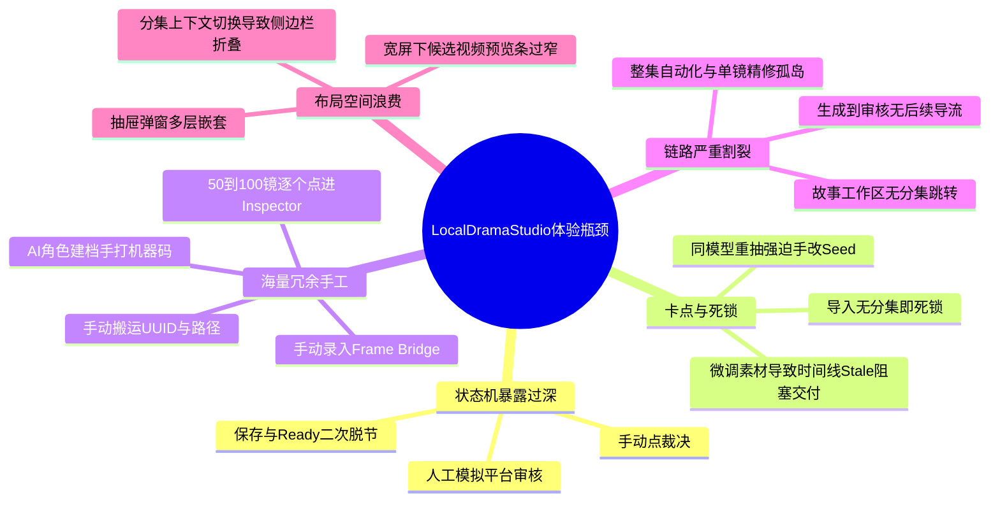
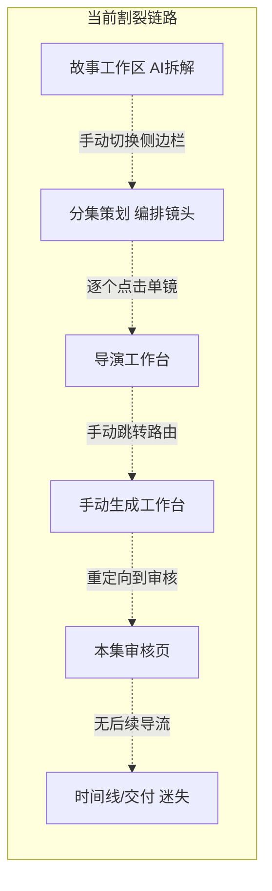
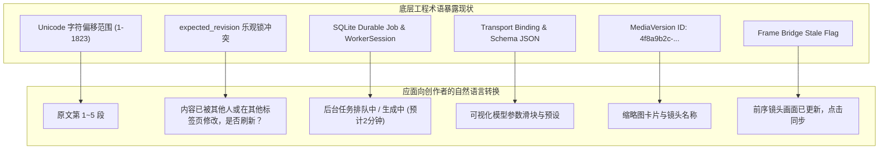
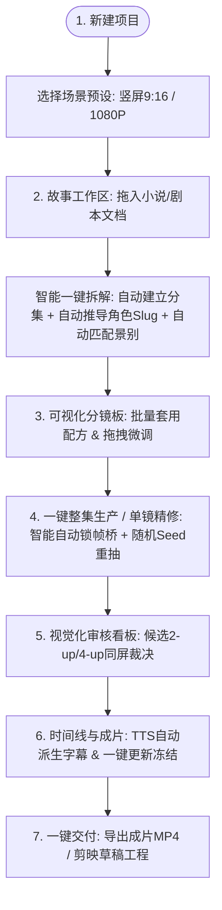

# LocalDramaStudio 全系统功能逻辑、操作体验与自动化全方位评估报告

> **报告日期**：2026-08-24  
> **评估范围**：系统全链路（前端交互 `apps/web`、后端 API 及业务状态流 `apps/api`、领域工作流模型）  
> **评估目标**：全面诊断当前系统中功能逻辑反直觉、用户操作不便易阻塞、功能设计不合理、操作冗余、本应后台自动处理却要求用户手动操作、前后链路脱节以及界面布局不合理之处，并提出面向创作者体验的系统化重构路线图。

---

## 目录

1. [执行摘要与核心诊断概览](#1-执行摘要与核心诊断概览)
2. [功能逻辑反直觉与不合理规则诊断](#2-功能逻辑反直觉与不合理规则诊断)
3. [易阻塞、死锁与流程中断卡点分析](#3-易阻塞死锁与流程中断卡点分析)
4. [冗余手工操作与后台自动化改造清单](#4-冗余手工操作与后台自动化改造清单)
5. [功能连贯性缺陷与链路割裂问题](#5-功能连贯性缺陷与链路割裂问题)
6. [界面布局、信息架构与视觉交互不合理之处](#6-界面布局信息架构与视觉交互不合理之处)
7. [技术抽象与工程术语向用户界面泄漏的问题](#7-技术抽象与工程术语向用户界面泄漏的问题)
8. [理想创作者旅程（End-to-End Creator Journey）重构方案](#8-理想创作者旅程end-to-end-creator-journey重构方案)
9. [改进实施路线图与优先级矩阵（P0 / P1 / P2）](#9-改进实施路线图与优先级矩阵p0--p1--p2)

---

## 1. 执行摘要与核心诊断概览

`LocalDramaStudio` 是一套具备强大底层架构的本地 AI 短剧/漫剧生成工作台。系统在数据不可变性（Immutability）、版本追溯（Revisions）、乐观锁控制（Optimistic Locking）、多模型 Profile 契约（Capability Contracts）和流水线证据链（Audit Evidence）方面构建了极其严密健壮的工程基座。

然而，**当前系统的交互逻辑将大量的“底层工程契约与状态机流转”直接暴露给了创作者**，导致产品在实际使用中存在严重的**反人类操作、频繁阻断、死锁卡点、海量重复劳动与链路割裂**。

### 核心共性痛点总结



---

## 2. 功能逻辑反直觉与不合理规则诊断

### 2.1 导演工作台：运镜裁决强制手动点击
* **现状逻辑**：在 `DirectorIntentEditor.tsx` 中，用户修改了景别、运镜方式或选择了运镜 Profile 后，Mode 会被重置为 `UNSUPPORTED`。系统不会自动执行后台运算，而是强迫用户去点击一个专门的按钮——**“按 Profile 裁决运镜能力”**。如果用户未点击该按钮，底部的校验卡片将直接把镜头标红并阻止标记为 `Production Ready`。
* **不合理原因**：运镜裁决本质上是根据所选 Profile 的参数支持矩阵进行规则匹配或只读探测，属于完全确定性的前端/后端即时计算。强迫用户在修改下拉框后多点一次按钮，纯属将内部校验流程当成用户操作。
* **改进方案**：用户切换运镜下拉框或 Profile 时，前端通过 `useEffect` / React Query 自动防抖触发裁决解析，实时更新 Mode 并给出视觉提示，彻底移除该手动按钮。

### 2.2 “保存 Revision” 与 “标记 Production Ready” 强行二元解耦
* **现状逻辑**：在 `DirectorIntentEditor.tsx` 底部，保存修改被设计为 `保存 revision {n+1}`，而标记完成被设计为另一个按钮 `标记 Production Ready`。更苛刻的是，只要表单存在未保存修改（`dirty === true`），`标记 Production Ready` 按钮就被禁用。
* **不合理原因**：用户的核心意图是“我把这个镜头导演好了，可以去生成了”。系统却要求：**先点保存 -> 等待服务端返回 -> 再点标记 Ready**。如果用户做完修改直接想标记 Ready，必须点两次并在两次之间等待。
* **改进方案**：提供一个高亮的 **“保存并就绪（Save & Ready）”** 组合操作。点击时在一次请求或事务中同时提交 Revision 并更新状态为 Ready；对于已保存无脏数据的镜头，直接支持单点切换 Ready 状态。

### 2.3 剧本拆解草稿盲盒应用与多季支持缺失
* **现状逻辑**：在 `AIDraftReviewPanel.tsx` 中：
  1. AI 拆解完成后只显示一行粗略统计 `X 个建议场次 · Y 个建议镜头`，没有任何树状或卡片视图展示具体拆解出来的场次标题、分镜动作描述和对白内容。
  2. 目标分集下拉框直接硬编码读取第一季 (`seasons.data?.items?.[0]?.id`)，如果项目拥有第二季或多季，用户在界面上根本无法选择其他季度的分集。
* **不合理原因**：用户在完全看不到具体拆解明细的情况下，被迫盲点“应用到成片”。一旦拆解不满意，无法在应用前局部调整、剔除废镜或合并场次。
* **改进方案**：
  1. 提供分集/场次/镜头的两栏预览树，支持点击展开查看每一镜的动作、景别和台词。
  2. 增加季度选择联动下拉框。
  3. 支持“全选应用”、“按场次勾选应用”和“局部编辑后应用”。

### 2.4 交付流程中要求用户手动模拟“平台审核”与“人工审核”
* **现状逻辑**：在 `DeliveryWorkflowPanel.tsx` 中，用户生成交付包后，页面并列出现四个按钮：“验证 manifest / SHA”、“记录人工批准”、“记录平台批准”、“撤回交付包”。点击“记录人工批准”和“记录平台批准”时，还会弹出模态框强迫用户手动填写一段文字理由（`textarea` 必填，为空时禁用提交）。
* **不合理原因**：在本地单机/个人创作者使用场景下，用户自己既是创作者也是审核者，要求用户自己给自己写一段“审核理由”并分别点两次（一次人工、一次平台），纯属将多租户/企业级平台的状态机硬套给单机用户。
* **改进方案**：提供“一键验证并批准交付”快捷通道，默认自动填入审计摘要（如“本机创作者一键批准”），保留高级折叠面板供特殊合规审计时补充详细批注。

---

## 3. 易阻塞、死锁与流程中断卡点分析

### 3.1 【严重阻塞】长文导入在无分集时直接死锁，无快速新建入口
* **阻塞场景**：用户新建项目后直接进入“故事工作区”导入小说/剧本长文，在第 2 步提交 AI 拆解时，系统提示 `项目暂无可用分集；请先创建季度与分集`，此时提交按钮永久禁用。
* **为什么造成死锁**：故事工作区页面内**没有任何“新建分集”或“快速生成分集”的入口**。用户必须中断当前的导入上下文，返回左侧侧边栏或项目首页，找到分集管理新建一集，再重新进入故事工作区，重新选择分段。
* **改进方案**：
  1. 在目标分集下拉框旁边直接放置 `+ 新建分集` 快捷按钮，点击弹窗 3 秒内完成分集创建并自动选中。
  2. 在长文拆解时支持“根据剧本篇幅自动创建 1~N 集”的智能预分集选项。

### 3.2 【高频阻断】同模型重抽强迫用户手改 Seed
* **阻塞场景**：在导演台点击“重抽当前镜头”时，若选择“沿用父候选 Profile（SEED 分支）”，系统要求 `同模型重抽必须显式使用不同整数`。如果当前 Seed 没有手动递增或改变，提交按钮直接禁用 (`disabled`)。
* **为什么造成困扰**：用户重抽的核心心理是“对当前结果不满意，再抽一张”。系统却把“Seed 不能重复”的校验抛给用户大脑，强迫用户手动在 input 里敲一个新数字。
* **改进方案**：打开重抽对话框时，系统自动通过 `Crypto` 或 `Math.random()` 预填一个全局不重复的全新随机 Seed，并提供“🎲 随机骰子”按钮，用户无需手打数字即可直接点击“立即重抽”。

### 3.3 【不可抗死锁】微调上游导致时间线 Stale，交付页面直接卡死
* **阻塞场景**：在 `DeliveryPage.tsx` 和 `TimelinePage.tsx` 中，交付工作区强行限定：**只消费处于 `FROZEN` 状态的时间线版本**。如果用户在导演台微调了某一个镜头的候选或台词，时间线状态立即变为 `STALE`，导致交付页面的渲染、打包按钮全变灰。
* **为什么造成困扰**：页面提示 `最新 revision 为 STALE；OTIO、EDL 与剪映导出只对冻结 revision 开放`，但没有提供“根据当前最新素材自动重新生成并冻结时间线”的一键修复操作，用户必须退回时间线页面 -> 点编排 -> 点冻结 -> 再回到交付页面。
* **改进方案**：在交付页面预检检测到时间线 Stale 时，直接呈现醒目的快捷修复横幅：**“检测到上游素材已更新，[一键更新并冻结时间线]”**，点击后后台完成同步并刷新交付就绪状态。

### 3.4 【操作中断】角色资产建议建档必须手动输入机器代码
* **阻塞场景**：在 `AssetProposalReviewPanel.tsx` 中，AI 拆解识别出了 10 个角色（如“林萧”、“顾里”），用户想将其建档为项目资产时，每一项后面都有一个 `独立资产 code` 的空输入框，且若不输入代码，`保留为独立角色` 按钮就是 disabled 的。
* **为什么造成困扰**：用户必须逐个手敲 `CHAR_LIN_XIAO`、`CHAR_GU_LI`。10 个角色就要手动敲 10 次机器码。
* **改进方案**：系统根据角色名自动生成规范的大写英文/拼音 Slug（如 `CHAR_LINXIAO`）并预填在输入框中，同时顶部增加 **“全部采纳为新资产”** 和 **“智能合并建议”** 的一键批量处理操作。

---

## 4. 冗余手工操作与后台自动化改造清单

| 序号 | 当前冗余手工操作 | 痛点描述 | 应该如何后台自动实现 | 优先级 |
|---|---|---|---|---|
| **1** | **逐镜进入 Inspector 配置导演意图** | 一部 80 镜短剧，用户需要点击 80 次镜头，每次手动选构图、动作、情绪、运镜方式、Profile 并逐一点击保存与 Ready | **支持基于剧本分析自动填充导演意图**，并提供**分镜批量板上的“批量套用配方（Batch Recipe Apply）”**，1 秒应用全集 | **P0** |
| **2** | **手动配置 Frame Bridge 镜头桥锁定** | 连续镜头间上一镜尾帧作为下一镜首帧是画风一致性关键，目前要求用户逐镜打开 Continuity 抽屉手动点锁定 | **后台自动推理帧继承关系**：同场景连续镜头默认自动连接前镜尾帧作为输入；仅当检测到场景切换或镜头类型跳跃时自动断开 | **P0** |
| **3** | **TTS 生成后手动触发字幕对齐** | TTS 任务成功后，音频时长与对白内容已确定，用户仍需在字幕面板中手动查看、创建或导入字幕 revision | **TTS 任务完成时后台自动生成字幕 Revision** 并挂载到时间线对应轨道的精确时间码上 | **P0** |
| **4** | **手工复制/填写媒体版本 UUID** | 在生成控制面板、返工批注、运动笔刷等模块，placeholder 和 label 多处要求输入 `MediaVersion ID` | **全面改造为可视化媒体选择器**（缩略图网格、分镜卡片拾取器、一键从当前镜头选择） | **P1** |
| **5** | **新建项目时手动配置底层视音频技术参数** | 要求输入画幅、宽高、fps 分子/分母、BCP-47 语言代码（如 `zh-CN`）、交付路径等 10+ 字段 | **采用场景化卡片预设**（如“抖音/快手 9:16 竖屏短剧 1080P/24fps”），点击即自动锁死全套最佳工程参数 | **P1** |
| **6** | **资产三视图/表情生成后手动多步绑定** | 生成 Multi-View 或表情后，用户需要多步选择 State、选择 Reference Kind、点击添加参考 | **生成成功后一键“设为主三视图/设为基础表情包”**，后台自动绑定 `HERO` / `THREE_VIEW_SHEET` 槽位 | **P1** |
| **7** | **手写运动控制与笔刷 JSON** | `GenerationControlPanel` 与 `MotionControlPanel` 中包含裸 JSON textarea，要求输入 `[{"time_us":0,"direction":"PAN_LEFT"}]` | **画布交互化**：在画面预览区通过拖拽箭头、框选 Mask 或可视化时间轴拖拽强度曲线自动生成 | **P2** |

---

## 5. 功能连贯性缺陷与链路割裂问题



### 5.1 页面间上下文断裂与跳转丢失
1. **拆解应用后无落地导流**：在 `StoryWorkspacePage` 点击“应用到成片目标集”成功后，页面只弹出一行成功提示文本，没有提供“立即前往该分集分镜策划”或“进入导演台”的直达按钮。
2. **生成到审核单向跳转，审核后成为死胡同**：在 `GenerationPage` 提交生成后，页面强行将用户重定向至 `EpisodeReviewPage`。用户在审核页完成批准后，页面没有任何“下一步”引导（如“下一镜生成”、“进入时间线”），用户只能去翻左侧侧边栏。
3. **整集生产 (EpisodeRun) 与单镜精修 (DirectorDesk) 脱节**：整集生产面板将 8 个阶段作为整体运行，当某个镜头因为提示词违规或模型崩溃失败时，用户在运行面板只能看到一个红色的 `FAILED` 状态，无法直接在当前视图内一键呼出该镜头的导演台抽屉进行微调重试，必须跳出到 Jobs 页面或导演台重新查找镜头。

### 5.2 资产圣经与分镜创作的数据回流断裂
* 在导演台或分镜表中，用户发现某个镜头需要新的角色服装状态（如“受伤状态”），目前无法直接在镜头 Inspector 中即时为该角色添加并生成新状态，必须跨页面跳去“资产圣经”，找到该角色，新增状态，上传参考图，再跳回导演台重新选择。

---

## 6. 界面布局、信息架构与视觉交互不合理之处

### 6.1 侧边栏层级与上下文管理不合理
* **问题现状**：左侧侧边栏采用了“选中项目展开项目菜单、选中分集展开分集菜单”的严格动态路由折叠。当用户在分集生产过程中，想临时去“资产圣经”看眼角色设定，点击资产圣经后，URL 变为 `/projects/:id/assets`，此时分集上下文丢失，侧边栏中的“本集生产”（分集策划、导演台、时间线等 8 个链接）瞬间全部缩回消失！用户看完资产想回导演台，必须先点项目总览或分集策划重新进入分集。
* **改进方案**：顶部栏或侧边栏顶部增加**全局常驻的“项目 / 分集 / 镜头”三级级联选择器（Context Selector Bar）**。无论在全局资产页还是在模型设置页，分集上下文保持激活状态，侧边栏的分集工作流入口始终触手可及。

### 6.2 导演工作台（DirectorDesk）屏幕空间浪费与信息层级倒置
* **宽屏空间浪费**：在 16:9 / 21:9 宽屏显示器上，导演台中间的媒体舞台占据了大块垂直空间，而右侧 Inspector（宽 380px）采用单栏超长滚动条，下方的候选条（Takes Strip）被压缩在狭窄的底部一栏（高度仅 120px 左右），导致 4-up 候选对比非常拥挤。
* **快捷操作入口深藏**：分镜的上一镜/下一镜导航、批量处理批次、画面构图选择、运镜参数被分散在 Context Bar、Stage Toolbar、Inspector Tabs、Timeline Strip 四个不同区域，视线跳跃极大。
* **改进布局方案**：

```
+------------------------------------------------------------------------------------+
| 顶部全局上下文条: [项目: 霸道总裁] / [分集: 第01集] / [镜头: SH-003]  | 状态: READY  |
+------------------------------------+-----------------------------------------------+
| 左栏: 镜头序列胶卷 (Filmstrip)     | 中栏: 实时画面预览与对比 (Stage & Compare)    |
| - SH-001 (已批准)                  | - 4K/1080P 舞台预览 / 2-up / 4-up 同屏播放    |
| - SH-002 (已批准)                  | - 镜头桥首尾帧继承指示器                      |
| > SH-003 (当前编辑中)              +-----------------------------------------------+
| - SH-004 (待生成)                  | 底栏: 候选变体管理 (Takes Timeline)          |
| [批量操作] [添加镜头]              | [Take 1 (当前)] [Take 2] [Take 3] [+ 重抽]    |
+------------------------------------+-----------------------------------------------+
| 右栏: 导演意图与参数属性检查器 (Inspector) - 紧凑双列布局                           |
| [景别/构图选择网格]  [运镜方式/Profile/强度]  [角色与资产快速绑定]  [对白与声音]   |
| 底部常驻大按钮: [ 一键保存并就绪 (Ctrl+S) ]  [ 立即生成新候选 (Ctrl+G) ]            |
+------------------------------------------------------------------------------------+
```

### 6.3 抽屉与弹窗嵌套层级过深
* 在 `StoryboardBatchWorkbench` 中，点击“重排、拆分与复制”，系统弹出一个覆盖在右侧的 680px 抽屉；在抽屉内部点击“预览”，抽屉下方展开冲突列表；再点击“确认”，才关闭抽屉刷新主页面。
* 这种“在抽屉里嵌套表单、在抽屉里看大段 diff、在抽屉里执行两阶段提交”的设计，割裂了用户对分镜大盘的全局视野。应直接升级为全屏可视化分镜编排工作台（支持拖拽排序、磁吸吸附、内联拆分）。

---

## 7. 技术抽象与工程术语向用户界面泄漏的问题

系统底层采用了严格的领域驱动设计（DDD），但在前端界面上直接呈现了大量底层数据库与工程术语，给普通用户造成了极高的认知负荷：



---

## 8. 理想创作者旅程（End-to-End Creator Journey）重构方案

通过对上述所有断点与痛点的梳理，重构后的全流程创作者闭环应遵循以下极致流畅的体验标准：



### 各阶段核心体验升级要点：
1. **新建与导入（< 30 秒）**：一键预设建项 -> 拖拽剧本 txt/docx -> 自动预估总集数与时长 -> 自动拆解。
2. **角色与资产（无需手动输入机器码）**：AI 提取角色 -> 自动生成头像与拼音 Code -> 用户一键“全部采纳” -> 自动发起三视图与表情批量生成。
3. **导演台与生成（零手动阻塞）**：景别与运镜切换实时生效 -> 镜头桥首尾帧默认智能级联锁定 -> 重抽自动分配新 Seed -> 一键“保存并就绪”。
4. **审核与交付（流畅自洽）**：审核通过自动点亮时间线 -> 时间线自动跟随上游同步 -> 交付页一键渲染与打包，支持直接导出剪映专业版（Jianying Pro）草稿工程。

---

## 9. 改进实施路线图与优先级矩阵（P0 / P1 / P2）

### P0：阻断与核心体验修复（立即实施）

| 模块 | 改动文件/组件 | 具体改动动作 |
|---|---|---|
| **导演台** | `DirectorIntentEditor.tsx` | 1. 移除手动“按 Profile 裁决运镜能力”按钮，改为下拉变化时自动即时裁决。<br>2. 增加“保存并就绪（Save & Ready）”复合主按钮。<br>3. 修复同模型重抽强迫手改 Seed 问题，默认自动生成随机 Seed。 |
| **故事工作区** | `ScriptImportPanel.tsx` / `AIDraftReviewPanel.tsx` | 1. 在分集下拉旁增加快速新建分集模态框，彻底消除无分集死锁。<br>2. 修复多季支持（增加季度切换联动）。<br>3. 增加草稿分镜明细树状展开预览。<br>4. 角色建档 code 自动根据角色名生成 slug 预填。 |
| **时间线与交付** | `DeliveryPage.tsx` / `TimelinePage.tsx` | 1. 在交付预检遇到时间线 Stale 时提供“一键更新并冻结时间线”修复按钮。<br>2. 简化交付审核流程，提供“一键批准交付”快捷通道。 |

### P1：工作流提效与自动化增强（下一阶段）

| 模块 | 改动文件/组件 | 具体改动动作 |
|---|---|---|
| **全局导航** | `AppShell.tsx` / `routeRegistry.ts` | 增加顶部常驻 Project/Episode/Shot 三级级联快速切换栏，解决跳出分集后侧边栏折叠问题。 |
| **分镜批量台** | `StoryboardBatchWorkbench.tsx` | 支持“批量套用导演配方（Batch Recipe Apply）”；将重排拆分从右侧抽屉移入主舞台支持直观拖拽。 |
| **镜头桥连续性** | `DirectorDeskPage.tsx` / 后端 FrameBridge 服务 | 默认开启同场景连续镜头首尾帧智能自动继承，仅在跨场景或冲突时提示手动干预。 |
| **资产工作台** | `AssetBiblePage.tsx` / `GenerateMultiViewPanel.tsx` | 生成多视角/表情后提供一键入库挂载，消除多步手动选择 State/Kind 的繁琐流程。 |

### P2：UI 空间重构与高级交互升级（远期优化）

| 模块 | 改动文件/组件 | 具体改动动作 |
|---|---|---|
| **导演台布局** | `DirectorDeskPage.tsx` / `director-desk.css` | 采用 Filmstrip（左）+ Stage & Compare（中）+ Takes Strip（底）+ Dual-column Inspector（右）的专业影视桌面布局。 |
| **生成控制** | `GenerationControlPanel.tsx` / `MotionControlPanel.tsx` | 彻底移除裸 JSON textarea，改造为可视化动作曲线与运镜方向控件。 |
| **提示与反馈** | 全局 UI 组件库 | 统一全局 Toast 通知与状态徽章颜色规范，全面收敛隐藏底层工程术语（如 UUID、乐观锁 Revision、字符偏移等）。 |

---

## 10. 评估结论

`LocalDramaStudio` 拥有极佳的本地多模型调度能力、确定的版本血缘管理和严格的生产质量保障。本报告所指出的问题绝大部分属于**“工程规范过度侵入创作者交互界面”**所带来的可用性代沟。

通过将**参数裁决后台化、重抽参数自动化、镜头继承智能化、状态流转一键化**，并对页面布局进行影视工作台级别的专业化重构，本系统将从“充满工程摩擦的严苛控制台”蜕变跃升为**“心流顺畅、操作敏捷、极度舒适的下一代 AI 漫剧/短剧创作旗舰工作台”**。
