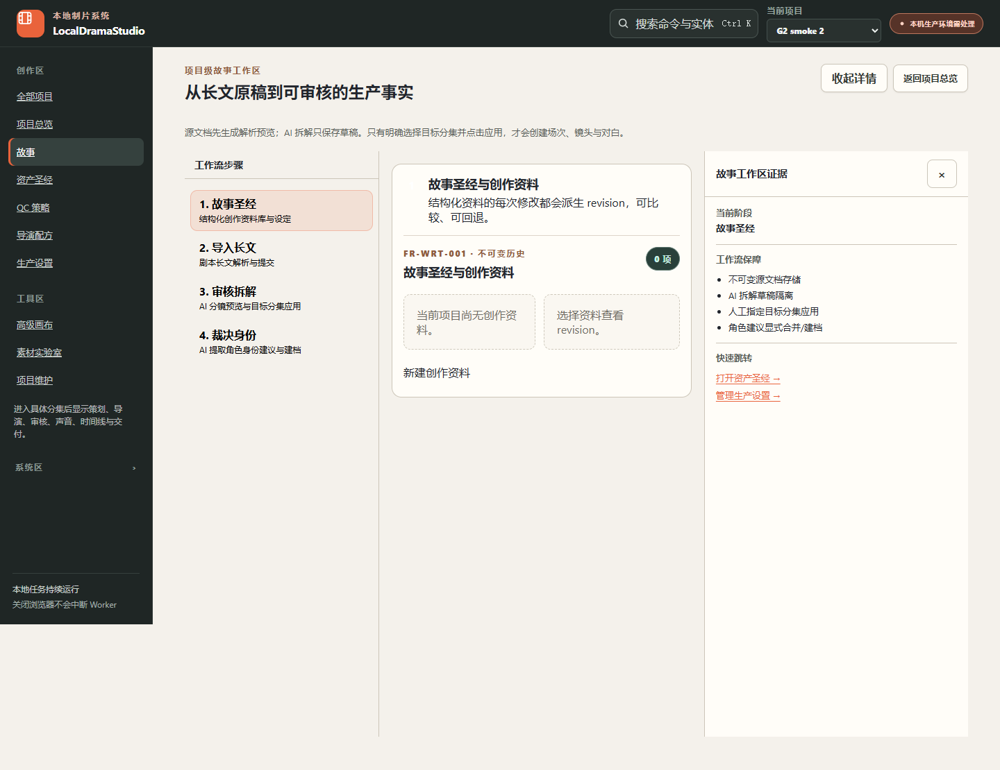
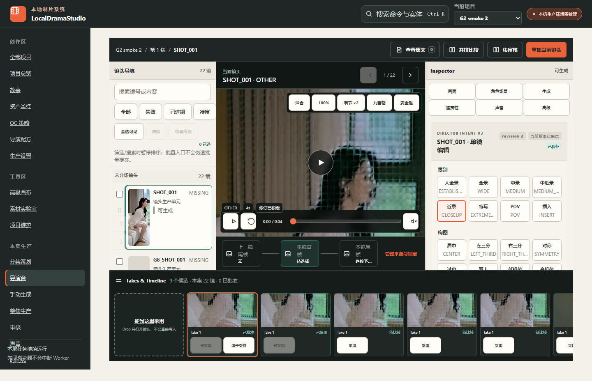
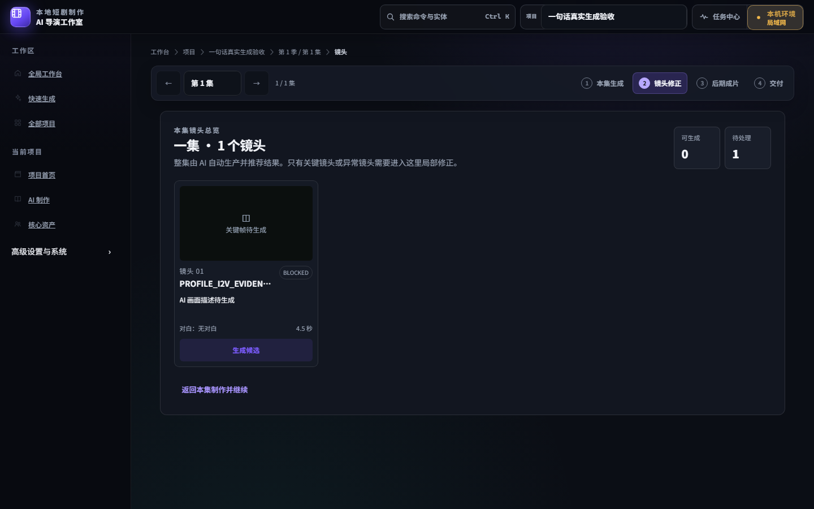

# 历史视觉参考与本次证据边界

以下文件从固定源码基线中原样复制，均为仓库历史图片。本轮没有新的真实运行页面截图；不能将这些图或设计图重命名成实测截图。原截图拍摄日期未逐张确认，统一标“历史”，不推断其等于当前 UI。

## 历史-故事工作区.png

数字分步可以参考；多层导航及常驻证据侧栏会挤占正文。

来源：[固定版本仓库文件](https://github.com/Qioooba/local_drama_studio/blob/d91a4107b6733a4783d860689fb819720463214a/docs/visual_audit/flash_check/screenshots/06_story_workspace_full.png)

内容 SHA-256：`bc9a810c3c06358746aba06d8633ae3a03cd4d7ff7930b90304885c0ee6e5516`

## 历史-导演台候选.png

真实媒体、候选和采用交互可参考；不复制整体复杂导演布局。

来源：[固定版本仓库文件](https://github.com/Qioooba/local_drama_studio/blob/d91a4107b6733a4783d860689fb819720463214a/docs/visual_audit/flash_check/screenshots/19_director_desk_shot_full.png)

内容 SHA-256：`7a73fa04a74abe571e41704ddd1c9a27b4d024c98295b54891960533a7fbe01c`

## 历史-导演台深色.png

较新深色布局参考；此图仍有未生成和配置阻塞，不作为模型成功证据。

来源：[固定版本仓库文件](https://github.com/Qioooba/local_drama_studio/blob/d91a4107b6733a4783d860689fb819720463214a/docs/visual_audit/reports/screenshots/P19_director_desk/P19_director_desk_laptop_900p_dark.png)

内容 SHA-256：`06382af6c7fde2a1c05de6cda269fa4b35da20a5f1f48282e6b8df9d41f27748`

